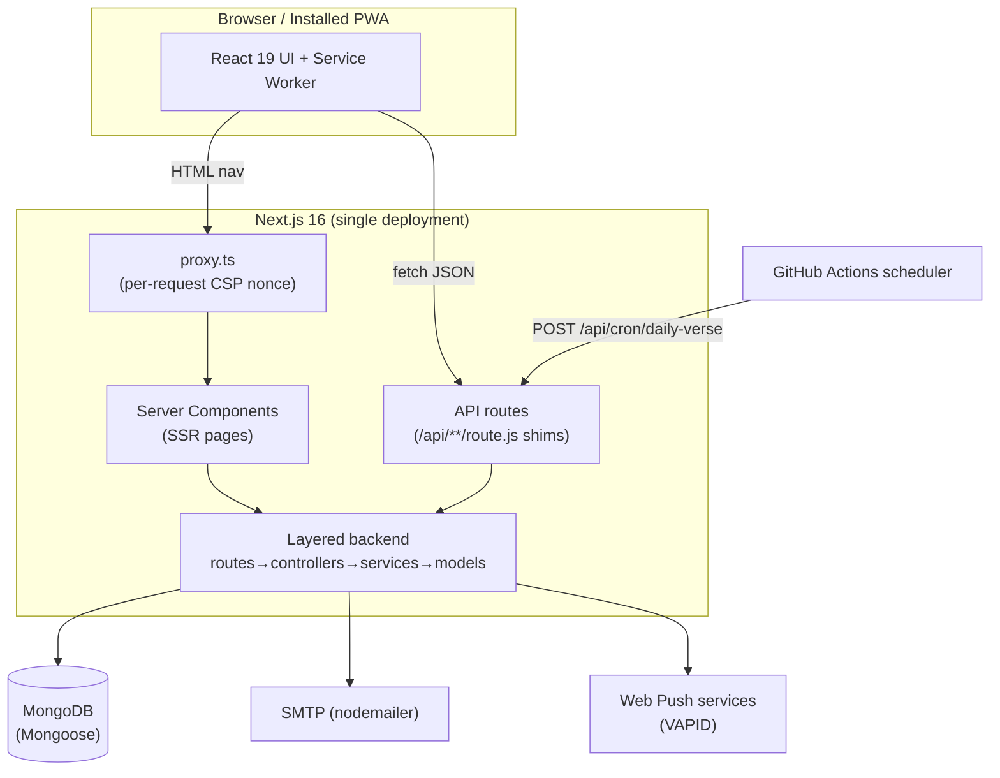
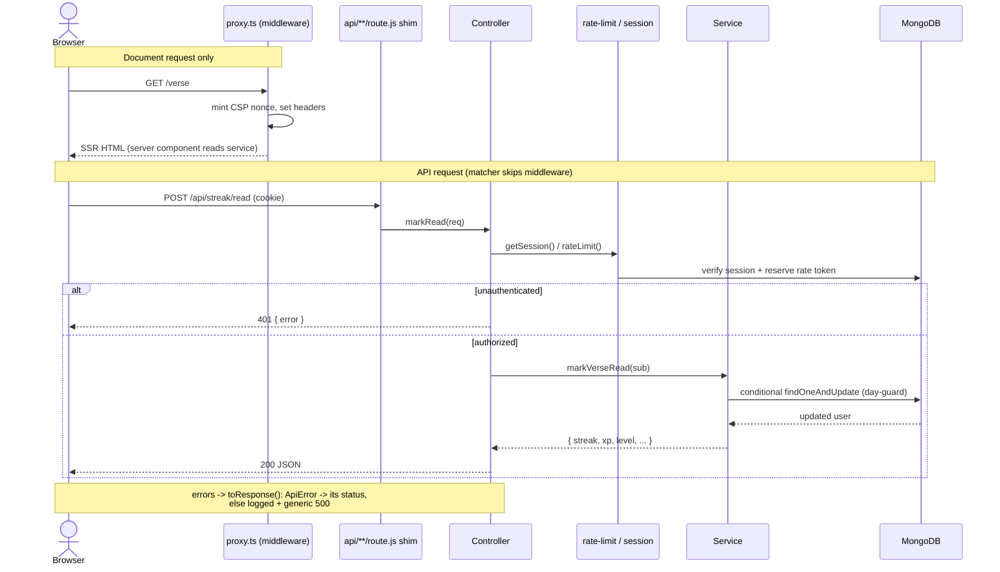
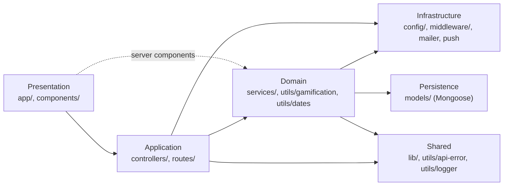
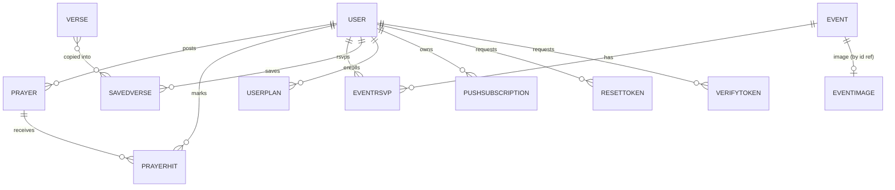
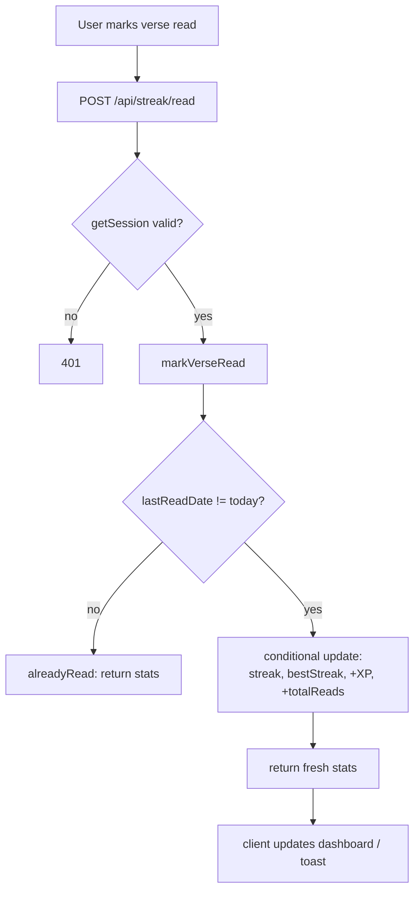
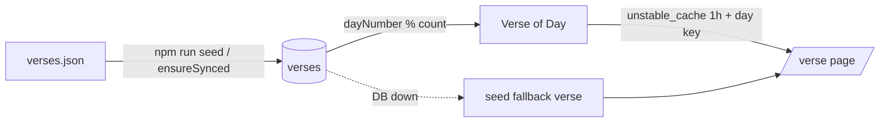
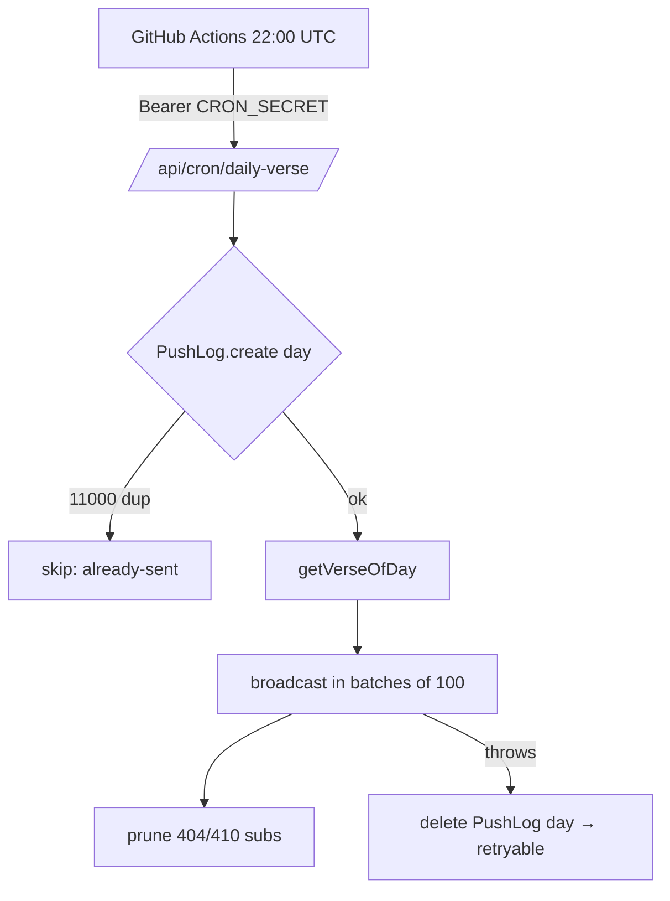
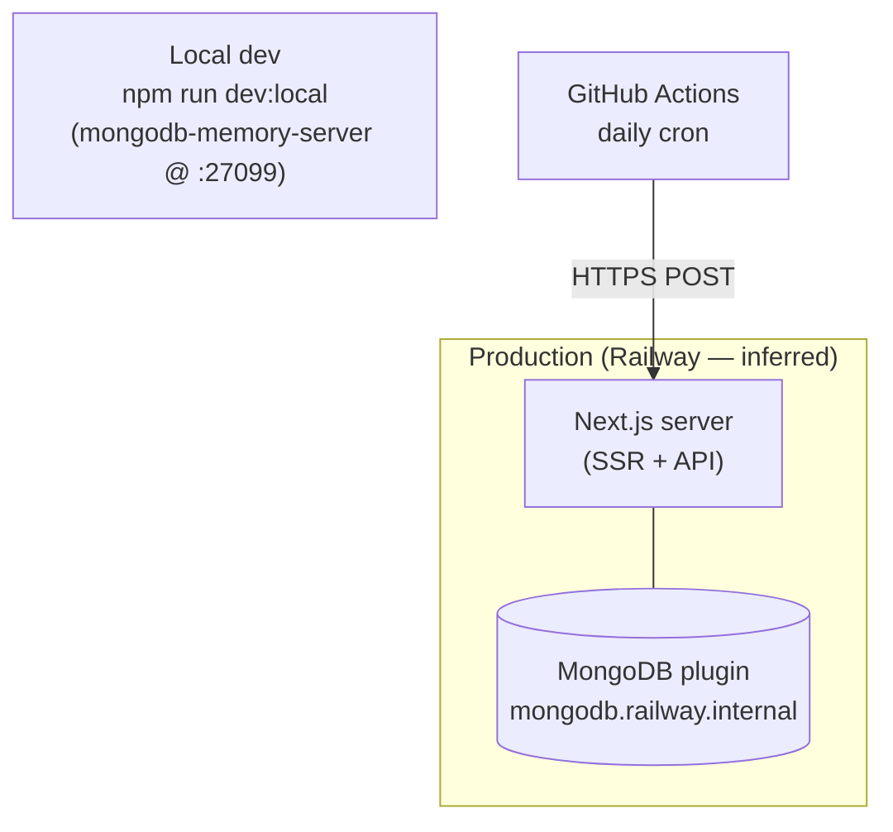
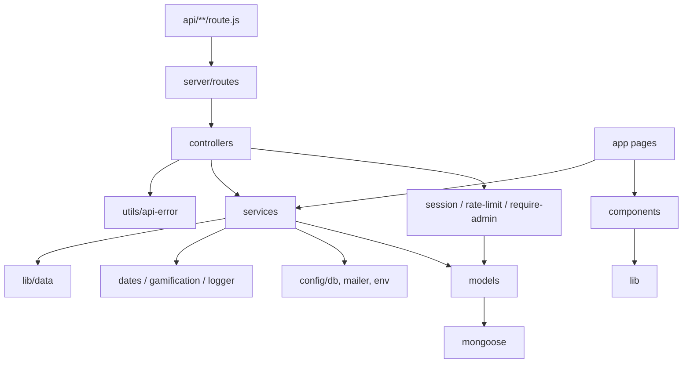

# CYA Daily Verse — Architecture

Canonical engineering reference for the CYA Daily Verse platform. Companion to
[`SYSTEM-FLOW.md`](./SYSTEM-FLOW.md), which covers the product experience in plain language; this
document covers how the system is built and why.

> Conventions used here
> - **Fact** — read directly from source in this repository.
> - **Inferred** — reasoned from the code but not explicitly stated; flagged inline.
> - `> TODO: Needs confirmation` — cannot be determined from the repository.

---

## Architecture Overview

**Summary.** CYA Daily Verse is a Progressive Web App and daily-devotional platform for the
*Christ's Youth in Action* youth ministry. It serves a rotating daily Bible verse, devotionals,
reading plans, a moderated prayer wall, community events, gamified reading streaks, and opt-in web
push reminders. A single Next.js deployment serves both the rendered UI and the JSON API.

**Core business domain.** Faith-habit formation. The product optimizes for daily return: verse of
the day → mark read → streak/XP → community (prayer, events). Domain nouns are *Verse*, *User*,
*Streak/XP*, *Prayer*, *Event*, *Devotion*, *Reading Plan*, *Push Subscription*.

**Architectural style — Layered Modular Monolith on Next.js App Router.**

| Trait | Evidence |
|---|---|
| **Monolith** | One Next.js process serves UI + API; `src/server/server.js` explicitly declines to be a custom HTTP server so Next keeps static optimization. |
| **Layered** | Strict `route → controller → service → model` chain under `src/server/`, mirroring an Express-style backend inside Next. |
| **Modular** | Each domain (auth, prayer, event, plan, verse, push…) has its own route/controller/service/model quartet. |
| **Backend-for-frontend** | The API exists only to serve this app's own UI; no public API contract or versioning. |

**Why this style.** The team is small and the domain is cohesive; a monolith removes cross-service
network cost and deployment complexity. The internal layering keeps the monolith testable and gives
a clean seam (`src/app/api/**/route.js` shims) between Next's routing and framework-agnostic backend
code — the backend could be lifted onto Express with minimal change because controllers already
take `Request` and return `NextResponse`.



---

## Project Structure

```
src/
  app/                      Next.js App Router — pages + API route shims
    (site)/                 public + member-facing pages (route group)
    (admin)/                admin portal + admin dashboards (route group)
    api/**/route.js         thin re-export shims -> src/server/routes
    layout.tsx              root layout, fonts, theme script, metadata
    globals.css             Tailwind v4 + Figma design tokens (CSS vars)
    manifest.ts robots.ts sitemap.ts opengraph-image.tsx   static metadata
  components/               React UI (client + server components)
    motion/ three/ nav/ pwa/ home/   feature-grouped UI
    ui.tsx verse-card.tsx toast.tsx   shared primitives
  lib/                      client-safe: data.ts, types.ts, hooks.ts, motion.ts, cx.ts
  data/verses.json          bundled 300-verse seed corpus (fallback + seed source)
  server/                   backend (server-only)
    config/                 db.js, env.js, mailer.js
    routes/                 name -> controller-handler mapping
    controllers/            HTTP concerns: parse, rate-limit, session, respond
    services/               business logic + persistence
    models/                 Mongoose schemas
    middleware/             session.js, rate-limit.js, require-admin.js
    utils/                  dates, gamification, api-error, logger, admin-session
    server.js               boot(): env assert + DB warmup
  proxy.ts                  Next middleware — per-request CSP nonce
scripts/                    dev-local, seed, purge-seed, fetch-verses, create-member
tests/                      node:test suites (unit + in-memory integration)
docs/                       SYSTEM-FLOW.md, ACTIVITY-LOG.md, ARCHITECTURE.md
```

**Ownership boundaries.**

| Directory | Owns | May depend on | Must NOT depend on |
|---|---|---|---|
| `app/(site)` `app/(admin)` | Route rendering, page composition | `components`, `lib`, `server/services` (via server components) | Mongoose models directly |
| `app/api/**` | HTTP method → handler binding only | `server/routes` | anything else (shims are one-liners) |
| `server/controllers` | HTTP I/O, auth gate, rate limit, error mapping | `server/services`, `middleware`, `utils` | Mongoose models directly (**inferred rule**; controllers call services) |
| `server/services` | Business rules, validation, DB access | `models`, `config`, `utils`, `lib/data` | `next/server` response objects (services throw `ApiError`) |
| `server/models` | Schema + indexes | mongoose only | services/controllers |
| `lib` | Client-safe shared code | — | `server/**` (would leak server code to client) |

The `"server-only"` import at the top of backend modules enforces the last rule at build time.

---

## Technology Stack

| Layer | Choice | Version (from `package.json`) |
|---|---|---|
| Language | TypeScript (strict) + JavaScript (backend `.js`) | TS ^5 |
| Runtime | Node.js | @types/node ^20 → Node 20.x target |
| Framework | Next.js App Router, Turbopack | 16.2.10 |
| UI | React / React DOM | 19.2.4 |
| Styling | Tailwind CSS v4 + CSS-variable design tokens | ^4 |
| Motion | Framer Motion | ^12 |
| 3D | React Three Fiber + drei + three | fiber ^9, three ^0.182 |
| Icons | lucide-react | ^1.24 |
| Fonts | Manrope (UI), Lora (scripture) via `next/font` | — |
| Database | MongoDB | via Mongoose ^9.8 |
| ODM | Mongoose | ^9.8 |
| Auth | Custom: bcryptjs ^3 (hashing) + jose ^6 (JWT session cookies) | — |
| Email | nodemailer ^9 (SMTP) | — |
| Push | web-push ^3.6 (VAPID) | — |
| Local DB | mongodb-memory-server ^11 (dev + tests) | — |
| Lint | ESLint ^9 + eslint-config-next | — |
| Test | `node:test` (built-in) with `--experimental-strip-types` | — |
| CI (jobs) | GitHub Actions (daily push cron only) | — |
| Hosting | Railway (inferred from `.env` + README) | — |

- **Caching:** Next `unstable_cache` (verse of day, community stats) + HTTP `Cache-Control` on
  images. No Redis.
- **Queues:** none. Fan-out done in-process with bounded batches.
- **Monitoring / Logging:** `console`-based structured logger (`server/utils/logger.js`).
  > TODO: Needs confirmation — external log/metrics/APM aggregation (e.g. Railway logs only, or a
  > third-party sink).
- **CI/CD (build & deploy):** > TODO: Needs confirmation — no build/deploy workflow in `.github/`;
  Railway auto-deploy on push is inferred but not proven in-repo.

---

## System Components

### Rendering & Edge

- **`proxy.ts` (Next middleware).** *Purpose:* generate a per-request CSP nonce so `script-src` can
  use `'nonce-… 'strict-dynamic'` instead of `'unsafe-inline'`. *Inputs:* incoming document
  requests (matcher excludes `api`, static, images, prefetches). *Outputs:* `x-nonce` +
  `content-security-policy` request/response headers. *Failure mode:* none material; on any error the
  request still flows (nonce is additive). Static security headers (HSTS, X-Frame-Options, etc.) are
  set separately in `next.config.ts`.
- **App Router pages.** Server-rendered on demand (they read live data + session cookie). Only
  metadata routes (`manifest`, `robots`, `sitemap`, `opengraph-image`) prerender static.

### Backend boot

- **`server/server.js` — `boot()` / `status()`.** *Purpose:* idempotent process warmup — assert
  required env, open Mongo. *Failure mode:* missing env throws with a pointer to `.env.example`;
  `status()` is the non-throwing variant used by `/api/health`.
- **`config/db.js` — `dbConnect()`.** Cached global Mongoose connection reused across hot reloads and
  invocations. `bufferCommands:false` + 5s server-selection timeout so a DB outage fails fast rather
  than hanging requests. On failure it clears the cached promise so the next call retries.

### Auth & session

- **`middleware/session.js`.** Issues/reads/clears the `cya-session` HS256 JWT cookie (httpOnly,
  `sameSite=lax`, `secure` in prod, 30-day). *Revocation:* JWT carries `tv` (tokenVersion); every
  read re-checks it against the DB. Bumped on password reset to kill stale sessions. *Failure policy:*
  DB outage during the revocation lookup **fails open** for reads (keeps session) but callers can pass
  `{ strict:true }` to **fail closed** on sensitive writes.
- **`utils/admin-session.js`.** Separate `cya-admin` cookie (8-hour) minted by the shared admin-portal
  passphrase; timing-safe compare.
- **`middleware/require-admin.js` — `assertAdmin()`.** Single admin gate: passes if either a valid
  admin-portal session **or** a signed-in user with `role:"admin"`.

### Rate limiting

- **`middleware/rate-limit.js`.** Fixed-window limiter backed by a Mongo `RateBucket` collection
  (shared across instances) via an atomic `$inc` upsert — no TOCTOU race. Falls back to a per-process
  in-memory window if Mongo is unreachable (degraded, never blocks). Client key derived from
  `X-Forwarded-For` counted *from the right* by `TRUSTED_PROXY_HOPS` to resist IP spoofing.

### Domain services (representative)

| Service | Responsibility | Notable behavior / failure mode |
|---|---|---|
| `verse.service` | Verse of day, archive, search | Deterministic rotation `dayNumber % count`; DB-down falls back to bundled `verses.json`; self-heals corpus via `ensureSynced()` upsert |
| `user.service` | Stats, `markVerseRead`, `claimChallenge`, roles | Once-per-day streak award enforced by conditional write filter; DB-down still returns session identity so UI stays logged in |
| `auth.service` | Register/login | bcrypt(10); input length validation; 409 on duplicate email |
| `push.service` | Subscribe/unsubscribe/broadcast/daily send | Bounded 100-concurrency batches; prunes 404/410 subs; daily send idempotent via unique `PushLog` day row |
| `stats.service` | Community totals | `unstable_cache`d aggregation; errors fall back to zeros, never cached |
| `email-verification` / `password-reset` | Token issue + consume | Hashed tokens with TTL; non-blocking send |

### Image handling

- **`image.controller.js` + `event-image` model.** Event pubmats stored as `Buffer` in Mongo, served
  through `/api/images/[id]` with a hard-clamped content-type allowlist (`jpeg/png/webp`, else
  `application/octet-stream`) and immutable 1-year cache. Next's image optimizer resizes/serves
  WebP/AVIF variants.

---

## Request Lifecycle

Two entry shapes: **document requests** (server-rendered pages, through `proxy.ts`) and **API
requests** (`/api/**` JSON, which the matcher excludes from middleware).



**Pipeline:** incoming request → (docs) CSP nonce → controller → auth (`getSession`/`assertAdmin`)
→ rate limit → input validation (in service) → business logic → Mongoose persistence → `NextResponse`
JSON. Errors funnel through `toResponse()`.

---

## Application Layers



| Layer | Location | Allowed to call |
|---|---|---|
| Presentation | `app/`, `components/` | `lib`, and services **only** through server components |
| Application (HTTP) | `server/routes`, `server/controllers` | services, middleware, `utils/api-error` |
| Domain | `server/services`, `utils/gamification`, `utils/dates` | models, config, shared utils |
| Infrastructure | `server/config`, `server/middleware` | models, external clients |
| Persistence | `server/models` | mongoose only |
| Shared/Utilities | `lib/`, `utils/api-error`, `utils/logger` | nothing upward |

**Rule:** dependencies point downward only. The `"server-only"` marker prevents Presentation from
importing server layers into the client bundle.

---

## Domain Model

| Concept | Type | Notes |
|---|---|---|
| `User` | Entity / Aggregate root | Owns streak, xp, totalReads, `challengeDates`, role, `tokenVersion` |
| `Verse` | Entity (read-mostly reference data) | Seeded corpus; text index for search |
| `Prayer` | Entity | `status: approved\|hidden`, `prayedCount` |
| `PrayerHit` | Association (unique per prayer+user) | Enforces "I prayed" once per user |
| `Event` | Entity | `published`, `rsvpCount` |
| `EventRsvp` | Association (unique per event+user) | |
| `EventImage` | Value/blob | Buffer pubmat |
| `Devotion` | Entity | `slug` unique, `published` |
| `UserPlan` | Entity (unique per user+plan) | `completedDays[]`, `active` |
| `SavedVerse` | Entity (unique per user+reference) | |
| `PushSubscription` | Entity | unique `endpoint`, optional `userId` |
| `PushLog` | Idempotency record | unique `day` = daily-send lock |
| `ResetToken` / `VerifyToken` | Value (hashed, TTL) | single-use via `usedAt` |
| `RateBucket` | Infrastructure record (TTL) | fixed-window counter |

**Domain services / policies (not persisted):**

- **Gamification policy** (`utils/gamification.js`): `XP_PER_READ=25`, `XP_PER_LEVEL=250`,
  level = `floor(xp/250)+1`.
- **Streak policy** (`user.service.markVerseRead`): consecutive-day extend else reset; once-per-day.
- **Manila-day policy** (`utils/dates.js`): all day keys use `Asia/Manila`; day rolls at PH midnight.
- **Challenge catalog** is server-side (`lib/data.challenges`); XP is read from the catalog, never
  from the client.

There is no formal Repository or Factory layer — services call Mongoose models directly (**inferred**
intentional simplification for a small app).

---

## Database Architecture

- **Engine:** MongoDB. **Access:** Mongoose ODM. **Schemas:** one file per collection in
  `server/models`.



**Key indexes & constraints (fact):**

| Collection | Index / constraint | Purpose |
|---|---|---|
| `users` | `email` unique | one account per address |
| `verses` | text index `{reference:10, text:5}`; `{topic:1}` | search + topic filter |
| `prayers` | `{status:1, createdAt:-1}` | wall query+sort in one scan |
| `prayerhits` | `{prayerId, userId}` unique | one pray per user |
| `events` | `{published:1, date:1}` | published upcoming list |
| `eventrsvps` | `{eventId, userId}` unique | one RSVP per user |
| `userplans` | `{userId, planSlug}` unique | one enrollment per plan |
| `savedverses` | `{userId, reference}` unique | no duplicate saves |
| `pushsubscriptions` | `endpoint` unique | dedupe device |
| `pushlogs` | `day` unique | daily-send idempotency lock |
| `reset/verifytokens` | `tokenHash` unique; `expiresAt` TTL | single-use, auto-expire |
| `ratebuckets` | `expiresAt` TTL | auto-clean windows |

- **Migration strategy:** schemaless + **self-reconciling seed**. `verse.service.ensureSynced()`
  upserts the bundled corpus by reference on first request after deploy, propagating edits without a
  migration tool. No formal migration framework.
- **Transactions:** none used; correctness comes from **atomic single-document operations** —
  conditional `findOneAndUpdate` (streak day-guard, rate-limit `$inc`), unique-index inserts
  (PushLog, PrayerHit), and `$inc` counters.
- **Concurrency:** handled per-document (see above); no multi-doc transaction boundaries.
- **Connection management:** single cached global connection (`config/db.js`); fail-fast timeouts.

---

## Data Flow





---

## API Architecture

- **Style:** REST-ish JSON over Next Route Handlers. No GraphQL/gRPC/WebSockets. Push uses the Web
  Push protocol (server → browser).
- **Shim pattern:** every `src/app/api/**/route.js` is a one-line re-export from `server/routes`, so
  HTTP binding is decoupled from handler logic.

**Endpoint groups (fact):**

| Group | Examples | Auth |
|---|---|---|
| Auth | `register, login, logout, me, forgot, reset, verify, verify/resend` | public + session |
| Verse | `verse/today, verse/search` | public |
| Streak | `streak/read, streak/challenge` | session |
| Prayer | `prayers`, `prayers/[id]/pray` | session (post/pray) |
| Events | `events`, `events/[id]/rsvp` | public read / session RSVP |
| Plans | `plans/enroll, plans/leave, plans/day` | session |
| Saved | `saved` | session |
| Push | `push/key, push/subscribe` | optional session |
| Account | `account`, `account/export` | strict session |
| Admin | `admin/prayers, admin/events, admin/devotions, admin/users, admin/sync-verses, admin/events/image` | `assertAdmin` |
| Admin portal | `admin/portal/login`, `admin/portal/logout` | passphrase |
| Cron | `cron/daily-verse` | `CRON_SECRET` bearer |
| Health | `health` | public |

- **AuthN:** JWT cookie (`jose` HS256). **AuthZ:** session presence, `emailVerified` gate for
  posting, `assertAdmin` for admin surfaces.
- **Versioning:** none (internal BFF; single client).
- **Error handling:** `ApiError(status, message)` thrown in services → `toResponse()` maps to JSON;
  unexpected errors logged and returned as generic 500.
- **Validation:** in services (length clamps, regex email, ObjectId checks, input `.slice()` caps).
- **Rate limiting:** per-endpoint via `rateLimit()` (see table below).
- **Pagination:** bounded `limit` params (e.g. search 60, users 200); no cursor pagination.

**Rate limits (fact):**

| Endpoint | Limit / window |
|---|---|
| `auth:register` | 5 / 60 min |
| `auth:login` | 10 / 15 min |
| `auth:forgot` | 3 / 15 min |
| `auth:reset`,`auth:verify` | 10 / 15 min |
| `auth:verify-resend` | 3 / 15 min |
| `admin:image` | 30 / 10 min |

> TODO: Needs confirmation — whether non-auth write endpoints (prayer post, RSVP, enroll) are
> rate-limited; not observed in the files reviewed.

---

## External Integrations

| Integration | Purpose | Auth | Failure handling | Retry / timeout | Fallback |
|---|---|---|---|---|---|
| MongoDB | Primary datastore | connection string (`MONGO_URL`) | fail-fast (5s selection), clear cached promise | app-level retry on next call | seed corpus for verses; degraded in-memory rate limit |
| SMTP (nodemailer) | Verify + reset email | `SMTP_USER/PASS` | send is fire-and-forget; own error boundary | SMTP timeouts set (per commit history) | feature silently disabled if unset |
| Web Push (VAPID) | Daily reminders | VAPID key pair | 404/410 → prune; other errors logged | bounded 100-batch send | feature disabled if keys unset |
| GitHub Actions | Daily push scheduler | `CRON_SECRET` bearer + `SITE_URL` secret | job fails on non-200; `workflow_dispatch` manual retry | 06:00 Manila cron | none |
| Railway (host) | Runtime + managed Mongo | platform | — | — | — (**inferred** host) |

---

## Security Architecture

- **Authentication:** bcrypt(10) password hashing; `jose` HS256 JWT session cookie; email
  verification tokens (hashed, TTL, single-use).
- **Authorization:** session gate + `emailVerified` for participation; dual admin path (portal
  passphrase or `role:admin`); users cannot strip their own admin role.
- **Session security:** httpOnly, `sameSite=lax`, `secure` in prod; tokenVersion revocation on
  password reset; strict fail-closed mode for sensitive writes.
- **Secrets:** environment variables only; `assertEnv()` fails boot if required ones missing;
  timing-safe compares for `CRON_SECRET` and admin passphrase.
- **Transport:** HSTS (2-year, includeSubDomains), `upgrade-insecure-requests`.
- **CSP:** per-request nonce + `strict-dynamic` (no `script-unsafe-inline`); `object-src none`,
  `frame-ancestors none`, `base-uri self`, `form-action self`. Style keeps `unsafe-inline` (font/
  Tailwind injected `<style>`; documented weaker risk).
- **CORS:** default same-origin (`connect-src 'self'`); no cross-origin API exposure.
- **CSRF:** `sameSite=lax` cookies + same-origin `form-action`. > TODO: Needs confirmation — no
  explicit anti-CSRF token on state-changing POSTs; relies on SameSite.
- **XSS:** React escaping + strict CSP; served image content-type clamped to an allowlist.
- **Injection:** Mongoose typed queries; user regex input escaped before search.
- **Input validation:** length/format clamps in services; ObjectId validation.
- **Abuse:** distributed fixed-window rate limiting; spoof-resistant client-IP derivation.
- **Audit logging:** > TODO: Needs confirmation — no dedicated audit trail for admin actions found.

---

## Configuration Management

- **Source:** environment variables (`.env`, documented in `.env.example`).
- **Required (boot-blocking):** `MONGO_URL`, `AUTH_SECRET`, `NEXT_PUBLIC_SITE_URL`.
- **Optional (feature toggles by presence):** `VAPID_*` (push), `SMTP_*` (email), `CRON_SECRET`
  (daily send), `ADMIN_PORTAL_PASSWORD` (portal), `TRUSTED_PROXY_HOPS` (rate-limit IP hops).
- **Feature flags:** implicit — a feature disables itself if its env is unset (push, email).
- **Hierarchy:** process env → `assertEnv()` gate → per-service `configure()` lazy checks.
- **Public config:** `NEXT_PUBLIC_SITE_URL` exposed to client for canonical/OG URLs.

---

## Caching Strategy

| Layer | Mechanism | TTL | Invalidation |
|---|---|---|---|
| Verse of day | `unstable_cache` keyed by Manila day | 3600s revalidate | day-key rollover + `tags:["verses"]` |
| Community stats | `unstable_cache` | minutes (staleness acceptable) | revalidate |
| Event images | HTTP `Cache-Control: immutable` | 1 year | content-addressed by id |
| Next image optimizer | `minimumCacheTTL` | 1 year | — |
| Client (device) | localStorage: recent searches, recently viewed | n/a | client-managed |

No distributed cache (Redis) — Next's cache + Mongo are sufficient at current scale.

---

## Background Processing

- **Scheduler:** external — GitHub Actions cron (`0 22 * * *` UTC = 06:00 Manila) POSTs
  `/api/cron/daily-verse` with the `CRON_SECRET` bearer.
- **Worker:** in-process `push.service.broadcast` — sequential batches of 100 concurrent sends.
- **Idempotency:** unique `PushLog.day` row claimed *before* sending; a retry/overlap short-circuits
  with `already-sent`. On broadcast failure the claim is released so a later retry succeeds.
- **Dead-letter:** none; permanently-gone subscriptions (404/410) are pruned, other errors logged.
- **Queues / DLQ:** none.



---

## Error Handling

- **Strategy:** services throw `ApiError(status, message)` with user-safe text; controllers wrap in
  try/catch and call `toResponse()`.
- **Unexpected errors:** logged via `logError("api.unhandled", err)` and returned as a generic 500 —
  internal detail never reaches the client.
- **Logging:** structured `console` logger with a label + context object.
- **Recovery / degradation:** DB-down fallbacks (seed verses, in-memory rate limit, session-identity
  stats). Non-blocking email send. Push claim release on failure.
- **Circuit breakers:** none (fail-fast timeouts substitute at current scale).
- **User-facing vs internal:** `ApiError` messages are curated for users; everything else is generic.

---

## Observability

- **Logging:** `server/utils/logger.js` (console). **Health:** `/api/health` (`status()` — env +
  DB reachability, `force-dynamic`).
- **Metrics / tracing / dashboards / alerts:** > TODO: Needs confirmation — none found in repo;
  likely relies on the host platform (Railway) defaults.
- **Liveness/readiness probes:** `/api/health` is a candidate but no probe config is in-repo.

---

## Deployment Architecture



- **Development:** `npm run dev:local` stands up a disposable on-disk MongoDB, seeds verses, and runs
  `next dev` against it — reusing an already-listening mongod if present. Plain `npm run dev` requires
  a reachable `MONGO_URL`.
- **Staging:** > TODO: Needs confirmation — no staging environment defined in repo.
- **Production:** single Next.js instance + managed MongoDB on Railway (inferred from `.env` comments
  and `NEXT_PUBLIC_SITE_URL`). No Docker/K8s files in repo.
- **Scaling:** horizontal-capable (stateless app; rate limit and daily-send lock are DB-shared) —
  see Scalability.
- **Reverse proxy / CDN / LB:** platform edge (inferred); `TRUSTED_PROXY_HOPS` accounts for it.

---

## Build Pipeline

| Stage | Command |
|---|---|
| Lint | `npm run lint` (eslint) |
| Type check | `npx tsc --noEmit` |
| Test | `npm test` (`node:test`, TS strip, in-memory Mongo) |
| Build | `npm run build` (Next + Turbopack) |
| Start | `npm start` |
| Seed | `npm run seed` / self-heal `ensureSynced()` on deploy |

- **Deployment trigger / rollback:** > TODO: Needs confirmation — assumed Railway push-to-deploy;
  no deploy/rollback workflow committed. Rollback would be a platform redeploy of a prior commit.

---

## Dependency Graph



---

## Architectural Decisions

| # | Decision | Reason | Tradeoff | Alternative considered |
|---|---|---|---|---|
| 1 | Monolith on Next (no custom server) | Keep Next static optimization; small team | Backend coupled to Next runtime | Standalone Express API |
| 2 | Layered `route→controller→service→model` inside Next | Testability + framework-agnostic backend | More files per feature | Logic directly in route handlers |
| 3 | JWT cookie sessions + tokenVersion | Stateless auth, no session store; still revocable | Revocation costs a DB read per request | Server-side session table |
| 4 | Mongo-backed fixed-window rate limit | Correct across instances, atomic `$inc` | Extra DB round-trip | Redis / in-memory only |
| 5 | Deterministic verse-of-day rotation | No history table; archive reproducible | Corpus reorder shifts historical mapping | Store daily assignments |
| 6 | Self-reconciling seed (`ensureSynced`) | Ship corpus edits with deploy, no migration tool | First request after deploy pays upsert cost | Formal migrations |
| 7 | Single-document atomicity over transactions | Simpler; Mongo strength | No multi-doc invariants | Multi-doc transactions |
| 8 | Per-request CSP nonce in middleware | Drop `unsafe-inline` for scripts | Middleware runs per document request | Static CSP w/ `unsafe-inline` |
| 9 | External GitHub Actions cron | No always-on scheduler process | Depends on GH availability | In-app interval / platform cron |
| 10 | Feature-by-env toggles | Optional integrations degrade gracefully | Silent disable can surprise ops | Explicit flag config |

---

## Performance Considerations

- **DB:** targeted compound indexes serve list+sort in one scan; text index for search; `.lean()`
  reads avoid Mongoose hydration cost.
- **Caching:** verse-of-day and community stats cached; images cache immutably; Next image
  optimization serves modern formats.
- **Concurrency / async:** push fan-out bounded (100) to avoid socket/memory spikes; email send
  non-blocking; `Promise.all` for independent stat aggregations.
- **I/O:** fail-fast DB timeouts prevent request pile-up during outages.
- **Bottlenecks (inferred):** per-request `tokenVersion` DB read on authed traffic; single Mongo
  connection pool; SSR pages read live data (no full-page cache) — heaviest at high concurrency.

---

## Scalability

- **Statelessness:** app holds no per-user server state; sessions are self-contained JWTs → horizontal
  scaling is viable.
- **Shared coordination:** rate limiting and the daily-send lock live in Mongo, so multiple instances
  coordinate correctly.
- **Vertical:** Mongo is the primary vertical dependency.
- **Distributed concerns:** `unstable_cache` is per-instance — community stats/verse-of-day may differ
  briefly across instances until each revalidates (acceptable staleness).
- **Session management:** cookie-based, no sticky sessions needed.

---

## Reliability

- **Fault tolerance:** graceful degradation on DB outage (seed fallback, in-memory limiter, identity-
  only stats); optional features fail closed to "disabled," not error.
- **Retries/backoff:** cron job retries next day or via manual dispatch; push claim release enables
  safe retry; no exponential backoff layer.
- **Recovery:** cached DB promise reset on failure; idempotent seed reconcile on deploy.
- **HA / DR:** > TODO: Needs confirmation — depends on Railway plan (replication, backups); not
  defined in repo.

---

## Testing Strategy

- **Runner:** built-in `node:test` with `--experimental-strip-types` (no Jest/Vitest).
- **Unit:** `dates`, `gamification`, `reading-plans`, `verse-rotation`, `verses`.
- **Integration:** `services.integration.test.mjs` runs auth + streak against **in-memory Mongo**
  (mongodb-memory-server) — real persistence, no external DB.
- **E2E / contract / perf / security tests:** > TODO: Needs confirmation — none in repo. UI
  verification is done manually via Playwright MCP per team convention (not committed tests).

---

## Coding Standards

- **Layer discipline:** dependencies point downward; controllers never touch models directly;
  services never build `NextResponse` (throw `ApiError`).
- **Server isolation:** backend modules start with `"server-only"`; `lib/` stays client-safe.
- **Error contract:** user-facing failures = `ApiError`; everything else logged + generic 500.
- **Naming:** kebab-case files; `*.controller.js` / `*.service.js` / `*.model.js` / `*.routes.js`
  suffixes; markdown docs kebab-case.
- **API shims:** `app/api/**/route.js` stays a one-line re-export.
- **Validation lives in services**, clamped by length and format before any DB call.
- **Time:** always via `utils/dates` (Manila), never raw `new Date()` for day logic.
- **Rewards/authority:** never trust client-supplied XP/ids; read from server catalog.
- **Comments:** one-line, explain *why*; matches existing density.

---

## Known Technical Debt

- **Mixed JS/TS backend** — `server/**` is JavaScript with JSDoc while UI is strict TS; no compile-time
  types across the API boundary. *(coupling/maintainability risk)*
- **No formal migrations** — schema/data changes rely on self-reconciling seed; non-verse data changes
  have no migration path. *(risk as schema grows)*
- **`unstable_cache` API** — Next-unstable surface used for caching; may change across Next majors.
- **Per-request tokenVersion DB read** — auth cost scales with authed traffic; no short-lived cache.
- **Verse-of-day coupling to lexical order** — reordering/removing verses retroactively changes the
  historical archive mapping. > TODO: Needs confirmation — whether this is acceptable product-wise.
- **No audit log for admin actions.** > TODO: Needs confirmation.
- **Rate-limit coverage gaps** on some write endpoints (see API section). > TODO: Needs confirmation.
- **Observability minimal** — console logging only; no metrics/tracing/alerting in repo.

---

## Future Improvements

**High priority**
- Add metrics + alerting (error rate, DB latency, push success) and wire `/api/health` to a probe.
- Extend rate limiting to all state-changing endpoints; confirm CSRF posture beyond SameSite.
- Document/verify production topology (host, backups, DR) and commit a deploy/rollback workflow.

**Medium priority**
- Migrate `server/**` to TypeScript for end-to-end type safety across the API boundary.
- Introduce a lightweight migration mechanism for non-verse collections.
- Cache tokenVersion (short TTL) or move revocation to a cheaper check to cut per-request DB reads.

**Low priority**
- Replace `unstable_cache` with a stable caching abstraction as Next evolves.
- Add E2E and contract test suites to complement unit/integration coverage.
- Consider Redis if rate-limit/cache traffic outgrows Mongo comfort.

---

## Appendix

### Glossary

| Term | Meaning |
|---|---|
| Verse of the Day | Deterministic verse chosen by `dayNumber % corpusCount`, Manila-dated |
| Streak | Consecutive Manila days a member marked the verse read |
| XP / Level | Points (`25`/read) and level (`floor(xp/250)+1`) |
| Prayer wall | Moderated community prayer feed |
| Pubmat | Event promotional image (stored as Mongo Buffer) |
| Self-reconciling seed | Startup upsert of the bundled corpus into Mongo |
| tokenVersion | Per-user counter enabling JWT session revocation |

### Acronyms

CSP · Content-Security-Policy | PWA · Progressive Web App | VAPID · Voluntary Application Server
Identification (web push) | RSVP · event attendance confirm | ODM · Object-Document Mapper |
BFF · Backend-for-Frontend | TTL · Time To Live | BSB · Berean Standard Bible (verse translation).

### Useful commands

```bash
npm run dev:local     # local Mongo + seed + next dev
npm run build         # production build
npm run lint          # eslint
npx tsc --noEmit      # type check
npm test              # node:test suites (in-memory Mongo)
npm run seed          # load verses.json into DB
npm run verses:fetch  # regenerate verses.json corpus
npm run member:create # create an account from CLI
```

### Development workflow

1. `npm install`
2. `npm run dev:local` → http://localhost:3000
3. Edit under `src/`; backend changes hot-reload via Next.
4. Before commit: `npm run lint && npx tsc --noEmit && npm test`.
5. Commits: Conventional Commits (`type(scope): message`). Docs/activity logs are not auto-committed.

### Important configuration files

| File | Role |
|---|---|
| `next.config.ts` | Static security headers, image optimizer, `transpilePackages` |
| `proxy.ts` | Per-request CSP nonce middleware |
| `.env.example` | Canonical env var documentation |
| `server/config/env.js` | Boot-time required-env assertion |
| `tsconfig.json` | Strict TS + `@/*` path alias |
| `eslint.config.mjs` | Lint rules |
| `.github/workflows/daily-verse-push.yml` | Daily push scheduler |

---

## Consolidated Diagrams Index

- **System Context / Component** — [Architecture Overview](#architecture-overview)
- **Dependency Graph** — [Dependency Graph](#dependency-graph)
- **Request Lifecycle / Sequence** — [Request Lifecycle](#request-lifecycle)
- **Deployment** — [Deployment Architecture](#deployment-architecture)
- **Data Flow** — [Data Flow](#data-flow)
- **Database Relationships** — [Database Architecture](#database-architecture)
- **Background Job Flow** — [Background Processing](#background-processing)
- **Layers** — [Application Layers](#application-layers)
