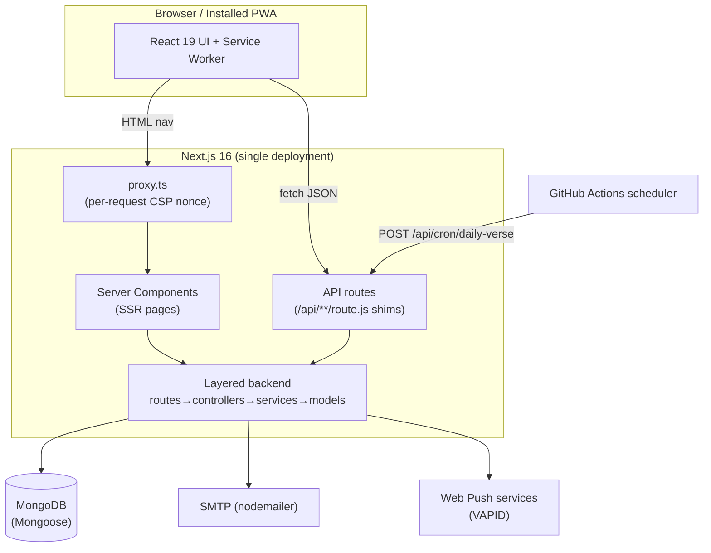
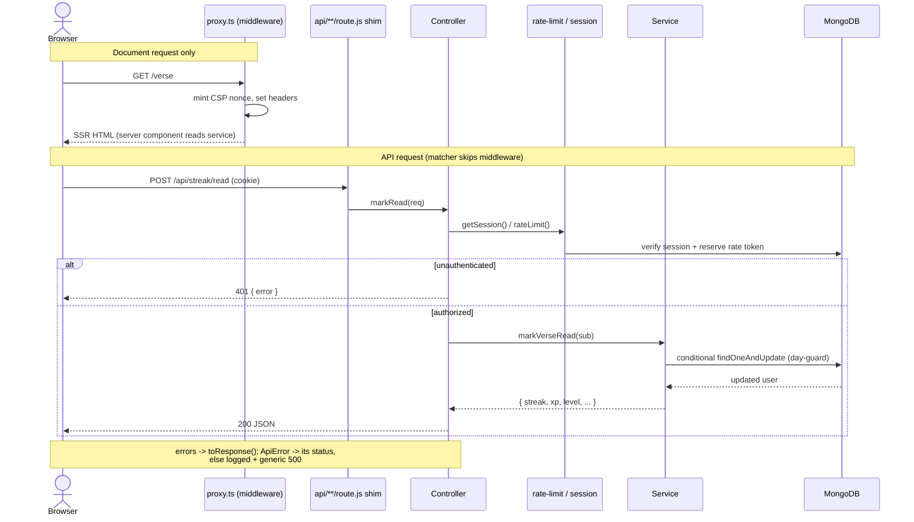
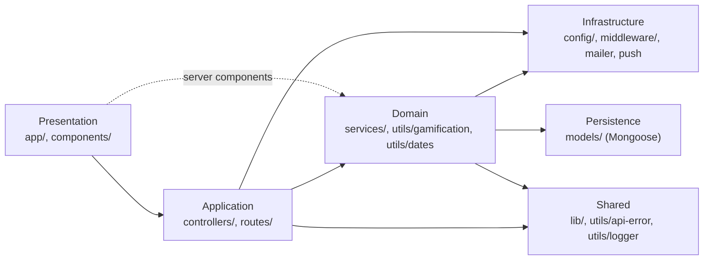
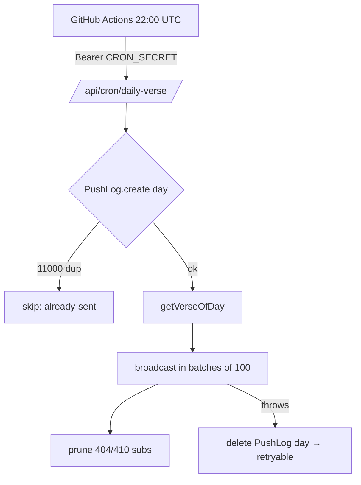
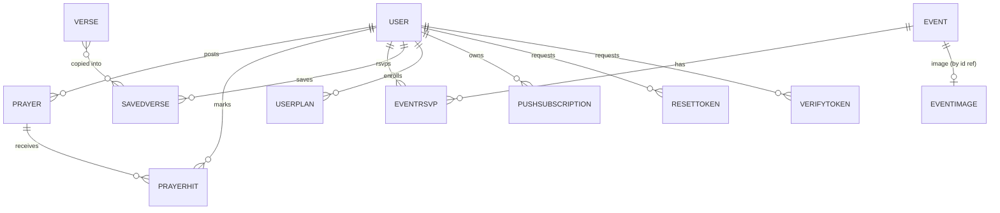
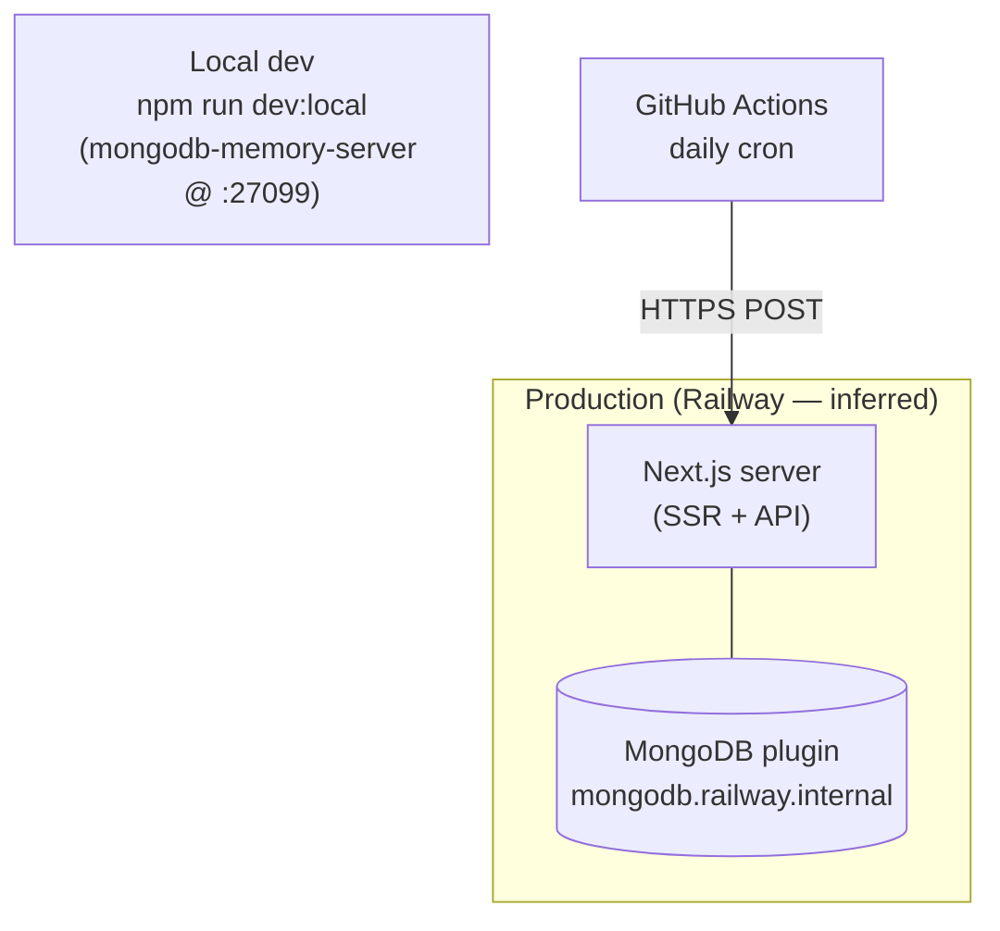

# CYA Daily Verse — Architecture

Canonical engineering reference for the CYA Daily Verse platform. Companion to
[`FEATURES.md`](./FEATURES.md) (product experience in plain language); this document covers how the
system is built and why.

> **Conventions**
> - **Fact** — read directly from source in this repository.
> - **Inferred** — reasoned from the code but not explicitly stated; flagged inline.
> - `> TBC` — *To be confirmed*: cannot be determined from the repository.

---

## Table of Contents

1. [Architecture Overview](#architecture-overview)
2. [System Architecture](#system-architecture)
3. [Frontend Architecture](#frontend-architecture)
4. [Backend Architecture](#backend-architecture)
5. [Database Architecture](#database-architecture)
6. [Authentication & Authorization](#authentication--authorization)
7. [External Services & Integrations](#external-services--integrations)
8. [Deployment Architecture](#deployment-architecture)
9. [Project File Structure](#project-file-structure)
10. [Design Decisions & Trade-offs](#design-decisions--trade-offs)
11. [Future Improvements](#future-improvements)
12. [Appendix](#appendix)

---

## Architecture Overview

**Summary.** CYA Daily Verse is a Progressive Web App and daily-devotional platform for the
*Christ's Youth in Action* youth ministry. It serves a rotating daily Bible verse, devotionals,
reading plans, a moderated prayer wall, community events, gamified reading streaks, and opt-in web
push reminders. A single Next.js deployment serves both the rendered UI and the JSON API.

**Core domain.** Faith-habit formation, optimized for daily return: *verse of the day → mark read →
streak/XP → community (prayer, events)*. Domain nouns: *Verse, User, Streak/XP, Prayer, Event,
Devotion, Reading Plan, Push Subscription*.

**Architectural style — Layered Modular Monolith on the Next.js App Router.**

| Trait | Evidence |
|---|---|
| **Monolith** | One Next.js process serves UI + API; no custom HTTP server, so Next keeps static optimization. |
| **Layered** | Strict `route → controller → service → model` chain under `src/server/`, an Express-style backend inside Next. |
| **Modular** | Each domain (auth, prayer, event, plan, verse, push…) owns its own route/controller/service/model quartet. |
| **Backend-for-frontend (BFF)** | The API serves only this app's UI; no public API contract or versioning. |

**Why this style.** Small team, cohesive domain. A monolith removes cross-service network cost and
deployment complexity. Internal layering keeps the monolith testable and provides a clean seam
(`src/app/api/**/route.js` shims) between Next's routing and framework-agnostic backend code — the
backend could be lifted onto Express with minimal change because controllers already take a `Request`
and return a `NextResponse`.

### System flow (major components)



### Technology stack (from `package.json`)

| Layer | Choice | Version |
|---|---|---|
| Language | TypeScript (strict) frontend + JavaScript backend (`.js` + JSDoc) | TS ^5 |
| Runtime | Node.js | 20.x target (`@types/node ^20`) |
| Framework | Next.js App Router, Turbopack | 16.2.10 |
| UI | React / React DOM | 19.2.4 |
| Styling | Tailwind CSS v4 + CSS-variable design tokens | ^4 |
| Motion | Framer Motion | ^12 |
| 3D | React Three Fiber + drei + three | fiber ^9, three ^0.182 |
| Icons | lucide-react | ^1.24 |
| Fonts | Manrope (UI), Lora (scripture) via `next/font` | — |
| Database / ODM | MongoDB via Mongoose | ^9.8 |
| Auth | bcryptjs ^3 (hashing) + jose ^6 (JWT session cookies) | — |
| Email | nodemailer ^9 (SMTP) | — |
| Push | web-push ^3.6 (VAPID) | — |
| Local DB | mongodb-memory-server ^11 (dev + tests) | — |
| Lint / Test | ESLint ^9 · `node:test` with `--experimental-strip-types` | — |
| CI (jobs) | GitHub Actions (daily push cron) | — |
| Hosting | Railway (**inferred** from `.env` + README) | — |

- **Caching:** Next `unstable_cache` (verse of day, community stats) + HTTP `Cache-Control` on images. No Redis.
- **Queues:** none. Fan-out done in-process with bounded batches.
- **Monitoring / Logging:** `console`-based structured logger (`server/utils/logger.js`). External APM `> TBC`.
- **CI/CD (build & deploy):** `> TBC` — no build/deploy workflow in `.github/`; Railway push-to-deploy inferred, not proven in-repo.

---

## System Architecture

### Major components & responsibilities

| Component | Location | Responsibility | Notable behavior / failure mode |
|---|---|---|---|
| **Edge middleware** | `proxy.ts` | Mint per-request CSP nonce for document requests | Additive; on error the request still flows. Static headers set in `next.config.ts`. |
| **App Router pages** | `app/(site)`, `app/(admin)` | Server-render pages on demand (read live data + session cookie) | Only metadata routes prerender static |
| **API shims** | `app/api/**/route.js` | Bind HTTP method → handler | One-line re-export from `server/routes` |
| **Backend boot** | `server/server.js` | Idempotent warmup: assert env, open Mongo | Missing env throws pointing at `.env.example`; `status()` variant powers `/api/health` |
| **DB connection** | `server/config/db.js` | Cached global Mongoose connection | `bufferCommands:false` + 5s selection timeout (fail fast); clears cached promise on failure to retry |
| **Session** | `server/middleware/session.js` | Issue/read/clear `cya-session` JWT | `tv` (tokenVersion) re-checked per read; fail-open reads, `{strict:true}` fail-closed writes |
| **Admin gate** | `server/middleware/require-admin.js` | Single `assertAdmin()` gate | Passes on valid admin-portal session **or** signed-in `role:"admin"` user |
| **Rate limiter** | `server/middleware/rate-limit.js` | Distributed fixed-window limiter | Atomic `$inc` upsert on Mongo `RateBucket`; in-memory fallback if Mongo down |
| **Domain services** | `server/services/*` | Business rules + persistence | See [Backend Architecture](#backend-architecture) |
| **Image handling** | `image.controller.js` + `event-image` model | Store/serve event pubmats | Buffer in Mongo; content-type allowlist (`jpeg/png/webp`); immutable 1-year cache |

### Data flow (frontend ↔ backend ↔ DB ↔ external)

Two entry shapes: **document requests** (server-rendered pages, through `proxy.ts`) and **API
requests** (`/api/**` JSON, which the middleware matcher excludes).



**Pipeline:** request → (docs) CSP nonce → controller → auth (`getSession`/`assertAdmin`) → rate
limit → validation (in service) → business logic → Mongoose persistence → `NextResponse` JSON. Errors
funnel through `toResponse()`.

### Communication patterns

- **UI → backend:** HTTP. Server Components call services in-process; Client Components `fetch` the JSON API.
- **Backend → external:** direct client calls (Mongoose, nodemailer SMTP, web-push VAPID). No message bus.
- **Scheduler → backend:** GitHub Actions HTTPS `POST` with a `CRON_SECRET` bearer.
- **Backend → browser (push):** Web Push protocol, server-initiated.
- **No** GraphQL, gRPC, or WebSockets.

### Application layers



| Layer | Location | Allowed to call |
|---|---|---|
| Presentation | `app/`, `components/` | `lib`; services **only** via server components |
| Application (HTTP) | `server/routes`, `server/controllers` | services, middleware, `utils/api-error` |
| Domain | `server/services`, `utils/gamification`, `utils/dates` | models, config, shared utils |
| Infrastructure | `server/config`, `server/middleware` | models, external clients |
| Persistence | `server/models` | mongoose only |
| Shared | `lib/`, `utils/api-error`, `utils/logger` | nothing upward |

**Rule:** dependencies point downward only. The `"server-only"` import marker prevents Presentation
from pulling server layers into the client bundle.

---

## Frontend Architecture

- **Framework:** Next.js 16 App Router, React 19, TypeScript (strict). **Server Components by
  default**; Client Components are opt-in islands marked `"use client"`.
- **Rendering model:** pages server-render on demand and read live data + the session cookie directly
  in Server Components; interactive widgets (forms, prayer wall, admin dashboards) hydrate as client
  islands. Only metadata routes (`manifest`, `robots`, `sitemap`, `opengraph-image`) prerender static.

### Application structure

- **Route groups.** `(site)` = public + member pages; `(admin)` = admin portal + dashboards. Groups
  share a segment layout without adding a URL prefix.
- **Component organization.** Feature-grouped folders (`nav/`, `motion/`, `three/`, `pwa/`, `home/`)
  plus shared primitives at the `components/` root (`ui.tsx`, `verse-card.tsx`, `toast.tsx`).
- **Page/client split.** A server `page.tsx` fetches data and renders shell + a sibling
  `*-client.tsx` island for interactivity (e.g. `prayer/page.tsx` + `prayer-client.tsx`).

### State management

- **No global store** (no Redux/Zustand/Context providers). State is deliberately local:
  - **Server state** lives on the server and arrives as props from Server Components.
  - **Client widget state** uses local `useState`.
  - **Cross-cutting client state** is read from the platform via `useSyncExternalStore` hooks in
    `lib/hooks.ts` — `useMediaQuery`, `useScrolled`, `useDarkMode` (reads the `<html>` class set
    pre-paint), `usePushSupported`, `useNow`, and `useRecentList` (localStorage-backed, tab-synced).
  - **Design choice:** SSR snapshots return `false`/`null` so markup matches the first client paint,
    avoiding hydration mismatch.

### Routing

- File-system routing via the App Router. Dynamic segments (`devotion/[slug]`, `events/[id]/rsvp`,
  `images/[id]`) and route groups for layout scoping. Client navigation is standard `next/link`;
  document navigations pass through `proxy.ts`.

### API communication layer

- Client Components call the JSON API directly with the native `fetch` (no axios/react-query). Requests
  are same-origin and cookie-authenticated (`connect-src 'self'`). Server Components skip HTTP and call
  services in-process.
- Static/shared client content (verse corpus, categories, challenge catalog) lives in `lib/data.ts`,
  which is bundled and client-safe.

### UI / design system

- **Tailwind CSS v4** with **CSS-variable design tokens** defined in `globals.css` (see
  [`DESIGN.md`](./DESIGN.md)). Fonts loaded via `next/font` (Manrope UI, Lora scripture).
- **Motion system** in `components/motion/` + `lib/motion.ts`: reusable `Reveal`, `Stagger`,
  `Magnetic`, `Tilt3D`, `Parallax`, `Counter`, `TextReveal` primitives built on Framer Motion. Every
  primitive **honors `prefers-reduced-motion`** (renders static content) and pointer-driven effects
  are mouse-only, never required to operate a control.
- **3D:** an optional React Three Fiber light scene (`components/three/`).
- **Accessibility:** `useDialog` traps focus, closes on Escape, and restores focus to the trigger.

### Error handling & performance (frontend)

- **Error boundaries:** `app/error.tsx` (segment errors) and `app/not-found.tsx` (404).
- **PWA/offline:** service worker (`public/sw.js`) + `public/offline.html` fallback; install prompt
  and push-notify toggle under `components/pwa/`.
- **Performance:** RSC keeps JS payloads small; images use the Next optimizer (WebP/AVIF, 1-year
  cache); motion uses `will-change`/transforms and springs; `useSyncExternalStore` avoids
  setState-in-effect churn; localStorage caches snapshots for referential stability.

### Frontend folder structure (actual)

```
src/
├── app/                         # App Router: pages + API shims
│   ├── (site)/                  # public + member pages (route group)
│   ├── (admin)/                 # admin portal + dashboards (route group)
│   ├── api/**/route.js          # thin re-export shims -> src/server/routes
│   ├── layout.tsx               # root layout, fonts, theme script, metadata
│   ├── globals.css              # Tailwind v4 + design tokens (CSS vars)
│   └── error.tsx / not-found.tsx
├── components/                  # React UI (server + client islands)
│   ├── motion/ three/ nav/ pwa/ home/   # feature-grouped UI
│   └── ui.tsx verse-card.tsx toast.tsx  # shared primitives
├── lib/                         # client-safe: data, types, hooks, motion, cx
├── data/verses.json             # bundled 300-verse seed corpus
└── proxy.ts                     # Next middleware — per-request CSP nonce
```

> Note: there is no separate `frontend/` root — frontend and backend share the Next.js `src/` tree,
> isolated by the `"server-only"` marker rather than by directory.

---

## Backend Architecture

- **Runtime/framework:** Node 20 inside the Next.js process. Backend code is plain JavaScript with
  JSDoc, framework-agnostic (takes `Request`, returns `NextResponse`).
- **API architecture:** REST-ish JSON over Next Route Handlers. Every `app/api/**/route.js` is a
  one-line re-export from `server/routes`, decoupling HTTP binding from handler logic.

### Business logic organization & module boundaries

Strict downward chain per domain:

```
route (name→handler map) → controller (HTTP I/O) → service (rules + persistence) → model (schema)
```

| Directory | Owns | May depend on | Must NOT depend on |
|---|---|---|---|
| `app/api/**` | HTTP method → handler binding only | `server/routes` | anything else (shims are one-liners) |
| `server/controllers` | HTTP I/O, auth gate, rate limit, error mapping | `server/services`, `middleware`, `utils` | Mongoose models directly |
| `server/services` | Business rules, validation, DB access | `models`, `config`, `utils`, `lib/data` | `next/server` response objects |
| `server/models` | Schema + indexes | mongoose only | services / controllers |

The `"server-only"` import at the top of backend modules enforces client isolation at build time.

### Representative domain services

| Service | Responsibility | Notable behavior / failure mode |
|---|---|---|
| `verse.service` | Verse of day, archive, search | Deterministic rotation `dayNumber % count`; DB-down → bundled `verses.json`; self-heals corpus via `ensureSynced()` upsert |
| `user.service` | Stats, `markVerseRead`, `claimChallenge`, roles | Once-per-day streak award via conditional write filter; DB-down still returns session identity so UI stays logged in |
| `auth.service` | Register/login | bcrypt(10); input length validation; 409 on duplicate email |
| `push.service` | Subscribe/unsubscribe/broadcast/daily send | Bounded 100-concurrency batches; prunes 404/410 subs; daily send idempotent via unique `PushLog` day row |
| `stats.service` | Community totals | `unstable_cache`d aggregation; errors fall back to zeros, never cached |
| `email-verification` / `password-reset` | Token issue + consume | Hashed tokens with TTL; non-blocking send |

### Middleware

- **`session.js`** — issue/read/clear `cya-session` JWT; `tokenVersion` revocation; fail-open reads,
  fail-closed strict writes.
- **`require-admin.js`** — `assertAdmin()` dual path (portal session or `role:admin`).
- **`rate-limit.js`** — Mongo-backed distributed fixed-window; in-memory degraded fallback;
  spoof-resistant client-IP derivation counted from the right by `TRUSTED_PROXY_HOPS`.

### Validation

In services, before any DB call: length clamps, regex email, `ObjectId` checks, `.slice()` caps on
input arrays/strings. Rewards/authority (XP, ids) are read from server catalogs, never trusted from
the client.

### Error handling

- Services throw `ApiError(status, message)` with user-safe text; controllers `try/catch` and call
  `toResponse()`.
- Unexpected errors are logged via `logError("api.unhandled", err)` and returned as a generic 500 —
  internal detail never reaches the client.

### Logging

Structured `console` logger (`server/utils/logger.js`) with a label + context object. No external log
sink in-repo (`> TBC`).

### Background jobs / queues

- **Scheduler:** external GitHub Actions cron (`0 22 * * *` UTC = 06:00 Manila) POSTs
  `/api/cron/daily-verse` with the `CRON_SECRET` bearer.
- **Worker:** in-process `push.service.broadcast` — sequential batches of 100 concurrent sends.
- **Idempotency:** unique `PushLog.day` row claimed *before* sending; overlap short-circuits with
  `already-sent`; on broadcast failure the claim is released so a later retry succeeds.
- **No queue / DLQ.** Permanently-gone subscriptions (404/410) are pruned; other errors logged.



### Backend folder structure (actual)

```
src/server/
├── config/          # db.js, env.js, mailer.js
├── routes/          # name -> controller-handler mapping (*.routes.js)
├── controllers/     # HTTP concerns: parse, rate-limit, session, respond (*.controller.js)
├── services/        # business logic + persistence (*.service.js)
├── models/          # Mongoose schemas (*.model.js)
├── middleware/      # session.js, rate-limit.js, require-admin.js
├── utils/           # dates, gamification, api-error, logger, admin-session
└── server.js        # boot(): env assert + DB warmup
```

> Mapping to the conventional layout: `routes` + `controllers` = the application/HTTP layer;
> `services` carry business logic **and** data access (no separate `repositories/` — services call
> Mongoose models directly, an intentional simplification for this app's scale). `tests/` lives at the
> repo root, not under `src/server`.

---

## Database Architecture

- **Engine:** MongoDB. **Access:** Mongoose ODM (no query builder / raw SQL). **Schemas:** one file
  per collection in `server/models`. Reads use `.lean()` to skip hydration cost.

### Entity relationships



### Data model overview

| Concept | Type | Notes |
|---|---|---|
| `User` | Aggregate root | Owns streak, xp, totalReads, `challengeDates`, role, `tokenVersion` |
| `Verse` | Read-mostly reference | Seeded corpus; text index for search |
| `Prayer` | Entity | `status: approved\|hidden`, `prayedCount` |
| `PrayerHit` | Association | Unique per prayer+user — "I prayed" once |
| `Event` / `EventRsvp` | Entity / Association | `published`, `rsvpCount`; RSVP unique per event+user |
| `EventImage` | Value/blob | Buffer pubmat |
| `Devotion` | Entity | `slug` unique, `published` |
| `UserPlan` | Entity | Unique per user+plan; `completedDays[]`, `active` |
| `SavedVerse` | Entity | Unique per user+reference |
| `PushSubscription` / `PushLog` | Entity / Idempotency | Unique `endpoint`; unique `day` = daily-send lock |
| `ResetToken` / `VerifyToken` | Value (hashed, TTL) | Single-use via `usedAt` |
| `RateBucket` | Infra record (TTL) | Fixed-window counter |

### Key indexes & constraints (fact)

| Collection | Index / constraint | Purpose |
|---|---|---|
| `users` | `email` unique | one account per address |
| `verses` | text `{reference:10, text:5}`; `{topic:1}` | search + topic filter |
| `prayers` | `{status:1, createdAt:-1}` | wall query+sort in one scan |
| `prayerhits` | `{prayerId, userId}` unique | one pray per user |
| `events` | `{published:1, date:1}` | published upcoming list |
| `eventrsvps` | `{eventId, userId}` unique | one RSVP per user |
| `userplans` | `{userId, planSlug}` unique | one enrollment per plan |
| `savedverses` | `{userId, reference}` unique | no duplicate saves |
| `pushsubscriptions` | `endpoint` unique | dedupe device |
| `pushlogs` | `day` unique | daily-send idempotency lock |
| `reset/verifytokens` | `tokenHash` unique; `expiresAt` TTL | single-use, auto-expire |
| `ratebuckets` | `expiresAt` TTL | auto-clean windows |

### Migration, transactions, backup

- **Migration:** schemaless + **self-reconciling seed**. `verse.service.ensureSynced()` upserts the
  bundled corpus by reference on first request after deploy — no migration tool. Non-verse
  collections have no migration path yet (see [Future Improvements](#future-improvements)).
- **Transactions:** none. Correctness comes from **atomic single-document operations** — conditional
  `findOneAndUpdate` (streak day-guard, rate-limit `$inc`), unique-index inserts (PushLog, PrayerHit),
  and `$inc` counters. No multi-doc transaction boundaries.
- **Connection management:** single cached global connection; fail-fast timeouts; cached promise reset
  on failure.
- **Backup / recovery:** `> TBC` — depends on the Railway plan (replication, snapshots); not defined
  in-repo.

---

## Authentication & Authorization

### Authentication mechanism

- **Passwords:** bcrypt(10) hashing (`bcryptjs`).
- **Sessions:** stateless **JWT cookie** `cya-session` (HS256 via `jose`) — httpOnly, `sameSite=lax`,
  `secure` in prod, 30-day. No server-side session store.
- **Email verification:** hashed, TTL, single-use tokens; `emailVerified` gate for participation.

### Session / token strategy & revocation

- The JWT carries `tv` (**tokenVersion**); every read re-checks it against the DB. Bumping
  `tokenVersion` (e.g. on password reset) invalidates all stale sessions — revocation without a
  session table.
- **Failure policy:** DB outage during the revocation lookup **fails open** for reads (keeps the user
  signed in), but callers pass `{ strict:true }` to **fail closed** on sensitive writes.

### User identity flow

```
register → hash+store → email verify token → verify → login (bcrypt compare) → mint JWT cookie
→ per-request getSession() re-checks tokenVersion → logout / password-reset bumps tokenVersion
```

### Authorization model

- Session presence gates member actions; `emailVerified` gates posting/participation.
- **Admin:** dual path via `assertAdmin()` — a valid **admin-portal** cookie (`cya-admin`, 8-hour,
  minted by a shared passphrase with timing-safe compare) **or** a signed-in user with `role:"admin"`.
  Users cannot strip their own admin role.

### Security considerations

- **Secrets:** env vars only; `assertEnv()` fails boot if required ones are missing; timing-safe
  compares for `CRON_SECRET` and the admin passphrase.
- **Transport:** HSTS (2-year, includeSubDomains), `upgrade-insecure-requests`.
- **CSP:** per-request nonce + `strict-dynamic` (no `script-unsafe-inline`); `object-src none`,
  `frame-ancestors none`, `base-uri self`, `form-action self`. Style keeps `unsafe-inline` (font /
  Tailwind injected `<style>`; documented weaker risk).
- **CSRF:** `sameSite=lax` cookies + same-origin `form-action`. No explicit anti-CSRF token on
  state-changing POSTs — relies on SameSite (`> TBC` whether to harden).
- **XSS/Injection:** React escaping + strict CSP; served image content-type clamped to an allowlist;
  Mongoose typed queries; user regex input escaped before search.
- **API protection:** distributed fixed-window rate limiting; spoof-resistant client-IP derivation.

**Rate limits (fact):**

| Endpoint | Limit / window |
|---|---|
| `auth:register` | 5 / 60 min |
| `auth:login` | 10 / 15 min |
| `auth:forgot` | 3 / 15 min |
| `auth:reset`, `auth:verify` | 10 / 15 min |
| `auth:verify-resend` | 3 / 15 min |
| `admin:image` | 30 / 10 min |

> `> TBC` — whether non-auth write endpoints (prayer post, RSVP, enroll) are rate-limited; not
> observed in the files reviewed. No dedicated audit trail for admin actions found.

---

## External Services & Integrations

| Integration | Purpose | Integration method / auth | Data exchanged | Failure handling |
|---|---|---|---|---|
| **MongoDB** | Primary datastore | Mongoose driver, `MONGO_URL` | All domain data | Fail-fast (5s selection), clear cached promise, retry next call; seed fallback for verses, degraded in-memory rate limit |
| **SMTP (nodemailer)** | Verify + reset email | SMTP creds `SMTP_USER/PASS` | Email address + token link | Fire-and-forget with own error boundary; SMTP timeouts set; **feature silently disabled if unset** |
| **Web Push (VAPID)** | Daily reminders | `web-push`, VAPID key pair | Push subscription endpoint + verse payload | 404/410 → prune sub; other errors logged; bounded 100-batch; **feature disabled if keys unset** |
| **GitHub Actions** | Daily push scheduler | HTTPS POST, `CRON_SECRET` bearer + `SITE_URL` secret | Trigger only | Job fails on non-200; `workflow_dispatch` manual retry; 06:00 Manila cron |
| **Railway (host)** | Runtime + managed Mongo (**inferred**) | Platform | — | — |

- **Payment / SMS / object storage / third-party monitoring:** none. Images are stored in Mongo, not
  an object store.

---

## Deployment Architecture



**Deployment flow**

```
Developer → GitHub repo → (push) → Railway build (next build) → seed/ensureSynced → Production (SSR + API)
                         └→ GitHub Actions (daily-verse-push.yml, scheduled cron) → POST /api/cron/daily-verse
```

- **Hosting:** single Next.js instance + managed MongoDB on Railway (**inferred** from `.env` comments
  and `NEXT_PUBLIC_SITE_URL`). No Docker/K8s files in repo — no containerization layer committed.
- **Environments:** local (`dev:local` disposable Mongo, seeds verses, runs `next dev`) and
  production. **No staging** defined in-repo (`> TBC`).
- **Configuration:** env vars documented in `.env.example`. Required (boot-blocking): `MONGO_URL`,
  `AUTH_SECRET`, `NEXT_PUBLIC_SITE_URL`. Optional feature toggles by presence: `VAPID_*`, `SMTP_*`,
  `CRON_SECRET`, `ADMIN_PORTAL_PASSWORD`, `TRUSTED_PROXY_HOPS`.
- **CI/CD pipeline:** GitHub Actions runs only the daily cron. A **build/deploy/rollback workflow is
  not committed** (`> TBC`); Railway push-to-deploy is inferred. Rollback would be a platform redeploy
  of a prior commit.
- **Build stages:** `lint` (eslint) → `type check` (`tsc --noEmit`) → `test` (`node:test`, in-memory
  Mongo) → `build` (`next build`, Turbopack) → `start`.
- **Scaling:** horizontal-capable — the app is stateless (self-contained JWT sessions); rate-limit and
  daily-send lock are Mongo-shared, so instances coordinate. `unstable_cache` is per-instance, so
  community stats/verse-of-day may differ briefly until each revalidates (acceptable staleness). Mongo
  is the primary vertical dependency.
- **Observability:** `/api/health` (`status()` — env + DB reachability, `force-dynamic`) + console
  logs. Metrics / tracing / alerting / probes not in repo (`> TBC`; likely relies on Railway
  defaults).

---

## Project File Structure

```
project-root/
├── src/
│   ├── app/                 # Next.js App Router: pages + API route shims
│   ├── components/          # React UI (server + client islands)
│   ├── lib/                 # client-safe shared code (data, types, hooks, motion)
│   ├── data/                # bundled verse corpus (verses.json)
│   ├── server/              # backend (server-only): config, routes, controllers,
│   │                        #   services, models, middleware, utils
│   └── proxy.ts             # Next middleware — per-request CSP nonce
├── scripts/                 # dev-local, seed, purge-seed, fetch-verses, create-member
├── tests/                   # node:test suites (unit + in-memory integration)
├── public/                  # static assets, service worker, offline page, media
├── docs/                    # ARCHITECTURE, DESIGN, API, DATABASE, DEPLOYMENT, SECURITY,
│                            #   TESTING, FEATURES, ROADMAP, CHANGELOG
├── .github/workflows/       # daily-verse-push.yml (scheduled cron)
├── next.config.ts           # static security headers, image optimizer, transpilePackages
├── eslint.config.mjs        # lint rules
├── package.json
└── README.md
```

| Directory | Responsibility |
|---|---|
| `src/app` | Routing, page composition, API shims, root layout, global styles |
| `src/components` | Presentational + interactive UI, feature-grouped |
| `src/lib` | Client-safe shared code; must not import `server/**` |
| `src/data` | Bundled static content (verse corpus / seed source + DB-down fallback) |
| `src/server` | All backend logic, isolated by `"server-only"` |
| `scripts` | Operational Node scripts (seed, corpus fetch, member creation) |
| `tests` | Automated test suites (unit + integration) |
| `public` | Static assets served as-is, incl. PWA service worker + media |
| `docs` | Engineering + product documentation |
| `.github/workflows` | CI/scheduled automation |

> There are no top-level `frontend/`, `backend/`, `database/`, `infrastructure/`, or `docker/`
> directories — this is a **single Next.js repo**, not a polyrepo/monorepo split. Frontend and backend
> co-locate under `src/`, separated by the `"server-only"` boundary. The conventional split is called
> out here for readers coming from a multi-service template.

---

## Design Decisions & Trade-offs

### Decision: Monolith on Next.js (no custom HTTP server)

- **Context.** Small team, one client, cohesive domain; need UI + API delivered together.
- **Decision.** Serve UI and JSON API from a single Next.js App Router deployment.
- **Reasoning.** No custom server keeps Next's static optimization; removes cross-service network cost
  and multi-deploy ops.
- **Trade-offs.** ✅ Simple deploy, shared types-in-repo, fast local dev. ❌ Backend coupled to the
  Next runtime; scaling is all-or-nothing per instance.
- **Alternatives considered.** Standalone Express API + separate SPA (rejected: more infra for no
  present benefit).

### Decision: Layered `route → controller → service → model` inside Next

- **Context.** Route handlers tend to accumulate logic and become untestable.
- **Decision.** Enforce an Express-style layered backend under `src/server/`, with `app/api/**` as
  one-line shims.
- **Reasoning.** Keeps handlers thin, business logic unit-testable, and the backend framework-agnostic
  (controllers take `Request`, return `NextResponse`) — liftable onto Express later.
- **Trade-offs.** ✅ Testable, clear seams, portable. ❌ More files per feature.
- **Alternatives considered.** Logic directly in route handlers (rejected: poor testability).

### Decision: JWT cookie sessions + tokenVersion revocation

- **Context.** Need auth without operating a session store, yet still be able to revoke.
- **Decision.** Stateless HS256 JWT cookie carrying `tokenVersion`, re-checked per request; bump to
  revoke.
- **Reasoning.** Stateless scaling with a revocation escape hatch.
- **Trade-offs.** ✅ No session table, horizontal-friendly. ❌ One DB read per authed request.
- **Alternatives considered.** Server-side session table (rejected: extra store + statefulness).

### Decision: MongoDB + Mongoose, single-document atomicity (no transactions)

- **Context.** Flexible document domain; need correctness under concurrency without transaction
  complexity.
- **Decision.** Model invariants as single-document atomic ops — conditional `findOneAndUpdate`,
  unique-index inserts, `$inc` counters.
- **Reasoning.** Plays to Mongo's strengths; avoids multi-doc transaction overhead the domain doesn't
  require.
- **Trade-offs.** ✅ Simple, race-free for per-doc invariants (streak day-guard, one-pray, daily-send
  lock). ❌ No multi-document invariants; correctness must fit a single document.
- **Alternatives considered.** Relational DB with ACID transactions; Mongo multi-doc transactions
  (rejected: unnecessary at scale).

### Decision: Deterministic verse-of-day + self-reconciling seed

- **Context.** Need a reproducible daily verse and a way to ship corpus edits without a migration
  tool.
- **Decision.** `dayNumber % corpusCount` rotation (Manila-dated); `ensureSynced()` upserts the
  bundled `verses.json` on first request after deploy.
- **Reasoning.** No history table, archive reproducible, corpus edits ship with the deploy.
- **Trade-offs.** ✅ Zero migration overhead, deterministic archive. ❌ Reordering/removing verses
  retroactively shifts the historical mapping; first request after deploy pays the upsert cost.
- **Alternatives considered.** Store daily assignments in a table; a formal migration framework.

### Decision: Per-request CSP nonce in middleware

- **Context.** Want a strict CSP without `script-unsafe-inline`.
- **Decision.** `proxy.ts` mints a nonce per document request; `script-src` uses `'nonce-…'
  'strict-dynamic'`.
- **Trade-offs.** ✅ Materially stronger XSS posture. ❌ Middleware runs on every document request.
- **Alternatives considered.** Static CSP with `unsafe-inline` (rejected: weaker).

### Decision: External GitHub Actions cron + feature-by-env toggles

- **Context.** No always-on scheduler process; optional integrations (push, email) shouldn't be hard
  requirements.
- **Decision.** GitHub Actions POSTs the daily-send endpoint; each optional feature disables itself
  when its env is unset.
- **Trade-offs.** ✅ No scheduler infra; graceful degradation. ❌ Depends on GitHub availability;
  silent disable can surprise operators.
- **Alternatives considered.** In-app interval / platform cron; explicit feature-flag config.

---

## Future Improvements

### Known limitations & technical debt

- **Mixed JS/TS backend** — `server/**` is JavaScript + JSDoc while the UI is strict TS; no
  compile-time types across the API boundary.
- **No formal migrations** — non-verse schema/data changes have no migration path.
- **`unstable_cache`** — a Next-unstable API surface; may change across majors.
- **Per-request tokenVersion DB read** — auth cost scales with authed traffic; no short-lived cache.
- **Verse-of-day coupling to lexical order** — reordering the corpus rewrites the historical archive
  mapping (`> TBC` if acceptable product-wise).
- **No admin audit log**; **rate-limit coverage gaps** on some write endpoints (`> TBC`).
- **Minimal observability** — console logging only; no metrics/tracing/alerting in repo.

### Planned evolution

**High priority**
- Add metrics + alerting (error rate, DB latency, push success); wire `/api/health` to a probe.
- Extend rate limiting to all state-changing endpoints; confirm/harden CSRF posture beyond SameSite.
- Document/verify production topology (host, backups, DR); commit a deploy/rollback workflow.

**Medium priority**
- Migrate `server/**` to TypeScript for end-to-end type safety across the API boundary.
- Introduce a lightweight migration mechanism for non-verse collections.
- Cache tokenVersion (short TTL) to cut per-request DB reads.

**Low priority**
- Replace `unstable_cache` with a stable caching abstraction as Next evolves.
- Add E2E and contract test suites to complement unit/integration coverage.
- Consider Redis if rate-limit/cache traffic outgrows Mongo comfort.

---

## Appendix

### Testing strategy

- **Runner:** built-in `node:test` with `--experimental-strip-types` (no Jest/Vitest).
- **Unit:** `dates`, `gamification`, `reading-plans`, `verse-rotation`, `verses`.
- **Integration:** `services.integration.test.mjs` runs auth + streak against **in-memory Mongo** —
  real persistence, no external DB.
- **E2E / contract / perf / security tests:** none in repo (`> TBC`). UI verification is manual via
  Playwright MCP per team convention.

### Coding standards

- Dependencies point downward; controllers never touch models; services never build `NextResponse`
  (throw `ApiError`).
- Backend modules start with `"server-only"`; `lib/` stays client-safe.
- Naming: kebab-case files; `*.controller.js` / `*.service.js` / `*.model.js` / `*.routes.js`;
  markdown docs ALL-CAPS.
- Validation lives in services; time always via `utils/dates` (Manila); never trust client XP/ids.

### Glossary & acronyms

| Term | Meaning |
|---|---|
| Verse of the Day | Deterministic verse chosen by `dayNumber % corpusCount`, Manila-dated |
| Streak / XP / Level | Consecutive read days; points (`25`/read); `floor(xp/250)+1` |
| Pubmat | Event promotional image (Mongo Buffer) |
| Self-reconciling seed | Startup upsert of the bundled corpus into Mongo |
| tokenVersion | Per-user counter enabling JWT session revocation |

CSP · Content-Security-Policy | PWA · Progressive Web App | VAPID · web push identification | ODM ·
Object-Document Mapper | BFF · Backend-for-Frontend | TTL · Time To Live | BSB · Berean Standard Bible.

### Useful commands

```bash
npm run dev:local     # local Mongo + seed + next dev
npm run build         # production build
npm run lint          # eslint
npx tsc --noEmit      # type check
npm test              # node:test suites (in-memory Mongo)
npm run seed          # load verses.json into DB
npm run verses:fetch  # regenerate verses.json corpus
npm run member:create # create an account from CLI
```

### Important configuration files

| File | Role |
|---|---|
| `next.config.ts` | Static security headers, image optimizer, `transpilePackages` |
| `proxy.ts` | Per-request CSP nonce middleware |
| `.env.example` | Canonical env var documentation |
| `server/config/env.js` | Boot-time required-env assertion |
| `tsconfig.json` | Strict TS + `@/*` path alias |
| `.github/workflows/daily-verse-push.yml` | Daily push scheduler |

### Diagram index

- **System flow / context** — [Architecture Overview](#architecture-overview)
- **Request lifecycle (sequence)** — [System Architecture](#system-architecture)
- **Application layers** — [System Architecture](#system-architecture)
- **Background job flow** — [Backend Architecture](#backend-architecture)
- **Entity relationships** — [Database Architecture](#database-architecture)
- **Deployment** — [Deployment Architecture](#deployment-architecture)
