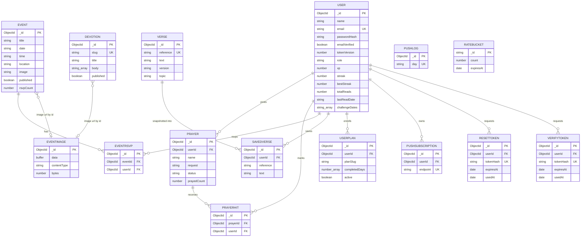

# Database Documentation

Data layer reference for **CYA Daily Verse** — a MongoDB document store accessed
through Mongoose models in [`src/server/models/`](../src/server/models/).
Correctness is enforced by unique indexes and atomic single-document writes, not
multi-document transactions. See [`ARCHITECTURE.md`](./ARCHITECTURE.md)
(Database Architecture) for rationale.

## Table of Contents

1. [Database Overview](#1-database-overview)
2. [Database Architecture](#2-database-architecture)
3. [Entity Relationship Diagram](#3-entity-relationship-diagram-erd)
4. [Database Tables](#4-database-tables)
5. [Table Relationships](#5-table-relationships)
6. [Index Strategy](#6-index-strategy)
7. [Database Constraints](#7-database-constraints)
8. [Migration Strategy](#8-migration-strategy)
9. [Database Seeding](#9-database-seeding)
10. [Backup and Recovery Strategy](#10-backup-and-recovery-strategy)
11. [Database Security](#11-database-security)
12. [Performance Optimization](#12-performance-optimization)
13. [Database Monitoring](#13-database-monitoring)
14. [Future Improvements](#14-future-improvements)

---

# 1. Database Overview

| Aspect | Value |
|---|---|
| **Database** | MongoDB (document store) |
| **Driver / ODM** | Mongoose `^9.8.0` |
| **Migration tool** | None (schemaless; app-level reconciliation — see §8) |
| **Provider** | Railway MongoDB plugin (per `.env.example`) |
| **Connection** | Single pooled connection cached on `global._mongoose` |
| **Version** | Not pinned in code. **TODO:** confirm the deployed MongoDB server version. |

**Purpose.** The database backs every stateful feature of the app:

- User accounts, authentication material, and gamification state (XP, streaks).
- The verse corpus (reference data) and users' saved verses.
- The moderated prayer wall and per-user "prayed" records.
- Events, per-user RSVPs, and uploaded event artwork (binary).
- Devotionals (authored content).
- Reading-plan enrollment and progress.
- Web-push subscriptions and daily-send idempotency.
- Single-use auth tokens (password reset, email verification).
- Distributed rate-limit counters.

**How the app communicates with the database.** Next.js Route Handlers →
controllers → **services** (the only layer that touches Mongoose) → models. A
single cached connection is opened lazily by `dbConnect()`
([`config/db.js`](../src/server/config/db.js)) with
`bufferCommands: false` and a 5s server-selection timeout, so a DB outage fails
fast rather than hanging requests.

```js
// config/db.js — connection cached across hot reloads and invocations
cached.promise ??= mongoose.connect(url, {
  bufferCommands: false,
  serverSelectionTimeoutMS: 5000,
});
```

---

# 2. Database Architecture

## Database Design Pattern

- **Document / NoSQL**, lightly normalized. Cross-collection references are
  stored as `ObjectId` (`ref` set for populate, though the app queries by id
  rather than populating).
- **Association collections** (`prayerhits`, `eventrsvps`) act as junction
  tables and are the **source of truth** for counts; denormalized counters
  (`prayedCount`, `rsvpCount`) are optimizations kept in sync by atomic `$inc`.
- **No multi-document transactions.** Every invariant is expressed as a single
  atomic write or a unique-index conflict, so correctness holds on a standalone
  server without replica-set transactions.

## Naming Convention

```
Collections:  Mongoose default — lowercased, pluralized model name
              (User → users, EventRsvp → eventrsvps, PushLog → pushlogs)
Fields:       camelCase (userId, prayedCount, lastReadDate)
Primary key:  _id — ObjectId auto-generated, except RateBucket (_id is a String key)
Timestamps:   createdAt / updatedAt (Mongoose `timestamps: true`)
```

## Common Fields

| Field | Type | Purpose |
|---|---|---|
| `_id` | ObjectId | Primary identifier (auto). `RateBucket._id` is a composite `String`. |
| `createdAt` | Date | Creation time — added by `timestamps`. Also used as prayer-wall pagination cursor. |
| `updatedAt` | Date | Last-modified time — added by `timestamps`. |

> Collections **without** `timestamps`: `verses`, `resettokens`, `verifytokens`,
> `ratebuckets`. Token collections use an explicit `expiresAt` instead.

## Data Lifecycle Strategy

| Mechanism | Where | Behavior |
|---|---|---|
| **Soft delete** | `prayers.status = "hidden"` | Moderated out of the wall, never removed. |
| **Draft gating** | `published` (events, devotions) | Unpublished rows hidden from public reads. |
| **Hard delete** | events, devotions, saved verses, RSVP/pray toggles, account delete | Physically removed; deleting an event cascades to its RSVPs and orphaned image. |
| **TTL auto-expiry** | `resettokens`, `verifytokens`, `ratebuckets` | Mongo removes documents once `expiresAt` passes. |
| **Bounded array** | `users.challengeDates` | Trimmed to the last ~40 entries on write. |
| **Audit tracking** | None beyond `createdAt`/`updatedAt` | No dedicated audit log. **TODO** if required. |

---

# 3. Entity Relationship Diagram (ERD)



> **Relationships are application-enforced.** MongoDB does not enforce foreign
> keys; `ref` is metadata for `populate()`. `EVENTIMAGE`/`DEVOTION`↔image links
> are **string URL** references (`/api/images/<id>`), not `ObjectId` FKs, so they
> appear as loose associations above. `SAVEDVERSE` stores a **snapshot copy** of
> verse fields, not a live FK to `VERSE`.

---

# 4. Database Tables

All schemas live in [`src/server/models/`](../src/server/models/). Field
constraints below (`maxlength`, `min`, `enum`, `match`) are Mongoose-level
validators.

## Collection: users — `user.model.js`

**Purpose.** Registered accounts: identity, auth material, and gamification
state.

| Field | Type | Nullable | Default | Key | Description |
|---|---|---|---|---|---|
| `_id` | ObjectId | No | auto | PK | Identifier |
| `name` | String | No | — | | required, trim, max 60 |
| `email` | String | No | — | UNIQUE | required, lowercase, trim, max 120 |
| `passwordHash` | String | No | — | | bcrypt hash (cost 10) |
| `emailVerified` | Boolean | No | `false` | | gates prayer-wall posting |
| `tokenVersion` | Number | No | `0` | | bumped on password reset to revoke all JWTs |
| `role` | String | No | `member` | | enum: `member` \| `admin` |
| `xp` | Number | No | `0` | | experience points |
| `streak` | Number | No | `0` | | current consecutive-day streak |
| `bestStreak` | Number | No | `0` | | best streak reached |
| `totalReads` | Number | No | `0` | | lifetime read days; powers community totals |
| `lastReadDate` | String \| null | Yes | `null` | | Manila day key `YYYY-MM-DD`; once/day guard |
| `challengeDates` | String[] | No | `[]` | | `day:challengeTitle` keys, bounded ~40 |
| `createdAt` / `updatedAt` | Date | No | auto | | timestamps |

**Business rules.** Email unique + lowercased. Password ≥8 chars validated in
service before hashing. Read award and challenge claim are once-per-Manila-day,
enforced by conditional writes.

## Collection: verses — `verse.model.js`

**Purpose.** Read-mostly Scripture corpus. Seeded from
[`src/data/verses.json`](../src/data/verses.json) (**300 BSB verses**). No
`timestamps`.

| Field | Type | Nullable | Default | Key | Description |
|---|---|---|---|---|---|
| `_id` | ObjectId | No | auto | PK | Identifier |
| `reference` | String | No | — | UNIQUE | e.g. `Isaiah 40:31`; upsert identity |
| `text` | String | No | — | | verse text |
| `version` | String | No | `BSB` | | translation code |
| `topic` | String | No | — | | required; one of the category set |

**Business rules.** `reference` is the natural key for idempotent upserts.
Verse-of-day is a deterministic rotation (`dayNumber % count`), so no per-day
history row is stored.

## Collection: prayers — `prayer.model.js`

**Purpose.** Prayer-wall requests.

| Field | Type | Nullable | Default | Key | Description |
|---|---|---|---|---|---|
| `_id` | ObjectId | No | auto | PK | Identifier |
| `userId` | ObjectId | Yes | `null` | FK→users, indexed | author (stored even when anonymous) |
| `name` | String | No | `Anonymous` | | display name, trim, max 60 |
| `request` | String | No | — | | required, trim, **min 10, max 1000** |
| `status` | String | No | `approved` | | enum: `approved` \| `hidden` |
| `prayedCount` | Number | No | `0` | | denormalized, `min 0`, atomic `$inc` |
| `createdAt` / `updatedAt` | Date | No | auto | | `createdAt` doubles as wall cursor |

> **Correction vs. prior docs:** there is **no stored `tag` field**. The `"New"`
> tag is *derived at read time* from `createdAt` age (<24h) and never persisted.

## Collection: prayerhits — `prayer-hit.model.js`

**Purpose.** Junction — one row per (prayer, user); source of truth for whether
a user has prayed. Prevents count inflation and survives refresh.

| Field | Type | Nullable | Key | Description |
|---|---|---|---|---|
| `prayerId` | ObjectId | No | FK→prayers, indexed | |
| `userId` | ObjectId | No | FK→users, indexed | |
| composite | — | — | `{prayerId, userId}` **UNIQUE** | at most one pray per user per request |

## Collection: events — `event.model.js`

**Purpose.** Community events.

| Field | Type | Nullable | Default | Key | Description |
|---|---|---|---|---|---|
| `_id` | ObjectId | No | auto | PK | |
| `title` | String | No | — | | required, trim, max 120 |
| `date` | String | No | — | | required, **match `^\d{4}-\d{2}-\d{2}$`** |
| `time` | String | No | — | | required, trim, max 40 |
| `location` | String | No | — | | required, trim, max 160 |
| `description` | String | No | `""` | | trim, max 800 |
| `speaker` | String | No | `""` | | trim, max 120 |
| `tag` | String | No | `Event` | | trim, max 40 |
| `image` | String | No | `/media/stage-event.jpg` | | `/media/*` or `/api/images/<id>`, max 300 |
| `published` | Boolean | No | `true` | | draft gate |
| `rsvpCount` | Number | No | `0` | | denormalized, `min 0`, atomic `$inc` |

**Business rules.** `date` display string is derived, never stored twice.
Delete cascades: removes RSVP rows and the uploaded image if unreferenced.

## Collection: eventrsvps — `event-rsvp.model.js`

**Purpose.** Junction — one row per (event, user); RSVP source of truth.

| Field | Type | Nullable | Key |
|---|---|---|---|
| `eventId` | ObjectId | No | FK→events, indexed |
| `userId` | ObjectId | No | FK→users, indexed |
| composite | — | — | `{eventId, userId}` **UNIQUE** |

## Collection: eventimages — `event-image.model.js`

**Purpose.** Uploaded event/devotion artwork stored **as binary in Mongo**
(Railway's filesystem is ephemeral). Served via `GET /api/images/[id]`.

| Field | Type | Nullable | Default | Description |
|---|---|---|---|---|
| `data` | Buffer | No | — | image bytes (magic-byte validated, ≤2MB) |
| `contentType` | String | No | — | clamped to jpeg/png/webp on serve |
| `bytes` | Number | No | — | byte length |
| `originalName` | String | No | `""` | max 200 |

## Collection: devotions — `devotion.model.js`

**Purpose.** Authored devotional articles.

| Field | Type | Nullable | Default | Key | Description |
|---|---|---|---|---|---|
| `slug` | String | No | — | UNIQUE | trim, lowercase, max 80 |
| `title` | String | No | — | | required, trim, max 160 |
| `excerpt` | String | No | `""` | | max 400 |
| `author` | String | No | `""` | | max 80 |
| `readTime` | String | No | `3 min` | | max 20 |
| `date` | String | No | `""` | | human display date, max 40 |
| `verse` / `verseText` | String | No | `""` | | paired scripture (max 80 / 500) |
| `image` | String | No | `/media/tree-guitar.jpg` | | max 300 |
| `imageAlt` | String | No | `""` | | max 200 |
| `body` | String[] | No | `[]` | | paragraphs (≤40 on write) |
| `practice` | String | No | `""` | | "try this" step, max 600 |
| `published` | Boolean | No | `true` | | draft gate |

## Collection: userplans — `user-plan.model.js`

**Purpose.** Reading-plan enrollment + progress.

| Field | Type | Nullable | Default | Key |
|---|---|---|---|---|
| `userId` | ObjectId | No | — | FK→users, indexed |
| `planSlug` | String | No | — | plan identifier (from `lib/data`) |
| `completedDays` | Number[] | No | `[]` | 1-based day numbers done |
| `active` | Boolean | No | `true` | exactly one active plan per user (app-enforced) |
| composite | — | — | `{userId, planSlug}` **UNIQUE** | re-enroll reuses the row |

## Collection: savedverses — `saved-verse.model.js`

**Purpose.** A user's saved verses, stored as a **snapshot** so display is
stable even if the corpus changes.

| Field | Type | Nullable | Default | Key |
|---|---|---|---|---|
| `userId` | ObjectId | No | — | FK→users, indexed |
| `reference` | String | No | — | trim |
| `text` | String | No | — | copied |
| `version` | String | No | `BSB` | copied |
| `topic` | String | No | `""` | copied |
| composite | — | — | `{userId, reference}` **UNIQUE** | idempotent toggle |

## Collection: pushsubscriptions — `push-subscription.model.js`

**Purpose.** Web-push endpoints (signed-in or anonymous devices).

| Field | Type | Nullable | Default | Key |
|---|---|---|---|---|
| `userId` | ObjectId | Yes | `null` | FK→users, indexed |
| `endpoint` | String | No | — | UNIQUE (dedupe device) |
| `keys.p256dh` | String | No | — | Web Push key |
| `keys.auth` | String | No | — | Web Push key |

## Collection: pushlogs — `push-log.model.js`

**Purpose.** Idempotency lock — one row per Manila day the daily push fired.

| Field | Type | Nullable | Key |
|---|---|---|---|
| `day` | String | No | UNIQUE — one broadcast per day |

## Collections: resettokens / verifytokens — `reset-token.model.js`, `verify-token.model.js`

**Purpose.** Single-use, hashed, auto-expiring tokens (password reset / email
verification). Identical shape. No `timestamps`.

| Field | Type | Nullable | Default | Key | Description |
|---|---|---|---|---|---|
| `userId` | ObjectId | No | — | FK→users, indexed | |
| `tokenHash` | String | No | — | UNIQUE | SHA-256 of emailed token — raw never stored |
| `expiresAt` | Date | No | — | TTL index | Mongo auto-removes on expiry |
| `usedAt` | Date \| null | Yes | `null` | | single-use guard |

## Collection: ratebuckets — `rate-bucket.model.js`

**Purpose.** Distributed fixed-window rate-limit counters. No `timestamps`.

| Field | Type | Nullable | Default | Key | Description |
|---|---|---|---|---|---|
| `_id` | String | No | — | PK | `name:client:windowStart` |
| `count` | Number | No | `0` | | atomic `$inc` |
| `expiresAt` | Date | No | — | TTL index | window auto-cleanup |

---

# 5. Table Relationships

> All are application-level (no DB foreign keys). "FK" denotes the reference
> field convention.

## users → prayers — One-to-Many
`prayers.userId → users._id`. A user authors many prayers; each prayer has one
(nullable) author. Author retained even for anonymous posts for moderation.

## users ↔ prayers → prayerhits — Many-to-Many (junction)
`prayerhits.userId → users._id`, `prayerhits.prayerId → prayers._id`. Unique
`{prayerId, userId}`. Drives `prayers.prayedCount`.

## users ↔ events → eventrsvps — Many-to-Many (junction)
`eventrsvps.userId → users._id`, `eventrsvps.eventId → events._id`. Unique
`{eventId, userId}`. Drives `events.rsvpCount`.

## events → eventimages — Optional reference (by URL)
`events.image` may hold `/api/images/<eventimages._id>`. Not an ObjectId FK;
resolved by string parsing. Devotions reference the same collection identically.

## users → userplans — One-to-Many (one active)
`userplans.userId → users._id`. Unique `{userId, planSlug}`. The app keeps at
most one `active: true` per user by deactivating others on enroll.

## users → savedverses — One-to-Many (snapshot)
`savedverses.userId → users._id`. Verse fields are copied in, not joined.

## users → pushsubscriptions — One-to-Many (nullable owner)
`pushsubscriptions.userId → users._id` or `null` for anonymous devices.

## users → resettokens / verifytokens — One-to-Many
`*.userId → users._id`. Short-lived, TTL-expired, single-use.

---

# 6. Index Strategy

| Collection | Index | Columns | Type | Purpose |
|---|---|---|---|---|
| users | `_id_` | `_id` | PK | default |
| users | `email_1` | `email` | UNIQUE | login lookup + duplicate-account guard |
| verses | `reference_1` | `reference` | UNIQUE | upsert identity + address lookup |
| verses | `verse_search` | `reference`(text,w10), `text`(text,w5) | TEXT | keyword search, reference ranked higher |
| verses | `topic_1` | `topic` | STANDARD | topic-filtered search + per-topic counts |
| prayers | `status_1_createdAt_-1` | `status`,`createdAt` | COMPOUND | wall: filter approved + sort newest in one scan |
| prayers | `userId_1` | `userId` | STANDARD | author lookups |
| prayerhits | `prayerId_1` / `userId_1` | each | STANDARD | reverse lookups |
| prayerhits | `prayerId_1_userId_1` | both | UNIQUE | one pray per user per request |
| events | `published_1_date_1` | `published`,`date` | COMPOUND | published upcoming list, sorted |
| eventrsvps | `eventId_1` / `userId_1` | each | STANDARD | reverse lookups |
| eventrsvps | `eventId_1_userId_1` | both | UNIQUE | one RSVP per user per event |
| devotions | `published_1_createdAt_-1` | `published`,`createdAt` | COMPOUND | public list: published, newest first |
| devotions | `slug_1` | `slug` | UNIQUE | slug routing + duplicate guard |
| userplans | `userId_1` | `userId` | STANDARD | active-plan lookup |
| userplans | `userId_1_planSlug_1` | both | UNIQUE | one enrollment doc per plan |
| savedverses | `userId_1` | `userId` | STANDARD | list a user's saves |
| savedverses | `userId_1_reference_1` | both | UNIQUE | idempotent save toggle |
| pushsubscriptions | `userId_1` | `userId` | STANDARD | owner lookup |
| pushsubscriptions | `endpoint_1` | `endpoint` | UNIQUE | device dedupe |
| pushlogs | `day_1` | `day` | UNIQUE | one daily broadcast per Manila day |
| resettokens | `tokenHash_1` | `tokenHash` | UNIQUE | token lookup |
| resettokens | `expiresAt_1` | `expiresAt` | TTL (`expireAfterSeconds: 0`) | auto-expire |
| resettokens | `userId_1` | `userId` | STANDARD | per-user tokens |
| verifytokens | — | (same three as resettokens) | | |
| ratebuckets | `expiresAt_1` | `expiresAt` | TTL (`expireAfterSeconds: 0`) | auto-clean windows |

> Only **one text index** is allowed per collection — `verse_search` covers both
> `reference` and `text`.

**Potential improvements**

- `pushlogs`/`pushsubscriptions` have no TTL — old logs and dead subscriptions
  accumulate. Consider a TTL on `pushlogs.createdAt` and periodic pruning of
  subscriptions that return 410 Gone from the push service.
- `events.date` is a string; range scans work lexically because of the strict
  `YYYY-MM-DD` format, but a real `Date` type would index range queries more
  naturally if formats ever loosen.

---

# 7. Database Constraints

## Primary Keys
Every collection has `_id` (ObjectId) except **ratebuckets**, whose `_id` is a
composite `String` (`name:client:windowStart`).

## Foreign Keys (convention, app-enforced)
`prayers.userId`, `prayerhits.{prayerId,userId}`, `eventrsvps.{eventId,userId}`,
`userplans.userId`, `savedverses.userId`, `pushsubscriptions.userId`,
`resettokens.userId`, `verifytokens.userId` → their parent `_id`. MongoDB does
not enforce referential integrity; services do (and cascade manually on delete).

## Unique Constraints
`users.email` · `verses.reference` · `devotions.slug` ·
`pushsubscriptions.endpoint` · `pushlogs.day` ·
`resettokens.tokenHash` · `verifytokens.tokenHash` ·
`prayerhits{prayerId,userId}` · `eventrsvps{eventId,userId}` ·
`savedverses{userId,reference}` · `userplans{userId,planSlug}`.

## Check / Validation Constraints (Mongoose validators)
- `prayers.request`: min 10, max 1000.
- `prayers.prayedCount`, `events.rsvpCount`: `min 0`.
- `events.date`: `match /^\d{4}-\d{2}-\d{2}$/`.
- Length caps (`maxlength`) on nearly all string fields (see §4).

## Enum Constraints
- `users.role`: `member` | `admin`.
- `prayers.status`: `approved` | `hidden`.

## TTL Constraints
`resettokens.expiresAt`, `verifytokens.expiresAt`, `ratebuckets.expiresAt` —
`expireAfterSeconds: 0` deletes documents once the timestamp passes.

---

# 8. Migration Strategy

## Migration Tool
**None.** MongoDB is schemaless and there is no migration framework (no Prisma /
TypeORM / migrate-mongo). Schema shape lives entirely in the Mongoose models,
applied at write time.

## How schema changes reach the database
- **Verse corpus** self-reconciles: `verse.service.syncVerses()` bulk-upserts
  every seed verse by `reference`; `ensureSynced()` runs it once per process on
  first verse read, and admins can force it via `POST /api/admin/sync-verses`.
- **Devotions** seed themselves once if the collection is empty
  (`seedIfEmpty()`).
- **Indexes** are declared in the models and built by Mongoose `autoIndex`
  (default on) when the model is first used.

## Development flow
```
1. Edit the Mongoose model (fields / indexes / validators).
2. Run the app locally against a dev database.
3. Mongoose applies the new index/validators on first model use.
4. For new verse content: edit src/data/verses.json, run `npm run seed`.
5. Commit model + data changes.
```

## Production flow
```
1. Back up the database (see §10 — currently a TODO).
2. Deploy the new model code.
3. First request builds any new indexes (watch for large-collection index builds).
4. Trigger POST /api/admin/sync-verses if verse data changed.
5. Verify GET /api/health (env + DB reachability).
```

## Best practices (project-specific)
- Additive changes are safe (documents without a new field read as its default).
- **Removing/renaming a field is a breaking change with no backfill path** — old
  documents keep the old shape. Handle in code or write a one-off script.
- Adding a `unique` index to a collection with existing duplicates will fail the
  build; de-duplicate first.
- Keep model changes version-controlled (they are the schema).

## Rollback
```
TODO:
No formal migration = no automated rollback. Document a manual procedure:
 - Revert the model code and redeploy.
 - Restore from a pre-change backup if a destructive data change shipped.
 - Non-verse collections have no reversal path today (see ARCHITECTURE.md, Future Improvements).
```

---

# 9. Database Seeding

| Command | Script | Effect |
|---|---|---|
| `npm run seed` | `scripts/seed.mjs` | Upserts all 300 verses from `src/data/verses.json` by `reference`. Idempotent; touches nothing else. |
| `npm run purge:seed` | `scripts/purge-seed.mjs` | Removes seeded verse data. |
| `npm run verses:fetch` | `scripts/fetch-verses.mjs` | Fetches/builds the verse dataset. |
| `npm run member:create` | `scripts/create-member.mjs` | Creates a member account (dev/admin bootstrap). |

**Automatic seeding at runtime:**
- Verses: `ensureSynced()` on first verse read (idempotent upsert).
- Devotions: `seedIfEmpty()` inserts the authored set from `lib/data` when the
  collection is empty.

**Initial data source:** `src/data/verses.json` (300 BSB verses) and the
devotion/plan/challenge catalogs in `src/lib/data`.

> **No seeded events or prayer data.** Those collections start empty and fill
> from real admin/user activity. Development accounts are created via
> `npm run member:create` (no default credentials committed).

---

# 10. Backup and Recovery Strategy

## Backup
```
TODO:
No backup automation exists in the repository. The database is hosted on the
Railway MongoDB plugin.
 - Confirm and document Railway's backup cadence/retention, OR
 - Add a scheduled `mongodump` job with offsite storage.
Recommended: daily automated dump + 7–30 day retention.
```

## Recovery
```
TODO:
Define and rehearse a restore procedure:
 - `mongorestore` from the latest dump into a fresh database.
 - Re-point MONGO_URL and verify GET /api/health.
 - State an RPO/RTO target.
```

Mitigating factors already in place: the verse corpus is fully reproducible from
`src/data/verses.json` (`npm run seed`), and devotions re-seed from code — so a
total data loss still leaves the app functional with reference content, losing
only user-generated data (accounts, prayers, RSVPs, saves, progress).

---

# 11. Database Security

## Authentication data storage
- Passwords stored **only** as bcrypt hashes (cost 10) in `users.passwordHash`.
  Plaintext is never persisted.
- Sessions are **stateless JWTs** in httpOnly cookies — no server-side session
  table. Revocation via `users.tokenVersion` compared on each request.
- Password-reset and email-verify tokens are stored **SHA-256 hashed**
  (`tokenHash`), single-use (`usedAt`), and TTL-expired — a DB leak yields no
  usable tokens.

## Authorization
- Role stored in `users.role` (`member` | `admin`); admin access also grantable
  via the passphrase portal session (no DB row).
- Self-lockout guard: an admin cannot strip their own `admin` role.
- Participation gating: `emailVerified` required to post to the prayer wall.

## Sensitive data protection
- No secrets in the database. Credentials (Mongo URL, `AUTH_SECRET`, VAPID keys,
  `CRON_SECRET`, `ADMIN_PORTAL_PASSWORD`, SMTP) live in environment variables
  (`.env`, documented in `.env.example`) — **never committed**.
- Required env vars (`MONGO_URL`, `AUTH_SECRET`, `NEXT_PUBLIC_SITE_URL`) are
  asserted at boot; `GET /api/health` reports readiness without exposing values.
- Uploaded images are magic-byte validated before storage and content-type
  clamped on serve.

> This document must never contain real connection strings, passwords, keys, or
> tokens.

---

# 12. Performance Optimization

## Query optimization
- Every hot read is index-backed (see §6): prayer wall, event list, verse
  search, and all unique-key lookups avoid collection scans.
- **No N+1:** "did I pray / RSVP" state is resolved with a single `$in` batch
  query per page (`prayedSet` / `rsvpedSet`), not one query per row.
- `.lean()` is used on read paths to skip Mongoose document hydration.
- Denormalized counters (`prayedCount`, `rsvpCount`) avoid per-render
  aggregation; kept exact via atomic `$inc` tied to junction-row creation.
- Verse-of-day, community stats, and topic counts are wrapped in
  `unstable_cache` (Next.js) — the DB is hit at most once per revalidation
  window (3600s / 300s), not per request.

## Pagination
- **Prayer wall uses cursor pagination** on `createdAt` (`limit` clamped 1–50,
  default 20) — stable under inserts, no deep-skip cost. Fetches `limit + 1` to
  detect the next page.
- Other lists return a single capped page (verses ≤60, events ≤24, saved ≤100,
  admin lists ≤200) — bounded result sets, no unbounded scans.

## Data management
- TTL indexes auto-purge expired tokens and rate-limit windows.
- `challengeDates` is bounded to ~40 entries per user to cap document growth.
- Event delete cascades to RSVP rows and orphaned images.
- **Gaps:** `pushlogs` and dead `pushsubscriptions` are never pruned (see §6 /
  §14).

---

# 13. Database Monitoring

```
TODO:
No dedicated DB monitoring is implemented.
Currently available:
 - GET /api/health — env readiness + DB reachability (used for uptime checks).
 - Server-side error logging via server/utils/logger.js (logError) on the
   unexpected-failure path, including DB errors.

Recommended additions:
 - Slow-query logging / MongoDB profiler in production.
 - Connection-pool and query metrics (e.g. via the Atlas/Railway dashboard).
 - Alerting on health-check failures and error-rate spikes.
```

---

# 14. Future Improvements

Based on the current implementation:

- **Backup/recovery:** automate `mongodump` + retention and document a tested
  restore (§10) — the single biggest production gap.
- **Migration path for non-verse collections:** add a lightweight,
  version-controlled migration runner (e.g. migrate-mongo) for field
  renames/removals and backfills (see `ARCHITECTURE.md`, Future Improvements).
- **Push hygiene:** TTL/prune `pushlogs`; drop subscriptions that return
  410 Gone; index/expire accordingly.
- **Monitoring:** enable the MongoDB profiler and dashboard alerts (§13).
- **Typed dates:** consider real `Date` for `events.date` if the string format
  is ever relaxed.
- **Explicit index build control:** disable `autoIndex` in production and build
  indexes deliberately to avoid first-request latency on large collections.
- **Audit trail:** add an audit log for admin moderation actions if compliance
  or accountability requirements grow.

---

## Appendix — Corrections vs. Prior `DATABASE.md`

1. **`prayers.tag` removed** — it was documented as a stored field but is
   *derived* from `createdAt` age at read time; not in the schema.
2. **`devotions` index added** — `{published: 1, createdAt: -1}` was missing.
3. **Standard secondary indexes documented** — `prayers.userId`,
   `prayerhits`/`eventrsvps` single-field indexes, `savedverses.userId`,
   `userplans.userId`, `pushsubscriptions.userId`, token `userId` — previously
   omitted.
4. **Validators surfaced** — `min 0` counters, `events.date` regex,
   `prayers.request` min/max, string `maxlength` caps.
5. **Image defaults / field caps** documented (`/media/stage-event.jpg`,
   `/media/tree-guitar.jpg`, etc.).
6. **Seeding, backup, monitoring, security, and performance** sections added to
   meet production-audit scope; backup/recovery/monitoring flagged as TODO
   because no implementation exists.
