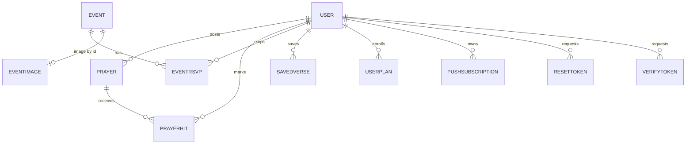

# Database

MongoDB collections for CYA Daily Verse, defined by the Mongoose models in `src/server/models/`.
Schemaless engine; correctness comes from unique indexes + atomic single-document writes (no
multi-document transactions). See [`DESIGN.md`](./DESIGN.md) §11 for rationale.

## Conventions

- All collections carry Mongoose `timestamps` (`createdAt`, `updatedAt`) unless noted.
- Day keys are Manila-timezone strings, `YYYY-MM-DD` (`server/utils/dates.js`).
- Ids referenced across collections are Mongo `ObjectId`.

## Collections

### users — `user.model.js`

| Field | Type | Notes |
|---|---|---|
| `name` | String | required, trim, max 60 |
| `email` | String | required, **unique**, lowercase, trim, max 120 |
| `passwordHash` | String | required, bcrypt(10) |
| `emailVerified` | Boolean | default false — gates participation writes |
| `tokenVersion` | Number | default 0 — bumped on password reset to revoke JWTs |
| `role` | String | enum `member`\|`admin`, default `member` |
| `xp` | Number | default 0 |
| `streak` / `bestStreak` | Number | default 0 |
| `totalReads` | Number | default 0 — powers community totals |
| `lastReadDate` | String\|null | Manila day key; day-guard for once/day award |
| `challengeDates` | String[] | `day:challengeTitle` keys, capped ~40 |

**Indexes:** `email` unique.

### verses — `verse.model.js`

Read-mostly reference data, seeded from `src/data/verses.json` (300 BSB verses).

| Field | Type | Notes |
|---|---|---|
| `reference` | String | identity for upsert (e.g. `Isaiah 40:31`) |
| `text` | String | verse text |
| `version` | String | translation code (BSB) |
| `topic` | String | one of 15 categories |

**Indexes:** text index `{reference:10, text:5}` (weighted search); `{topic:1}`.

### prayers — `prayer.model.js`

| Field | Type | Notes |
|---|---|---|
| `name` | String | display name or "Anonymous" |
| `request` | String | prayer text |
| `tag` | String | category/label |
| `status` | String | `approved`\|`hidden` — hidden, never deleted |
| `prayedCount` | Number | `$inc` on each unique pray |
| `userId` | ObjectId | author (nullable for anonymous) |

**Indexes:** `{status:1, createdAt:-1}` (wall query+sort in one scan).

### prayerhits — `prayer-hit.model.js`

Association enforcing one pray per user per prayer.

| Field | Type |
|---|---|
| `prayerId` | ObjectId |
| `userId` | ObjectId |

**Indexes:** `{prayerId, userId}` **unique**.

### events — `event.model.js`

| Field | Type | Notes |
|---|---|---|
| `title`, `location`, `time`, `speaker`, `tag`, `description` | String | |
| `date` | String | `YYYY-MM-DD` |
| `image` | String | `/media/<file>` or `/api/images/<id>` |
| `published` | Boolean | |
| `rsvpCount` | Number | `$inc` on RSVP |

**Indexes:** `{published:1, date:1}` (published upcoming list).

### eventrsvps — `event-rsvp.model.js`

| Field | Type |
|---|---|
| `eventId` | ObjectId |
| `userId` | ObjectId |

**Indexes:** `{eventId, userId}` **unique**.

### eventimages — `event-image.model.js`

Uploaded pubmats stored as binary in Mongo, served via `/api/images/[id]`.

| Field | Type | Notes |
|---|---|---|
| `data` | Buffer | image bytes |
| `contentType` | String | clamped to `jpeg`/`png`/`webp` on serve |

### devotions — `devotion.model.js`

| Field | Type | Notes |
|---|---|---|
| `slug` | String | **unique** |
| `title`, `excerpt`, `author`, `readTime`, `date` | String | |
| `verse`, `verseText` | String | paired scripture |
| `image`, `imageAlt` | String | |
| `body` | String[] | paragraphs |
| `practice` | String | "try this" step |
| `published` | Boolean | |

### userplans — `user-plan.model.js`

| Field | Type | Notes |
|---|---|---|
| `userId` | ObjectId | |
| `planSlug` | String | |
| `completedDays` | Number[] | days marked done |
| `active` | Boolean | |

**Indexes:** `{userId, planSlug}` **unique**.

### savedverses — `saved-verse.model.js`

| Field | Type | Notes |
|---|---|---|
| `userId` | ObjectId | |
| `reference`, `text`, `version`, `topic` | String | copied snapshot |

**Indexes:** `{userId, reference}` **unique**.

### pushsubscriptions — `push-subscription.model.js`

| Field | Type | Notes |
|---|---|---|
| `endpoint` | String | **unique** — dedupe device |
| `keys.p256dh`, `keys.auth` | String | Web Push keys |
| `userId` | ObjectId\|null | ownership for removal auth |

### pushlogs — `push-log.model.js`

Idempotency lock for the daily send.

| Field | Type | Notes |
|---|---|---|
| `day` | String | **unique** — one broadcast per Manila day |

### resettokens / verifytokens — `reset-token.model.js`

Single-use, hashed, auto-expiring tokens (password reset + email verification).

| Field | Type | Notes |
|---|---|---|
| `tokenHash` | String | **unique** — never store raw token |
| `userId` | ObjectId | |
| `expiresAt` | Date | **TTL** index |
| `usedAt` | Date\|null | single-use guard |

### ratebuckets — `rate-bucket.model.js`

Distributed fixed-window rate-limit counter.

| Field | Type | Notes |
|---|---|---|
| `_id` | String | `name:client:windowStart` |
| `count` | Number | atomic `$inc` |
| `expiresAt` | Date | **TTL** — auto-clean windows |

## Relationships

## Migrations

No migration framework. Verse data self-reconciles via `verse.service.syncVerses()` (bulk upsert by
`reference`), run once per process by `ensureSynced()`. **Non-verse collections have no migration
path** — a known gap (see `DESIGN.md` §21).
