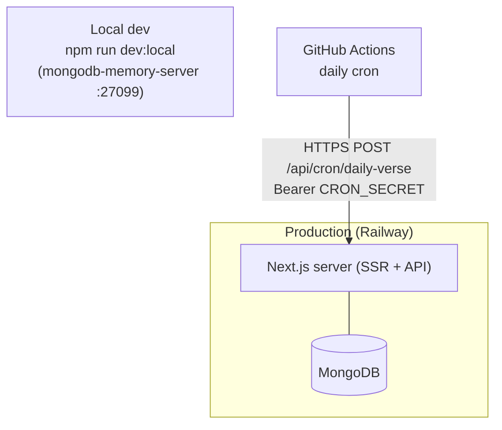

# Deployment Guide

Complete guide to building, configuring, deploying, and operating **CYA Daily
Verse**. A new engineer should be able to deploy the application by following
this document end to end. See [`ARCHITECTURE.md`](./ARCHITECTURE.md)
(Deployment Architecture, Design Decisions & Trade-offs) for rationale.

> **Ground truth vs. reference patterns.** The application currently ships as a
> single **Next.js** server deployed on **Railway** with **MongoDB**, plus a
> **GitHub Actions** cron for the daily push. Sections for Docker, generic
> CI/CD, Vercel, and AWS are included as **portable reference patterns** the
> team can adopt; where a file or provider is not yet part of the repo it is
> marked **(not in repo — template)** so nothing here misrepresents the current
> setup.

---

## Table of Contents

1. [Overview](#1-overview)
2. [Repository Structure](#2-repository-structure)
3. [Prerequisites](#3-prerequisites)
4. [Environment Variables](#4-environment-variables)
5. [Local Development Setup](#5-local-development-setup)
6. [Docker Deployment](#6-docker-deployment)
7. [Database Setup and Migrations](#7-database-setup-and-migrations)
8. [CI/CD Pipeline](#8-cicd-pipeline)
9. [Railway Deployment](#9-railway-deployment)
10. [Vercel Deployment](#10-vercel-deployment)
11. [AWS Deployment](#11-aws-deployment)
12. [Deployment Workflow](#12-deployment-workflow)
13. [Production Deployment Checklist](#13-production-deployment-checklist)
14. [Rollback Strategy](#14-rollback-strategy)
15. [Monitoring and Logging](#15-monitoring-and-logging)
16. [Security Best Practices](#16-security-best-practices)
17. [Troubleshooting](#17-troubleshooting)

---

## 1. Overview

**Application.** CYA Daily Verse is a Next.js 16 (App Router) full-stack app:
server-rendered UI **and** JSON API in one deployment, backed by MongoDB. It
serves a daily verse, reading streaks/XP, a moderated prayer wall, events + RSVP,
reading plans, saved verses, and web-push reminders.

**Purpose of this guide.** Document how the app is built, configured, deployed,
monitored, and rolled back across all environments.

**Supported environments.**

| Environment | Runtime | Database | Purpose |
|---|---|---|---|
| **Development** | `npm run dev:local` | `mongodb-memory-server` @ `:27099` (disk-backed `.dev-db`) | Local feature work |
| **Staging** | Railway (separate env/project) | Separate MongoDB instance | Pre-production verification — **TODO:** provision if not present |
| **Production** | Railway service | Railway MongoDB plugin | Live traffic |

**High-level deployment workflow.**

```
Developer
    |
    v
Git Repository (GitHub)
    |
    v
CI/CD (GitHub Actions checks)
    |
    v
Build (next build)  [optional: Docker image]
    |
    v
Cloud Deployment (Railway)
    |
    v
Production Environment (Next.js + MongoDB)
```

**Production architecture.** Stateless app — horizontally scalable. All shared
coordination (rate-limit counters, daily-send idempotency lock) lives in Mongo,
so any instance can serve any request.



---

## 2. Repository Structure

```
CYA DV/
├── .github/
│   └── workflows/
│       └── daily-verse-push.yml     # cron: POST /api/cron/daily-verse
├── docs/
│   ├── API.md
│   ├── ARCHITECTURE.md
│   ├── DATABASE.md
│   └── DEPLOYMENT.md                # this file
├── public/                          # static assets (media, icons, manifest)
├── scripts/
│   ├── dev-local.mjs                # one-command local dev (in-memory Mongo)
│   ├── seed.mjs                     # upsert verses.json -> DB
│   ├── purge-seed.mjs               # remove seeded verses
│   ├── create-member.mjs            # bootstrap a member/admin account
│   └── fetch-verses.mjs             # build the verse dataset
├── src/
│   ├── app/                         # App Router: (site), (admin), api/**
│   │   └── api/**/route.js          # thin shims re-exporting server routes
│   ├── components/
│   ├── data/verses.json             # 300-verse corpus (seed source)
│   ├── lib/                         # client utils + shared catalogs
│   └── server/
│       ├── config/  (db, env, mailer)
│       ├── controllers/
│       ├── middleware/  (session, rate-limit, require-admin)
│       ├── models/                  # Mongoose schemas
│       ├── routes/                  # URL -> controller wiring
│       ├── services/                # only layer touching Mongoose
│       └── utils/
├── .env.example                     # documented env template (no secrets)
├── next.config.ts                   # security headers, image config
├── eslint.config.mjs
├── package.json
├── tsconfig.json
└── README.md
```

**Notes.**
- **No `frontend/` + `backend/` split** — Next.js is one project; the API lives
  under `src/app/api/**` and delegates to `src/server`.
- **No `database/migrations/`** — schema is defined by Mongoose models; verse
  data is reconciled from `src/data/verses.json` (see §7).
- **Docker files (`Dockerfile`, `docker-compose.yml`, `.dockerignore`) are not
  in the repo** — templates in §6 if you adopt containers.
- **CI/CD:** only `daily-verse-push.yml` exists today (a scheduled cron, not a
  build/test/deploy pipeline). Test/build/deploy workflow templates in §8.

---

## 3. Prerequisites

**Tools.**

| Tool | Version | Notes |
|---|---|---|
| Node.js | `>= 20` | `@types/node` targets 20; Next 16 requires 18.18+ |
| npm | `>= 10` | ships with Node 20 |
| Git | `>= 2.30` | |
| MongoDB client | any | `mongosh` for inspecting prod data |
| Railway CLI | latest | `npm i -g @railway/cli` (optional, for CLI deploys/logs) |
| Docker | `>= 24` | **only** if adopting the §6 container path |
| Docker Compose | `>= 2` | optional |

> Local development needs **no local MongoDB install** — `npm run dev:local`
> provisions an in-memory instance automatically.

**Accounts.**
- **GitHub** — source + Actions (cron, CI).
- **Railway** — hosting + managed MongoDB (current production).
- **Vercel** / **AWS** — only if adopting those paths (§10 / §11).
- **SMTP provider** (e.g. Gmail App Password) — optional, enables reset/verify
  email.

---

## 4. Environment Variables

Environment variables externalize configuration and secrets so the same image
runs across environments without code changes. **Required** vars are asserted at
boot by `assertEnv()` ([`src/server/config/env.js`](../src/server/config/env.js))
— a missing one fails startup with a clear message instead of a deep runtime
error. Optional integrations disable themselves gracefully when unset.

**Files.**

| File | Committed? | Use |
|---|---|---|
| `.env.example` | **Yes** | Documented template — no real values |
| `.env` | **No** (gitignored) | Local development values |
| `.env.staging` | **No** | Staging values — **TODO** if staging is added |
| `.env.production` | **No** | Set in the host's secret manager, not on disk |

**Variables.**

| Variable | Required | Purpose | Example format |
|---|---|---|---|
| `MONGO_URL` | **Yes** | MongoDB connection string | `mongodb://<user>:<pass>@<host>:27017/<db>` |
| `AUTH_SECRET` | **Yes** | HS256 secret signing session + admin JWTs | 64-hex string |
| `NEXT_PUBLIC_SITE_URL` | **Yes** | Canonical/OG URLs + reset/verify links (public) | `https://<your-domain>` |
| `VAPID_PUBLIC_KEY` | No | Web-push public key (push off if unset) | base64url |
| `VAPID_PRIVATE_KEY` | No | Web-push private key | base64url |
| `VAPID_CONTACT_EMAIL` | No | VAPID `mailto:` contact | `mailto:you@example.com` |
| `CRON_SECRET` | No | Bearer secret for the daily-push cron | 48-hex string |
| `ADMIN_PORTAL_PASSWORD` | No | Passphrase for `/admin-portal` (8h session) | long random string |
| `SMTP_USER` | No | SMTP username (reset/verify email) | `you@gmail.com` |
| `SMTP_PASS` | No | SMTP password / app password | 16-char app password |
| `SMTP_FROM` | No | From address on outbound mail | `CYA <you@gmail.com>` |
| `TRUSTED_PROXY_HOPS` | No | Trusted reverse-proxy hops for client-IP derivation (default 1) | `1` |

> This project uses **cookie-JWT sessions** (no `JWT_SECRET`/`SESSION_SECRET`
> pair, no Redis) and stores rate-limit/cron state in Mongo — so `REDIS_URL` is
> not used. `NODE_ENV`/`PORT` are managed by Next.js/the host and rarely set by
> hand. Generic vars from other stacks (`DATABASE_URL`, `API_URL`, AWS keys) are
> **not** consumed unless you adopt those providers.

**Generate secrets.**

```bash
# AUTH_SECRET
node -e "console.log(require('crypto').randomBytes(32).toString('hex'))"

# CRON_SECRET
node -e "console.log(require('crypto').randomBytes(24).toString('hex'))"

# VAPID key pair
node -e "console.log(require('web-push').generateVAPIDKeys())"
```

**Setup.**

```bash
cp .env.example .env
# then fill in MONGO_URL, AUTH_SECRET, NEXT_PUBLIC_SITE_URL at minimum
```

**Secret management rules.**
- **Never commit `.env*` files** (only `.env.example`).
- In production, store secrets in the **host's secret manager** (Railway
  Variables, Vercel Env, AWS Secrets Manager) — never in the image or repo.
- **Rotate** `AUTH_SECRET`, `CRON_SECRET`, and `ADMIN_PORTAL_PASSWORD`
  periodically and whenever a person with access leaves. Rotating `AUTH_SECRET`
  invalidates all active sessions (acceptable, forces re-login).

---

## 5. Local Development Setup

### Clone

```bash
git clone <repository-url>
cd "CYA DV"
```

### Install dependencies

```bash
npm install
```

### Configure environment

```bash
cp .env.example .env
```

`dev:local` does not read `.env` or touch the production database — it runs a
throwaway local Mongo. Fill `.env` only for plain `npm run dev` against a real
`MONGO_URL`.

### Start (recommended — one command)

```bash
npm run dev:local
```

This ([`scripts/dev-local.mjs`](../scripts/dev-local.mjs)):
1. Starts `mongodb-memory-server` on port **27099**, data persisted under
   `.dev-db` (survives restarts).
2. Reuses an already-running local mongod if present (avoids stale-lock crash).
3. Seeds the verse corpus once.
4. Launches `next dev` pointed at the local database.

App: `http://localhost:3000`.

### Alternative — plain dev against a real DB

```bash
npm run dev   # requires a reachable MONGO_URL in .env
```

> The production `MONGO_URL` targets Railway's private network
> (`mongodb.railway.internal`) and will **not** resolve locally — use
> `dev:local` or a local/Atlas connection string instead.

### Database setup / seeding

No migration step. To seed verses into a real database:

```bash
npm run seed          # upsert 300 verses from src/data/verses.json (idempotent)
npm run member:create # bootstrap a member/admin account
```

---

## 6. Docker Deployment

**(not in repo — reference template.)** The app deploys today via Railway's
native Nixpacks build (no Dockerfile required). Adopt the pattern below if you
want reproducible container images or a different host.

**Why Docker.** Reproducible builds, environment parity, easy horizontal
scaling, and portability across hosts. Production images should be multi-stage
(small, non-root, no dev dependencies).

### `Dockerfile` (template)

```dockerfile
# ---- deps ----
FROM node:20-alpine AS deps
WORKDIR /app
COPY package*.json ./
RUN npm ci

# ---- build ----
FROM node:20-alpine AS build
WORKDIR /app
COPY --from=deps /app/node_modules ./node_modules
COPY . .
RUN npm run build

# ---- run ----
FROM node:20-alpine AS runner
WORKDIR /app
ENV NODE_ENV=production
# Run as an unprivileged user.
RUN addgroup -S app && adduser -S app -G app
COPY --from=build /app/.next ./.next
COPY --from=build /app/public ./public
COPY --from=build /app/node_modules ./node_modules
COPY --from=build /app/package.json ./package.json
USER app
EXPOSE 3000
HEALTHCHECK --interval=30s --timeout=5s --retries=3 \
  CMD wget -qO- http://localhost:3000/api/health || exit 1
CMD ["npm", "start"]
```

### `.dockerignore` (template)

```
node_modules
.next
.dev-db
.env*
!.env.example
.git
docs
```

### Build & run

```bash
docker build -t cya-daily-verse .
docker run -p 3000:3000 --env-file .env cya-daily-verse
```

### `docker-compose.yml` (template — local full stack)

```yaml
services:
  app:
    build: .
    ports: ["3000:3000"]
    env_file: .env
    environment:
      MONGO_URL: mongodb://mongo:27017/cya
    depends_on: [mongo]
    restart: unless-stopped
  mongo:
    image: mongo:7
    volumes: ["mongo-data:/data/db"]
    restart: unless-stopped
volumes:
  mongo-data:
```

```bash
docker compose up -d
```

- **Services:** `app` (Next.js) + `mongo`.
- **Network:** default compose bridge; `app` reaches `mongo` by service name.
- **Volume:** `mongo-data` persists database state across restarts.

**Production best practices:** multi-stage build, `node:alpine` base, non-root
user, `HEALTHCHECK` hitting `/api/health`, `restart: unless-stopped`, ship logs
to stdout (host aggregates), and scan images (`docker scout cves` / Trivy).

---

## 7. Database Setup and Migrations

**Requirements.** MongoDB (Railway plugin in prod; in-memory locally). Driver:
Mongoose. Connection is a single pooled, cached client
([`config/db.js`](../src/server/config/db.js)) with `bufferCommands: false` and a
5s server-selection timeout.

**Connection config.** Set `MONGO_URL`. Nothing else required — indexes are
declared in the models and built by Mongoose `autoIndex` on first model use.

**Migrations.** There is **no migration framework** (MongoDB is schemaless).
Schema shape lives in the Mongoose models. Data reconciliation:

- **Verses** self-reconcile: `verse.service.syncVerses()` bulk-upserts by
  `reference`; `ensureSynced()` runs it once per process on first verse read.
  Admins can force it: `POST /api/admin/sync-verses` (auth: `CRON_SECRET` bearer
  or admin session).
- **Devotions** seed themselves once when the collection is empty.

```bash
npm run seed          # manual verse sync (idempotent upsert)
npm run purge:seed    # remove seeded verse data
# npm run migrate / migrate:rollback  -> NOT APPLICABLE (no migration tool)
```

**When it runs.** Verse sync auto-fires on the first request after a redeploy —
no manual step needed for content changes bundled in `verses.json`.

**Production data-change process.**
1. Back up the database first (see §14 — **backup automation is a TODO**).
2. Deploy the code (model + `verses.json` changes ship together).
3. First request builds new indexes and runs the upsert sync.
4. Verify `GET /api/health`.

> **Breaking schema changes** (rename/remove a field) have **no automated
> backfill** — write a one-off script and back up first. Adding a `unique` index
> to a collection with duplicates fails the build; de-duplicate first.

---

## 8. CI/CD Pipeline

### Continuous Integration

Recommended gates on every pull request (all runnable locally):

```
Code Push / PR
    |
    v
Install (npm ci)
    |
    v
Lint (npm run lint)
    |
    v
Type check (npx tsc --noEmit)
    |
    v
Test (npm test  — node:test + in-memory Mongo)
    |
    v
Build (npm run build)
    |
    v
Deploy (Railway — on merge to main)
```

### Existing workflow

`.github/workflows/daily-verse-push.yml` — **scheduled cron**, not a build
pipeline:
- Trigger: cron `0 22 * * *` UTC (06:00 Manila) + manual `workflow_dispatch`.
- Action: `POST /api/cron/daily-verse` with `Authorization: Bearer ${{ secrets.CRON_SECRET }}` and the site URL.
- Idempotent: `PushLog.day` prevents double-send; the lock releases on broadcast
  failure so a retry is safe.

### CI workflow (template — `.github/workflows/ci.yml`, not in repo)

```yaml
name: CI
on:
  pull_request:
  push:
    branches: [main]
jobs:
  verify:
    runs-on: ubuntu-latest
    steps:
      - uses: actions/checkout@v4
      - uses: actions/setup-node@v4
        with: { node-version: 20, cache: npm }
      - run: npm ci
      - run: npm run lint
      - run: npx tsc --noEmit
      - run: npm test
      - run: npm run build
```

**Branch strategy.** Feature branches → PR → CI must pass → review → merge to
`main` → deploy. Store CI/deploy secrets (`CRON_SECRET`, Railway token) in GitHub
**repository secrets**; gate production deploys with an environment
**approval** if desired.

### Suggested workflows

```
.github/workflows/
├── daily-verse-push.yml   # exists — scheduled cron
├── ci.yml                 # TODO — lint + typecheck + test + build
└── deploy.yml             # TODO — deploy on merge (or use Railway auto-deploy)
```

---

## 9. Railway Deployment

Current production host. Builds with Nixpacks (auto-detects Next.js) — no
Dockerfile needed.

1. **Connect repo.** Railway → New Project → Deploy from GitHub → select this
   repo. Enable auto-deploy on `main`.
2. **Add the database.** New → Database → MongoDB. Railway injects a private
   `MONGO_URL` reachable at `mongodb.railway.internal`.
3. **Configure variables.** Service → Variables: set `MONGO_URL` (reference the
   Mongo plugin var), `AUTH_SECRET`, `NEXT_PUBLIC_SITE_URL`, and any optional
   integrations (VAPID, SMTP, `CRON_SECRET`, `ADMIN_PORTAL_PASSWORD`).
4. **Build/start.** Detected automatically: build `npm run build`, start
   `npm start`. Override in Settings if needed.
5. **Migrations.** None — verse sync auto-runs on first request. Optionally run
   `npm run seed` via `railway run` against the prod DB.
6. **Deploy.** Push to `main` (auto-deploy) or `railway up` from the CLI.
7. **Logs.** `railway logs` or the dashboard Deploy Logs.
8. **Health / monitoring.** Point an uptime check at `GET /api/health` (returns
   `200` only when env + DB are ready).
9. **Rollback.** Railway dashboard → Deployments → select a previous successful
   deploy → **Redeploy** (see §14).

```bash
npm i -g @railway/cli
railway login
railway link          # link to the project
railway variables     # inspect env
railway run npm run seed
railway up            # deploy current dir
railway logs
```

---

## 10. Vercel Deployment

**(alternative host — not currently used.)** Next.js is first-class on Vercel;
you still need an **external** MongoDB (Atlas), since Vercel provides no
database.

- **Import** the GitHub repo into Vercel; framework auto-detected (Next.js).
- **Build:** `npm run build` (default). Output: managed by Next adapter.
- **Environment variables:** add `MONGO_URL` (Atlas SRV string), `AUTH_SECRET`,
  `NEXT_PUBLIC_SITE_URL`, plus optional VAPID/SMTP/`CRON_SECRET` — set per
  environment (Production / Preview / Development).
- **Preview deployments:** every PR gets an isolated preview URL — point it at a
  **staging** database, not production.
- **Production:** merges to `main` promote to production.
- **Custom domains:** Project → Domains → add and configure DNS; set
  `NEXT_PUBLIC_SITE_URL` to the final domain.
- **Cron:** Vercel Cron can replace the GitHub Actions cron — schedule a request
  to `/api/cron/daily-verse` with the bearer secret.

```bash
npm i -g vercel
vercel            # preview deploy
vercel deploy --prod
```

---

## 11. AWS Deployment

**(reference architecture — not currently used.)** For teams standardizing on
AWS.

```
Users
  |
CloudFront (CDN, TLS)
  |
Application Load Balancer
  |
ECS Fargate (Next.js container from §6)
  |
DocumentDB / MongoDB Atlas       S3 (optional asset offload)
```

- **Compute:** ECS **Fargate** running the §6 image is the natural fit (SSR
  server). EC2 (self-managed) or Lambda (`@ App Router` adapters) are possible
  but heavier/limited for a long-lived SSR server.
- **Database:** MongoDB **Atlas** (recommended — same wire protocol) or AWS
  **DocumentDB**. Set `MONGO_URL` accordingly. RDS/Aurora are **not** applicable
  (this app is not SQL).
- **Storage:** event images currently stream from Mongo. Optionally offload to
  **S3** + CloudFront if image volume grows (code change required).
- **Security:** scope **IAM** roles least-privilege; restrict DB access with
  **Security Groups**; store secrets in **AWS Secrets Manager** and inject as env
  at task start.
- **Monitoring:** **CloudWatch** Logs (container stdout), metrics, and alarms on
  error rate / CPU / memory / health-check failures.

```bash
aws ecr create-repository --repository-name cya-daily-verse
docker build -t cya-daily-verse .
docker tag cya-daily-verse:latest <acct>.dkr.ecr.<region>.amazonaws.com/cya-daily-verse:latest
docker push <acct>.dkr.ecr.<region>.amazonaws.com/cya-daily-verse:latest
# then update the ECS service to the new image tag
```

---

## 12. Deployment Workflow

```
Feature Development (branch)
        |
        v
Pull Request
        |
        v
CI Checks (lint, typecheck, test, build)
        |
        v
Code Review
        |
        v
Merge to main
        |
        v
Deploy Staging (verify)      [TODO if staging exists]
        |
        v
Production Release (Railway auto-deploy on main)
```

---

## 13. Production Deployment Checklist

**Before deployment**

- [ ] Tests passing (`npm test`)
- [ ] Lint + type check clean (`npm run lint`, `npx tsc --noEmit`)
- [ ] Required env vars configured on the host (`MONGO_URL`, `AUTH_SECRET`, `NEXT_PUBLIC_SITE_URL`)
- [ ] Database backup completed (**manual — see §14**)
- [ ] Schema/data changes reviewed (breaking field changes have no auto-backfill)
- [ ] Build succeeds locally (`npm run build`)
- [ ] Dependencies audited (`npm audit`)

**During deployment**

- [ ] Deploy the application (push to `main` / `railway up`)
- [ ] Verse sync auto-runs on first request (or `railway run npm run seed`)
- [ ] `GET /api/health` returns `200`
- [ ] Review deploy logs for errors

**After deployment**

- [ ] App reachable at `NEXT_PUBLIC_SITE_URL`
- [ ] Database connection verified (health check `db: connected`)
- [ ] Daily-push cron secret valid (trigger `workflow_dispatch` to test)
- [ ] Monitoring/uptime check enabled on `/api/health`
- [ ] Rollback path confirmed (previous deploy available to redeploy)

---

## 14. Rollback Strategy

**Application rollback.** Immutable deploys make this instant:
- **Railway:** Deployments → pick the last good deploy → **Redeploy**.
- **Vercel:** Deployments → previous production → **Promote**.
- **Git:** `git revert <sha>` and push to trigger a fresh deploy.

**Database rollback.** No migration framework, so there is **no automated schema
reversal**:
- Additive changes need no rollback (old docs read defaults).
- For a destructive data change, **restore from the pre-deploy backup**.
- Verse/devotion content is reproducible from `verses.json` / code, so a bad
  content sync is fixed by correcting the source and re-running the upsert.

**Failed deployment recovery.**
1. Redeploy the last healthy build (above).
2. Check `GET /api/health` for `missingEnv` / `db: unreachable`.
3. Inspect logs for the boot assertion or DB error.

**Version management.** Deploys are pinned to Git SHAs by the host; tag releases
(`git tag vX.Y.Z`) for a human-readable history.

> **TODO:** Automate MongoDB backups (`mongodump` + retention) and document a
> tested restore with an RPO/RTO target. Confirm Railway's managed backup
> cadence.

---

## 15. Monitoring and Logging

**Application.**
- **Logs:** structured server logging via
  [`server/utils/logger.js`](../src/server/utils/logger.js) (`logError`) on the
  unexpected-failure path (incl. DB errors); written to stdout and captured by
  the host.
- **Health:** `GET /api/health` — env readiness + DB reachability; `200`
  healthy, `503` degraded (`missingEnv` or `db: unreachable`). Use for uptime
  checks and platform probes.
- **Error tracking / APM:** **TODO** — integrate Sentry (client + server) for
  exception aggregation and performance traces.

**Infrastructure.**
- CPU / memory / storage / restarts: Railway dashboard metrics (or CloudWatch on
  AWS).
- Database health: Railway/Atlas metrics; alert on connection saturation.
- Availability: external uptime monitor hitting `/api/health`.

**Recommended stack (not yet wired):** Sentry (errors), Datadog **or**
Prometheus + Grafana (metrics/dashboards), platform-native logs
(Railway/CloudWatch).

---

## 16. Security Best Practices

- **Never commit secrets** — only `.env.example`; real values live in host
  secret managers.
- **HTTPS everywhere** — Railway/Vercel terminate TLS; HSTS is set in
  `next.config.ts` (`max-age=63072000; includeSubDomains`).
- **Security headers** — `X-Content-Type-Options`, `X-Frame-Options: DENY`,
  `Referrer-Policy`, `Permissions-Policy`, and a per-request nonce'd CSP
  (`proxy.ts`).
- **Dependency hygiene** — `npm audit` in CI; update regularly; scan images
  (Trivy / `docker scout`) if containerized.
- **Least privilege** — scoped DB users, minimal IAM roles, admin gated by
  role/passphrase with self-lockout protection.
- **Auth data** — passwords bcrypt-hashed (cost 10); reset/verify tokens stored
  SHA-256 hashed, single-use, TTL-expired; sessions are httpOnly JWT cookies
  with `tokenVersion` revocation.
- **Container security** — non-root user, minimal base image, health checks (§6).
- **Credential rotation** — rotate `AUTH_SECRET`, `CRON_SECRET`,
  `ADMIN_PORTAL_PASSWORD` on a schedule and on personnel changes.
- **Upload safety** — images magic-byte validated (≤2MB) and content-type
  clamped on serve.

---

## 17. Troubleshooting

### Application does not start

- **Causes:** missing required env var; unreachable `MONGO_URL`; failed build.
- **Diagnose:** check deploy logs for `Missing required environment variable(s):
  ...` (from `assertEnv()`); hit `GET /api/health` → `missingEnv` array.
- **Fix:** set the missing var in the host; redeploy. Verify Node `>= 20`.

### Database connection failure

- **Causes:** wrong `MONGO_URL`; using the Railway **private** URL from outside
  Railway; network/firewall; DB down.
- **Diagnose:** `GET /api/health` → `db: "unreachable"` with an error string;
  connect with `mongosh "$MONGO_URL"`.
- **Fix:** use the correct connection string (public string / Atlas SRV for
  external access); confirm IP allowlist; restart the DB service.

### "Data does not appear / verses missing"

- **Causes:** verse sync hasn't run; empty collection.
- **Diagnose:** call `GET /api/verse/today`; check logs for
  `verse.ensureSynced`.
- **Fix:** `railway run npm run seed`, or `POST /api/admin/sync-verses` with the
  cron secret or an admin session.

### Migration failure

- **Cause:** N/A — no migration tool. A **unique-index build** can fail on
  existing duplicates; a **removed field** leaves old-shaped documents.
- **Diagnose:** index build error in logs naming the duplicate key.
- **Fix:** de-duplicate the collection, then redeploy; write a one-off backfill
  script for field changes (back up first).

### CI/CD failure

- **Causes:** failing tests/lint/typecheck; missing GitHub secret; build error.
- **Diagnose:** open the failing GitHub Actions run and read the step log.
- **Fix:** reproduce locally (`npm run lint`, `npx tsc --noEmit`, `npm test`,
  `npm run build`); add the missing repo secret (e.g. `CRON_SECRET`).

### Daily push not sending

- **Causes:** `CRON_SECRET` mismatch; VAPID keys unset; already sent today.
- **Diagnose:** run the `daily-verse-push` workflow via `workflow_dispatch` and
  read logs; a `401` = bad secret; a no-op = `PushLog.day` already claimed.
- **Fix:** align `CRON_SECRET` in GitHub secrets and the app; set VAPID keys to
  enable push.
