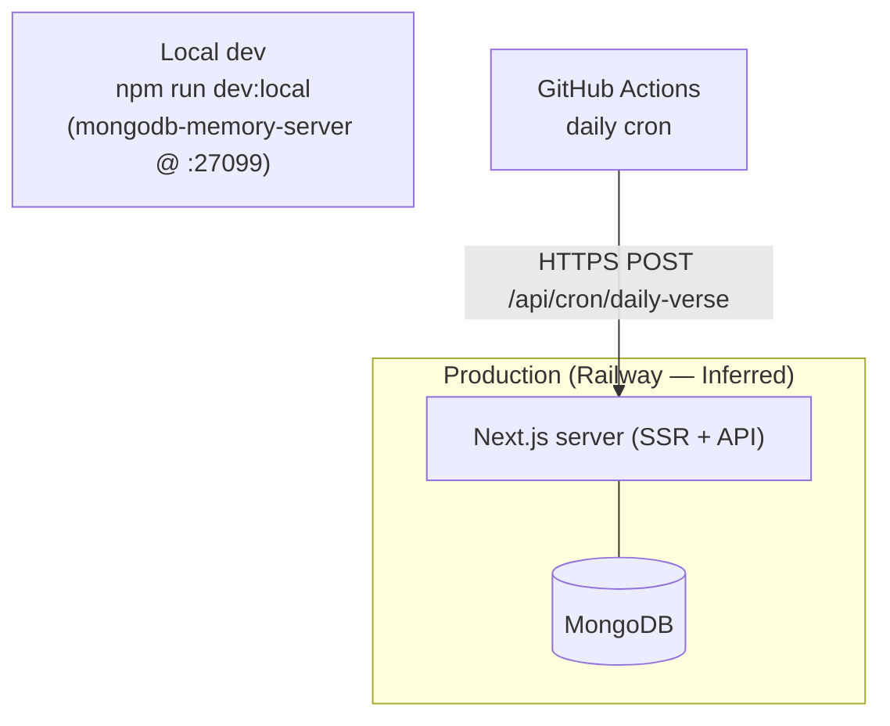

# Deployment

How CYA Daily Verse is built, configured, and run. See [`DESIGN.md`](./DESIGN.md) §10, §16 and
[`ARCHITECTURE.md`](./ARCHITECTURE.md) for rationale.

## Topology

Single Next.js 16 deployment (SSR UI + JSON API) + MongoDB. Stateless app — horizontally scalable;
shared coordination (rate limit, daily-send lock) lives in Mongo.



## Environment variables

Documented in `.env.example`. Required vars gate boot via `assertEnv()` (`server/config/env.js`).

| Var | Required | Purpose |
|---|---|---|
| `MONGO_URL` | yes | MongoDB connection string |
| `AUTH_SECRET` | yes | HS256 JWT signing secret |
| `NEXT_PUBLIC_SITE_URL` | yes | canonical/OG URLs, reset/verify links (public) |
| `VAPID_PUBLIC_KEY` / `VAPID_PRIVATE_KEY` | no | web push (feature off if unset) |
| `VAPID_CONTACT_EMAIL` | no | VAPID `mailto:` contact |
| `SMTP_*` | no | email verify/reset (feature off if unset) |
| `CRON_SECRET` | no | bearer for daily push cron |
| `ADMIN_PORTAL_PASSWORD` | no | admin portal passphrase |
| `TRUSTED_PROXY_HOPS` | no | reverse-proxy hop count for client-IP derivation |

Optional integrations disable themselves gracefully when their env is unset.

## Build pipeline

| Stage | Command |
|---|---|
| Lint | `npm run lint` |
| Type check | `npx tsc --noEmit` |
| Test | `npm test` (node:test, in-memory Mongo) |
| Build | `npm run build` (Next + Turbopack) |
| Start | `npm start` |
| Seed | `npm run seed` / auto `ensureSynced()` on first request post-deploy |

## Local development

```bash
npm install
npm run dev:local   # disposable local Mongo under .dev-db, seeds verses, runs next dev
```

- `dev:local` (`scripts/dev-local.mjs`) stands up `mongodb-memory-server` on port **27099**, keeps
  data under `.dev-db`, seeds the corpus, then launches `next dev` pointed at it.
- Reuses an already-listening mongod if a prior `dev:local` is running (avoids a stale-lock crash).
- Plain `npm run dev` requires a reachable `MONGO_URL` (prod value targets Railway's private network
  and won't resolve locally).

## Background scheduler

- **GitHub Actions** `.github/workflows/daily-verse-push.yml`: cron `0 22 * * *` UTC = 06:00 Manila.
- POSTs `/api/cron/daily-verse` with `Authorization: Bearer $CRON_SECRET` (secret) and `$SITE_URL`.
- Manual retry via `workflow_dispatch`. Idempotent: `PushLog.day` prevents double-send; claim released
  on broadcast failure for safe retry.

## Production notes

- **Migrations:** none formal. Verse corpus self-reconciles via `ensureSynced()` upsert on first
  request after a redeploy.
- **Health:** `GET /api/health` (env + DB reachability) — probe candidate.
- **Scaling:** stateless app allows multiple instances; per-instance `unstable_cache` may briefly
  differ until each revalidates (acceptable).

## Needs Verification

- Host, managed-DB plan, backups, DR, and deploy/rollback workflow (Railway inferred from
  `.env` comments + `NEXT_PUBLIC_SITE_URL`; no Docker/K8s or deploy workflow committed).
- External log/metrics/APM aggregation.
