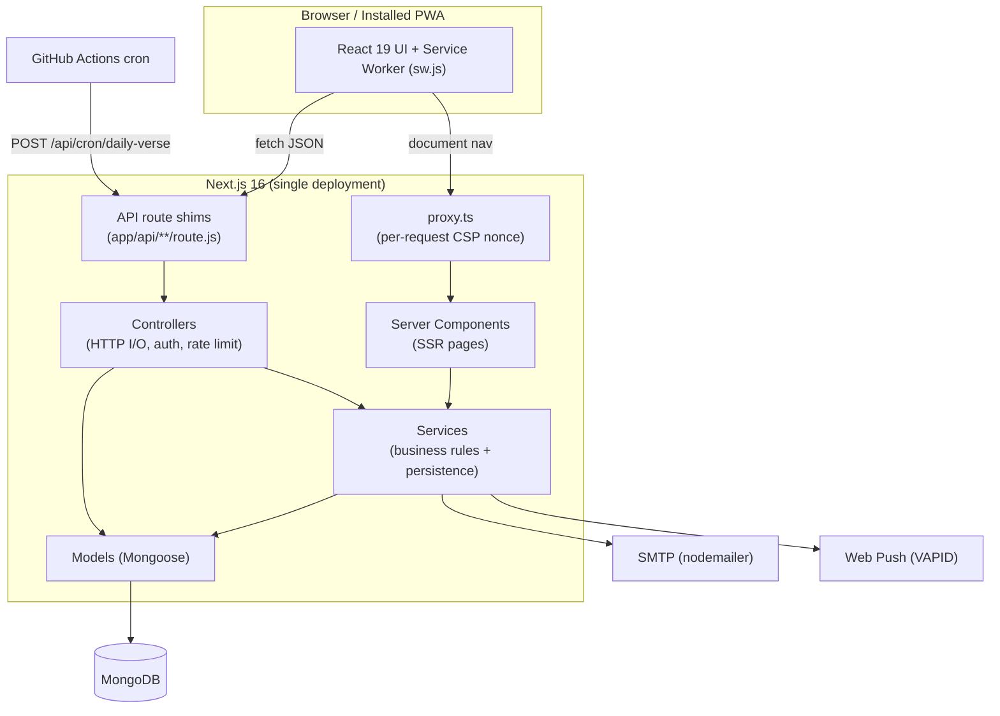
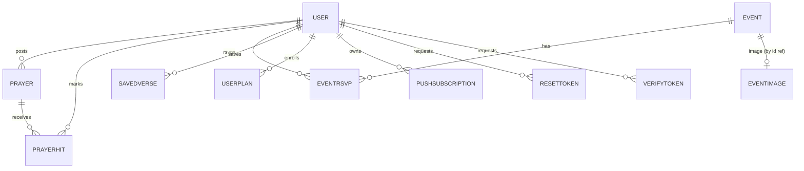
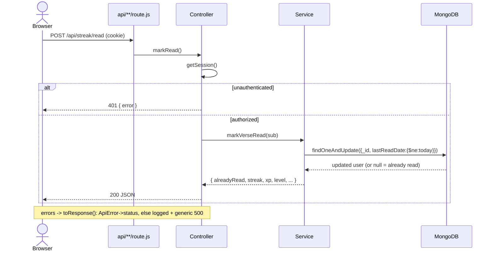
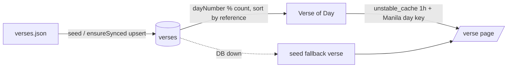

# Design

Long-term architectural design record for **CYA Daily Verse**. Companion to
[`ARCHITECTURE.md`](./ARCHITECTURE.md) (engineering reference) and
[`SYSTEM-FLOW.md`](./system-flow.md) (product experience). This document explains *why* the system
is shaped the way it is, for maintainers, new contributors, and AI coding agents making
architecture-consistent changes.

> **Evidence conventions**
> - **Fact** — read directly from source in this repository.
> - **Inferred** — reasoned from the code, not explicitly stated.
> - **Needs Verification** — cannot be determined from the repository alone.

---

## 1. Overview

- **Purpose.** A Progressive Web App and daily-devotional platform for the *Christ's Youth in Action*
  (CYA) youth ministry. It serves a rotating daily Bible verse plus devotionals, reading plans, a
  moderated prayer wall, community events, gamified reading streaks, and opt-in web-push reminders.
- **Business goal.** Faith-habit formation. The product optimizes for daily return:
  *verse of the day → mark read → streak/XP → community (prayer, events)*. Success = a member who
  opens the app daily, keeps a streak, saves verses, prays for others, and shows up to events.
- **Target users.** Three roles (`src/lib/types.ts`, `require-admin.js`):
  - **Visitor** — unauthenticated; read verse, search, browse devotions/prayer/events.
  - **Member** — registered + email-verified; save verses, track streak/XP, follow plans, post/pray,
    RSVP, receive reminders.
  - **Moderator/Admin** — trusted leaders; moderate prayers, manage events/devotions/roles.
- **High-level architecture.** A **single Next.js 16 deployment** serves both server-rendered UI and
  the JSON API. Backend follows a strict `route → controller → service → model` layering on top of
  MongoDB (Mongoose). See [§3](#3-system-architecture).
- **Primary responsibilities.** Render UI (SSR + client), authenticate/authorize, enforce daily
  gamification rules, persist community content, fan out daily push notifications, and degrade
  gracefully when infrastructure fails.
- **Major capabilities.** Deterministic verse-of-day rotation, streak/XP engine, moderated prayer
  wall, events with RSVP + image pubmats, reading plans, devotions, PWA/offline, web push, admin
  portal, self-reconciling verse seed, data export/delete.

---

## 2. Design Philosophy

- **Monolith by choice.** One cohesive domain + small team → a modular monolith removes cross-service
  network cost and deployment overhead. `next dev` is the whole stack.
- **Layered, framework-portable backend.** Backend under `src/server/**` mimics an Express-style
  stack. Controllers accept a `Request` and return `NextResponse`; the API could be lifted onto a
  standalone server with minimal change. The `src/app/api/**/route.js` shims are the only Next-coupled
  seam.
- **Separation of concerns.** HTTP concerns (parse, auth, rate limit, respond) live in **controllers**;
  business rules + persistence live in **services**; schema lives in **models**. Services never build
  HTTP responses — they throw `ApiError`.
- **Client/server isolation.** Backend modules begin with `import "server-only"` so server code cannot
  leak into the client bundle. `src/lib/**` stays client-safe.
- **Simplicity over flexibility.** No repository/factory abstraction — services call Mongoose directly
  (**inferred** deliberate simplification). No message queue, no Redis; Next's cache + Mongo suffice at
  current scale.
- **Reliability via graceful degradation.** Every external dependency has a documented failure mode:
  DB-down falls back to the bundled seed corpus and in-memory rate limiting; optional features (push,
  email) disable themselves if unconfigured rather than erroring.
- **Correctness via single-document atomicity.** No multi-document transactions. Invariants
  (once-per-day streak, one pray per user, daily-send lock) are enforced by conditional
  `findOneAndUpdate` filters and unique indexes.
- **Security by default.** Per-request CSP nonce + `strict-dynamic`, HS256 JWT sessions with
  revocation, timing-safe secret compares, spoof-resistant client-IP derivation.
- **Performance priorities.** Fast-fail DB timeouts, `.lean()` reads, targeted compound indexes,
  bounded push fan-out, cached verse-of-day.
- **Maintainability.** Consistent `*.controller/service/model/routes.js` naming; one-line "why"
  comments; Conventional Commits; ALL-CAPS markdown filenames.

---

## 3. System Architecture

- **Style.** Layered Modular Monolith on the Next.js App Router (BFF — the API exists only to serve
  this app's own UI; no versioning, no public contract).
- **Layered responsibilities.** `route → controller → service → model`, dependencies point downward
  only.
- **Module boundaries.** Each domain (auth, verse, streak, prayer, event, plan, push, account, admin,
  devotion, saved, image) owns its own route/controller/service/model quartet.
- **Communication.** Browser ↔ server over HTTP (SSR documents + JSON API). Server → browser over the
  Web Push protocol (VAPID). Scheduler → server over HTTPS (GitHub Actions cron).
- **Dependency direction.** Presentation → Application → Domain → Persistence; Domain → Infrastructure.
  Enforced by convention + `"server-only"`.



> **Note (Fact).** In Next 16 the middleware entry is `src/proxy.ts` exporting `proxy(req)` (formerly
> `middleware.ts`). The `config.matcher` targets document requests only and excludes `api`, static,
> images, and prefetches.

---

## 4. Repository Structure

```
src/
  app/                      Next.js App Router — pages + API route shims
    (site)/                 public + member pages (route group)
    (admin)/                admin portal + dashboards (route group)
    api/**/route.js         thin re-export shims -> server/routes
    layout.tsx globals.css  root layout, fonts, theme script; Tailwind v4 + tokens
    manifest.ts robots.ts sitemap.ts opengraph-image.tsx   static metadata
  components/               React UI (motion/, three/, nav/, pwa/, home/ + shared primitives)
  lib/                      client-safe: data.ts, types.ts, hooks.ts, motion.ts, cx.ts, media.ts
  data/verses.json          bundled 300-verse BSB seed corpus (seed + DB-down fallback)
  server/                   backend (server-only)
    config/                 db.js, env.js, mailer.js
    routes/                 name -> controller-handler mapping
    controllers/            HTTP concerns: parse, auth gate, rate limit, respond
    services/               business logic + persistence
    models/                 Mongoose schemas
    middleware/             session.js, rate-limit.js, require-admin.js
    utils/                  dates, gamification, api-error, logger, admin-session
    server.js               boot(): env assert + DB warmup
  proxy.ts                  Next middleware — per-request CSP nonce
scripts/                    dev-local, seed, purge-seed, fetch-verses, create-member
tests/                      node:test suites (unit + in-memory integration)
docs/                       DESIGN.md, ARCHITECTURE.md, SYSTEM-FLOW.md, CHANGELOG.md, activity-log.md
public/                     PWA assets, icons, media, sw.js, offline.html
.github/workflows/          daily-verse-push.yml (cron scheduler)
```

**Directory contracts** (extends the ownership table in `ARCHITECTURE.md`):

| Directory | Owns | May depend on | Must NOT contain |
|---|---|---|---|
| `app/(site)`, `app/(admin)` | Page rendering, composition | `components`, `lib`, services via server components | Direct Mongoose model use |
| `app/api/**` | HTTP method → handler binding | `server/routes` | Any logic (one-line shims) |
| `server/routes` | Name → controller function map | `server/controllers` | Business logic |
| `server/controllers` | HTTP I/O, auth, rate limit, error mapping | `services`, `middleware`, `utils/api-error` | Direct model access *(inferred rule — controllers call services; but `user.service.requireAdmin` and `image.controller` touch models/services pragmatically)* |
| `server/services` | Business rules, validation, DB access | `models`, `config`, `utils`, `lib/data` | `NextResponse` (throw `ApiError` instead) |
| `server/models` | Schema + indexes | mongoose only | Services/controllers |
| `lib` | Client-safe shared code | — | `server/**` imports |

The `"server-only"` import enforces the last rule at build time.

---

## 5. Component Architecture

### 5.1 Edge / Middleware — `src/proxy.ts`

- **Purpose.** Mint a per-request base64 CSP nonce so `script-src` can use `'nonce-… 'strict-dynamic'`
  instead of `'unsafe-inline'`.
- **Behavior.** Builds the full CSP string, sets it on both request and response headers plus `x-nonce`;
  Next stamps the nonce onto every script it emits (including the inline theme script).
- **Consumers.** All document requests (matcher excludes API/static/images/prefetch).
- **Failure mode.** Additive; nonce generation can't meaningfully fail. Static headers (HSTS, XFO,
  etc.) come from `next.config.ts`.

### 5.2 Backend boot — `src/server/server.js`

- `boot()` — idempotent warmup: `assertEnv()` then open Mongo. Missing env throws pointing to
  `.env.example`. `status()` is the non-throwing variant for `/api/health`.

### 5.3 DB connection — `src/server/config/db.js`

- Cached global Mongoose connection reused across hot reloads/invocations; `bufferCommands:false` +
  ~5s server-selection timeout → fail fast on outage. Clears the cached promise on failure so the next
  call retries.

### 5.4 Session — `src/server/middleware/session.js`

- **Interface.** `createSession(user)`, `getSession({strict?})`, `destroySession()`.
- **Cookie.** `cya-session` HS256 JWT (jose), httpOnly, `sameSite=lax`, `secure` in prod, 30-day.
- **Revocation.** JWT carries `tv` (tokenVersion); every read re-checks it against the DB. Bumped on
  password reset to kill stale sessions.
- **Failure policy.** DB outage during the revocation lookup **fails open** by default (keep session),
  **fails closed** when caller passes `{strict:true}` (used on sensitive writes: prayer post, account
  delete/export).

### 5.5 Admin gate — `require-admin.js` + `utils/admin-session.js`

- Separate `cya-admin` cookie (8-hour) minted by the shared admin-portal passphrase with a timing-safe
  compare. `assertAdmin()` passes if **either** a valid admin-portal session **or** a signed-in user
  with `role:"admin"`.

### 5.6 Rate limiter — `middleware/rate-limit.js`

- Fixed-window limiter backed by a Mongo `RateBucket` collection via atomic `$inc` upsert (no TOCTOU
  race; exactly `limit` requests pass per window). Falls back to a per-process in-memory window if
  Mongo is unreachable. Client key derived from `X-Forwarded-For` counted **from the right** by
  `TRUSTED_PROXY_HOPS` to resist spoofing.

### 5.7 Representative domain services

| Service | Responsibility | Notable behavior |
|---|---|---|
| `verse.service` | Verse of day, archive, search | Deterministic `dayNumber % count` rotation over `sort({reference:1})`; `unstable_cache` 1h + Manila day key; DB-down → bundled `verses.json`; `ensureSynced()` self-heals corpus via upsert |
| `user.service` | Stats, `markVerseRead`, `claimChallenge`, roles | Once-per-day streak via `{lastReadDate:{$ne:today}}` conditional write; challenge XP read from server catalog only; admin cannot strip own role; DB-down `getUserStats` returns session identity |
| `auth.service` | Register/login | bcrypt(10); length validation; 409 on duplicate email |
| `push.service` | Subscribe/unsubscribe/broadcast/daily | Bounded 100-concurrency batches; prunes 404/410 subs; daily send idempotent via unique `PushLog.day`, claim released on failure |
| `stats.service` | Community totals | `unstable_cache`d aggregation; errors fall back to zeros, never cached |
| `email-verification` / `password-reset` | Token issue + consume | Hashed tokens, TTL, single-use; non-blocking send |

### 5.8 Image handling — `image.controller.js` + `event-image.model.js`

- Event pubmats stored as `Buffer` in Mongo, served via `/api/images/[id]` with a content-type
  allowlist (`jpeg/png/webp`, else `application/octet-stream`) and immutable 1-year cache. Next's image
  optimizer resizes and serves WebP/AVIF.

### 5.9 UI components (`src/components/`)

- Feature-grouped: `motion/` (Reveal, Stagger, Magnetic, Tilt3D, Parallax, Counter — Framer Motion),
  `three/` (R3F hero scene, desktop-only, `aria-hidden`, skipped on low-core devices), `nav/`, `pwa/`
  (install prompt, notify toggle), `home/`, plus shared primitives (`ui.tsx`, `verse-card.tsx`,
  `toast.tsx`). Every animation degrades under `prefers-reduced-motion`.

---

## 6. Domain Model

Authoritative types live in `src/lib/types.ts`; schemas in `src/server/models/`.

| Concept | Type | Ownership / invariants |
|---|---|---|
| `User` | Aggregate root | Owns streak, xp, totalReads, `challengeDates`, role, `tokenVersion`, `lastReadDate` (Manila key). `email` unique+lowercase. |
| `Verse` | Read-mostly reference data | Seeded BSB corpus; text index for search. Identity = `reference`. |
| `Prayer` | Entity | `status: approved\|hidden`, `prayedCount`. Hidden, never deleted. |
| `PrayerHit` | Association | `{prayerId,userId}` unique — one pray per user. |
| `Event` | Entity | `published`, `rsvpCount`. |
| `EventRsvp` | Association | `{eventId,userId}` unique. |
| `EventImage` | Blob | Buffer pubmat, served by id. |
| `Devotion` | Entity | `slug` unique, `published`. |
| `UserPlan` | Entity | `{userId,planSlug}` unique; `completedDays[]`, `active`. |
| `SavedVerse` | Entity | `{userId,reference}` unique. |
| `PushSubscription` | Entity | `endpoint` unique, optional `userId` (ownership-checked on removal). |
| `PushLog` | Idempotency record | `day` unique = daily-send lock. |
| `ResetToken` / `VerifyToken` | Value | Hashed, TTL, single-use via `usedAt`. |
| `RateBucket` | Infra record | Fixed-window counter, `expiresAt` TTL. |

**Policies (not persisted):** gamification (`XP_PER_READ=25`, `XP_PER_LEVEL=250`,
`level=floor(xp/250)+1`), streak (consecutive-day extend else reset, once/day), Manila-day
(`utils/dates.js`, day rolls at PH midnight), challenge catalog (`lib/data.challenges`, XP server-side).



---

## 7. Data Flow

**Pipeline.** Request → (documents) CSP nonce → controller → auth (`getSession`/`assertAdmin`) → rate
limit → validation (in service) → business logic → Mongoose persistence → `NextResponse` JSON. Errors
funnel through `toResponse()`.



**Verse-of-day flow.**



**Background event flow.** GitHub Actions cron → `POST /api/cron/daily-verse` (Bearer `CRON_SECRET`) →
claim `PushLog.day` → `getVerseOfDay()` → `broadcast()` in batches of 100 → prune dead subs. Duplicate
day claim (11000) short-circuits; broadcast throw releases the claim for retry.

**Error flow.** Services throw `ApiError(status, msg)` with user-safe text → controller `toResponse()`
maps to JSON; unexpected errors logged via `logError("api.unhandled", err)` → generic 500.

---

## 8. State Management

- **Application state.** None held in-process per user — the app is stateless between requests.
- **Session state.** Self-contained HS256 JWT cookie; no server-side session store. Revocation via
  per-request `tokenVersion` DB read.
- **Shared/coordination state.** Lives in Mongo: `RateBucket` (fixed-window counts) and `PushLog`
  (daily-send lock) coordinate across instances.
- **Persistent state.** MongoDB collections (users, verses, community content, tokens).
- **Cache state.** `unstable_cache` (verse-of-day keyed by Manila day, community stats) — per-instance;
  HTTP immutable cache for images; client `localStorage` for recent searches / recently viewed.
- **Concurrency model.** Per-document atomicity (conditional `findOneAndUpdate`, unique-index inserts,
  `$inc`). No multi-document transactions.

---

## 9. Dependency Management

- **Internal dependencies** point downward: `route → controller → service → model`; UI → `lib`.
  Illustrated in the dependency graph in `ARCHITECTURE.md`.
- **External libraries** (`package.json`): `next` 16.2.10, `react`/`react-dom` 19.2.4, `mongoose` ^9.8,
  `jose` ^6, `bcryptjs` ^3, `nodemailer` ^9, `web-push` ^3.6, `framer-motion` ^12, `three` ^0.182 +
  `@react-three/fiber`/`drei`, `lucide-react` ^1.24, `tailwindcss` ^4. Dev: `mongodb-memory-server`,
  `eslint`, `typescript`.
- **Dependency injection.** None formal — modules import concrete implementations. Configuration is
  read lazily from `process.env` inside `configure()`/`secret()` helpers.
- **Circular-dependency prevention.** Strict layer direction + `"server-only"` boundary. `lib/`
  never imports `server/`.
- **Shared utilities.** `lib/` (client + server safe), `server/utils/` (server-only: `api-error`,
  `logger`, `dates`, `gamification`, `admin-session`).

---

## 10. Configuration System

- **Source.** Environment variables only, documented in `.env.example`.
- **Required (boot-blocking).** `MONGO_URL`, `AUTH_SECRET`, `NEXT_PUBLIC_SITE_URL` — asserted once by
  `assertEnv()` (`config/env.js`), which throws pointing to `.env.example`.
- **Optional (feature toggles by presence).** `VAPID_*` (push), `SMTP_*` (email), `CRON_SECRET`
  (daily send), `ADMIN_PORTAL_PASSWORD` (portal), `TRUSTED_PROXY_HOPS` (rate-limit IP hops),
  `VAPID_CONTACT_EMAIL`.
- **Feature flags.** Implicit — a feature disables itself if its env is unset (`push.service.configure`
  throws `503` when VAPID keys are missing; email silently no-ops).
- **Hierarchy.** process env → `assertEnv()` boot gate → per-service lazy `configure()` checks.
- **Public config.** `NEXT_PUBLIC_SITE_URL` exposed to the client for canonical/OG URLs.
- **Secrets.** Never committed; timing-safe compares for `CRON_SECRET` and admin passphrase.

---

## 11. Persistence Layer

- **Engine.** MongoDB via Mongoose ODM; one schema file per collection in `server/models`.
- **Data-access pattern.** Services call models directly with `.lean()` reads for hot paths. No
  repository abstraction.
- **Key indexes/constraints.** `users.email` unique; `verses` text index `{reference:10,text:5}` +
  `{topic:1}`; `prayers {status:1,createdAt:-1}`; unique composite indexes on `prayerhits`,
  `eventrsvps`, `userplans`, `savedverses`; `pushsubscriptions.endpoint` unique; `pushlogs.day` unique;
  TTL on token + rate-bucket `expiresAt`.
- **Transactions.** None. Correctness = atomic single-document ops (conditional `findOneAndUpdate`,
  unique-index inserts, `$inc`).
- **Migrations.** No migration framework. Verse data self-reconciles via `verse.service.syncVerses()`
  (`bulkWrite` upsert by `reference`, `ordered:false`), run once per process by `ensureSynced()` — so
  seed edits reach an already-populated deployment on the first request after redeploy.
  **Non-verse collections have no migration path** (see [§21](#21-technical-debt)).
- **Connection.** Single cached global connection; fail-fast timeouts.

---

## 12. API Design

- **Style.** REST-ish JSON over Next Route Handlers. No GraphQL/gRPC/WebSockets. Push uses the Web Push
  protocol.
- **Shim pattern.** Every `src/app/api/**/route.js` is a one-line re-export from `server/routes` (e.g.
  `export { markVerseRead as POST } from "@/server/routes/streak.routes"`), decoupling HTTP binding
  from handler logic.
- **Routing.** `server/routes/*.routes.js` maps semantic names to controller functions; controllers
  implement HTTP concerns.
- **Endpoint groups.** Auth, Verse, Streak, Prayer, Events, Plans, Saved, Push, Account, Admin,
  Admin-portal, Cron, Health (full table in `ARCHITECTURE.md` §API Architecture).
- **AuthN.** JWT cookie (jose HS256). **AuthZ.** session presence + `emailVerified` gate for posting +
  `assertAdmin` for admin surfaces + `CRON_SECRET` bearer for cron.
- **Validation.** In services — length clamps (`.slice()`), regex email, `isValidObjectId`, bounded
  `limit` params.
- **Serialization.** Plain JSON via `NextResponse.json`; documents mapped to DTOs (e.g. `toVerse`,
  `stats`) to avoid leaking internal fields.
- **Versioning.** None — internal BFF, single client.
- **Rate limits (Fact).** `auth:register` 5/60m, `auth:login` 10/15m, `auth:forgot` 3/15m,
  `auth:reset`/`auth:verify` 10/15m, `auth:verify-resend` 3/15m, `admin:image` 30/10m.
  **Needs Verification:** whether non-auth write endpoints (prayer post, RSVP, enroll) are rate-limited.

---

## 13. Error Handling

- **Hierarchy.** Single `ApiError(status, message)` class (`utils/api-error.js`) for user-safe,
  intentional failures.
- **Handling.** Services throw; controllers `try/catch` → `toResponse(err, fallback)`. `ApiError` maps
  to its status + message; anything else is logged and returned as a generic 500 (internal detail never
  reaches the client).
- **Logging.** Structured `console` logger (`utils/logger.js`) — label + context object.
- **Recovery/degradation.** DB-down fallbacks (seed verses, in-memory rate limit, identity-only stats);
  non-blocking email; push claim release on failure; cached DB promise reset on connection failure.
- **Retry strategy.** No exponential backoff layer. Cron retries next day or via `workflow_dispatch`;
  push retry enabled by claim release; DB retries on next request.
- **User-facing vs internal.** `ApiError` messages are curated for users; everything else is generic.

---

## 14. Security Design

- **Authentication.** bcrypt(10) hashing; jose HS256 JWT session cookie; hashed, TTL, single-use email
  verification + password reset tokens.
- **Authorization.** Session gate + `emailVerified` for participation; dual admin path (portal
  passphrase or `role:admin`); users cannot strip their own admin role; push subscriptions are
  ownership-checked on removal.
- **Session security.** httpOnly, `sameSite=lax`, `secure` in prod; `tokenVersion` revocation on
  password reset; strict fail-closed mode for sensitive writes.
- **Input validation.** Length/format clamps in services; ObjectId checks; user regex escaped before
  search (`escapeRegex`).
- **Output encoding.** React escaping + strict CSP; served image content-type clamped to an allowlist.
- **Secret management.** Env vars only; `assertEnv()` fails boot on missing required; timing-safe
  compares for `CRON_SECRET` and admin passphrase.
- **Transport / CSP.** HSTS (2-year, includeSubDomains); per-request nonce + `strict-dynamic` (no
  script `unsafe-inline`); `object-src none`, `frame-ancestors none`, `base-uri self`,
  `form-action self`. Style keeps `unsafe-inline` (font/Tailwind inject `<style>`; weaker risk,
  documented).
- **CSRF.** Relies on `sameSite=lax` + same-origin `form-action`. **Needs Verification:** no explicit
  anti-CSRF token on state-changing POSTs.
- **Abuse.** Distributed fixed-window rate limiting; spoof-resistant client-IP derivation.
- **Audit logging.** **Needs Verification** — no dedicated admin-action audit trail found.

---

## 15. Performance Design

- **Critical paths.** SSR pages read live data + session cookie (no full-page cache); authed traffic
  pays a per-request `tokenVersion` DB read.
- **Caching.** `unstable_cache` for verse-of-day (1h + day key) and community stats; images cached
  immutably (1-year) with Next optimizer serving WebP/AVIF.
- **Lazy loading.** 3D hero and heavy motion are desktop-only and skipped on low-core devices; service
  worker caches shell + `offline.html`.
- **Background processing.** Push fan-out bounded to 100 concurrent sends per batch to avoid socket/
  memory spikes.
- **Async execution.** `Promise.all` for independent stat aggregations; non-blocking email send.
- **DB optimization.** Targeted compound indexes serve list+sort in one scan; text index for search;
  `.lean()` avoids Mongoose hydration cost; fail-fast timeouts prevent request pile-up.
- **Bottlenecks (Inferred).** Per-request tokenVersion read; single Mongo connection pool; live-data
  SSR at high concurrency.

---

## 16. Scalability

- **Horizontal.** Viable — app holds no per-user server state; sessions are self-contained JWTs.
  Shared coordination (rate limit, daily-send lock) lives in Mongo, so multiple instances coordinate
  correctly. No sticky sessions needed.
- **Vertical.** MongoDB is the primary vertical dependency.
- **Stateless components.** UI rendering, controllers, services.
- **Stateful components.** MongoDB; per-instance `unstable_cache` (brief cross-instance staleness is
  acceptable).
- **Bottlenecks.** Mongo throughput; per-request auth DB read.
- **Future scaling.** Cache/shorten tokenVersion checks; add Redis if rate-limit/cache traffic outgrows
  Mongo; read replicas for verse/community reads.

---

## 17. Testing Strategy

- **Runner.** Built-in `node:test` with `--experimental-strip-types` (no Jest/Vitest); registered via
  `tests/helpers/register.mjs`.
- **Unit.** `dates`, `gamification`, `reading-plans`, `verse-rotation`, `verses`.
- **Integration.** `services.integration.test.mjs` runs auth + streak services against a throwaway
  **in-memory MongoDB** (`mongodb-memory-server`) — real Mongoose queries + indexes, no external DB.
  Env is wired before dynamic imports so `dbConnect()` targets the memory server.
- **Mocking/fixtures.** Minimal — real in-memory persistence over mocks; `beforeEach` clears
  collections.
- **Coverage philosophy.** Cover pure domain logic + persistence-critical service paths; UI verified
  manually via Playwright MCP (not committed).
- **E2E / contract / perf / security tests.** **Needs Verification** — none in repo.

---

## 18. Observability

- **Logging.** `server/utils/logger.js` (console, structured label + context).
- **Health.** `/api/health` — `status()` reports env readiness + DB reachability, `force-dynamic`.
- **Metrics / tracing / dashboards / alerts.** **Needs Verification** — none in repo; likely relies on
  host platform defaults.
- **Debugging.** `logError` labels (`session.currentTokenVersion`, `verse.getVerseOfDay`,
  `push.broadcast.send`, `api.unhandled`) give greppable failure points.

---

## 19. Design Decisions

| Decision | Evidence | Rationale | Trade-offs |
|---|---|---|---|
| Modular monolith on Next (no custom server) | Single deployment; `app/api` shims | Keep Next static optimization; small team; no cross-service network cost | Backend coupled to Next runtime |
| Layered `route→controller→service→model` | `server/{routes,controllers,services,models}` | Testable, framework-portable backend | More files per feature |
| JWT cookie + `tokenVersion` | `session.js`, `user.model.js` | Stateless auth, still revocable | Per-request DB read for revocation |
| Fail-open reads / fail-closed strict writes | `getSession({strict})` | Avoid mass logout on DB blips without weakening sensitive writes | Two auth modes to reason about |
| Mongo fixed-window rate limit + local fallback | `rate-limit.js` | Correct across instances via atomic `$inc`; never blocks on DB down | Extra DB round-trip |
| IP counted from the right by `TRUSTED_PROXY_HOPS` | `clientKey()` | Resist `X-Forwarded-For` spoofing | Must be tuned per deployment |
| Deterministic verse-of-day (`dayNumber % count`) | `verse.service` | No history table; archive reproducible | Corpus reorder shifts historical mapping |
| Self-reconciling seed (`ensureSynced`) | `syncVerses` bulkWrite upsert | Ship corpus edits with deploy, no migration tool | First request post-deploy pays upsert |
| Single-document atomicity over transactions | Conditional `findOneAndUpdate`, unique indexes | Simpler; plays to Mongo strengths | No multi-doc invariants |
| Per-request CSP nonce in middleware | `proxy.ts` | Drop script `unsafe-inline` | Middleware runs per document |
| Server-authoritative rewards | `claimChallenge` reads catalog | Prevent XP inflation / fake ids | Catalog must stay in sync with UI |
| Feature-by-env toggles | `push.configure`, mailer | Optional integrations degrade gracefully | Silent disable can surprise ops |
| External GitHub Actions cron | `daily-verse-push.yml` | No always-on scheduler process | Depends on GH availability |

---

## 20. Design Patterns

| Pattern | Where | Why |
|---|---|---|
| **Layered architecture** | `server/**` | Separation of HTTP, domain, persistence |
| **Backend-for-Frontend (BFF)** | Entire API | Serves only this app; no versioning overhead |
| **Adapter / Shim** | `app/api/**/route.js` | Decouple Next routing from handler logic |
| **Service layer** | `server/services` | Encapsulate business rules + persistence |
| **Singleton (cached)** | `config/db.js`, `push.configure`, `env.assertEnv` | Reuse a single connection/config across invocations |
| **Guard clause / Policy** | `getSession`, `assertAdmin`, day-guard filter | Centralize authz + invariants |
| **Idempotency key** | `PushLog.day`, unique inserts | Safe retries, once-per-day semantics |
| **Graceful degradation / Fallback** | verse seed, in-memory limiter, identity stats | Survive dependency outages |
| **DTO mapping** | `toVerse`, `stats`, `listUsers` map | Avoid leaking internal document fields |
| **Optimistic concurrency (conditional write)** | `markVerseRead` filter | Once-per-day award without locks |

No Factory, Observer, CQRS, or DI container — deliberately omitted for a small codebase.

---

## 21. Technical Debt

- **Mixed JS/TS backend.** `server/**` is JavaScript with JSDoc while UI is strict TS — no compile-time
  types across the API boundary.
- **No formal migrations.** Only verse data self-reconciles; non-verse schema/data changes have no
  migration path.
- **`unstable_cache` usage.** Next-unstable surface; may change across majors.
- **Per-request tokenVersion DB read.** Auth cost scales with authed traffic; no short-lived cache.
- **Verse-of-day couples to lexical order.** Reordering/removing verses retroactively changes the
  historical archive mapping. **Needs Verification** — product acceptability.
- **Rate-limit coverage gaps** on some write endpoints. **Needs Verification.**
- **No admin audit log.** **Needs Verification.**
- **Observability minimal** — console logging only; no metrics/tracing/alerting in repo.
- **Deployment topology undocumented in-repo** — host, backups, DR, deploy/rollback workflow not
  committed (Railway inferred).

---

## 22. Future Evolution

| Recommendation | Why it helps | Impact | Difficulty | Risks |
|---|---|---|---|---|
| Metrics + alerting; wire `/api/health` to a probe | Detect DB latency / push failures early | High | Medium | Vendor lock-in to chosen APM |
| Extend rate limiting to all state-changing endpoints; confirm CSRF posture | Close abuse gaps | High | Low | Over-limiting legitimate bursts |
| Document/verify prod topology + commit deploy/rollback workflow | Reproducible, recoverable ops | High | Low | — |
| Migrate `server/**` to TypeScript | End-to-end type safety across API boundary | Medium | Medium | Large diff; JSDoc churn |
| Lightweight migration mechanism for non-verse collections | Safe schema evolution as data grows | Medium | Medium | Migration bugs on prod data |
| Cache/cheapen tokenVersion revocation check | Cut per-request DB reads under load | Medium | Medium | Stale revocation window |
| Replace `unstable_cache` with a stable abstraction | Insulate from Next churn | Low | Low | Rework if API stabilizes anyway |
| Add E2E + contract suites | Regression safety for flows | Medium | Medium | Test maintenance cost |

---

## 23. Contributor Guide

**Where new features belong.**
- New endpoint → add `server/services/<x>.service.js` (logic) + `server/controllers/<x>.controller.js`
  (HTTP) + `server/routes/<x>.routes.js` (map) + `app/api/<x>/route.js` (one-line shim).
- New UI → `components/` (feature-grouped) consuming `lib/` + services via server components.
- Static non-user content (plans, categories, moods, challenge catalog) → `src/lib/data.ts`.

**Where NOT to add code.**
- No logic in `app/api/**/route.js` (shims stay one line).
- No `NextResponse`/HTTP in services — throw `ApiError`.
- No direct Mongoose access from pages/components or controllers (route through services).
- No `server/**` imports inside `lib/`.

**Architectural rules.**
- Dependencies point downward only; backend modules start with `"server-only"`.
- Time/day logic always via `utils/dates` (Manila) — never raw `new Date()` for day keys.
- Never trust client-supplied XP/ids/rewards — read from the server catalog.
- Enforce invariants with conditional writes / unique indexes, not read-then-write.

**Naming.** kebab-case files with `*.controller/service/model/routes.js` suffixes; ALL-CAPS markdown
filenames.

**Common pitfalls.** Forgetting `"server-only"`; building responses in services; adding a verse mid-
corpus (shifts archive mapping); skipping `emailVerified` gate on participation writes; using
`unstable_cache` without a day/tag key.

**Code review expectations.** Layer discipline respected; validation present before DB calls;
user-facing failures use `ApiError`; comments are one-line "why"; before commit run
`npm run lint && npx tsc --noEmit && npm test`; Conventional Commits; docs/activity logs not
auto-committed.

---

## 24. Appendix

### Technology Stack

- **Languages.** TypeScript (strict, UI/`lib`), JavaScript + JSDoc (`server/**`, scripts).
- **Framework.** Next.js 16.2.10 (App Router, Turbopack), React 19.2.4.
- **Styling/UI.** Tailwind CSS v4 + CSS-variable design tokens (mirrors the Figma Semantic collection),
  Framer Motion, React Three Fiber + drei + three, lucide-react; fonts Manrope (UI) + Lora (scripture).
- **Backend.** Mongoose ^9.8, jose ^6 (JWT), bcryptjs ^3, nodemailer ^9 (SMTP), web-push ^3.6 (VAPID).
- **Database.** MongoDB; `mongodb-memory-server` ^11 for dev + tests.
- **Build/test tools.** ESLint ^9 + eslint-config-next, TypeScript ^5, `node:test`.
- **Infrastructure.** GitHub Actions (daily push cron); Railway host (**Inferred**).

### Glossary

| Term | Meaning |
|---|---|
| Verse of the Day | Deterministic verse chosen by `dayNumber % corpusCount`, Manila-dated |
| Streak | Consecutive Manila days a member marked the verse read |
| XP / Level | Points (25/read) and level (`floor(xp/250)+1`) |
| Prayer wall | Moderated community prayer feed (`approved`/`hidden`) |
| Pubmat | Event promotional image (Mongo `Buffer`) |
| Self-reconciling seed | Startup upsert of the bundled corpus into Mongo |
| tokenVersion | Per-user counter enabling JWT session revocation |
| BFF | Backend-for-Frontend — API serving only this app |
| BSB | Berean Standard Bible (public-domain verse translation) |
| VAPID | Voluntary Application Server Identification (web push) |

### File References

| File | Role |
|---|---|
| `src/proxy.ts` | Per-request CSP nonce middleware (Next 16 `proxy` export) |
| `next.config.ts` | Static security headers, image optimizer, `transpilePackages` |
| `src/server/server.js` | `boot()` / `status()` — env assert + DB warmup |
| `src/server/config/{db,env,mailer}.js` | Connection, required-env gate, SMTP |
| `src/server/middleware/{session,rate-limit,require-admin}.js` | Auth, throttling, admin gate |
| `src/server/utils/{api-error,dates,gamification,logger,admin-session}.js` | Cross-cutting helpers |
| `src/server/services/{verse,user,push,auth}.service.js` | Core domain logic |
| `src/server/models/*.model.js` | Mongoose schemas + indexes |
| `src/lib/{data,types}.ts` | Static catalog + shared DTO types |
| `src/data/verses.json` | Seed corpus + DB-down fallback |
| `scripts/dev-local.mjs` | One-command local Mongo + seed + `next dev` |
| `.github/workflows/daily-verse-push.yml` | Daily push scheduler |
| `docs/ARCHITECTURE.md` | Deeper engineering reference (companion) |

---

*Maintenance note: keep this document evidence-driven. When architecture changes, update the affected
section and the [Design Decisions](#19-design-decisions) table, and re-verify any **Needs
Verification** items.*
