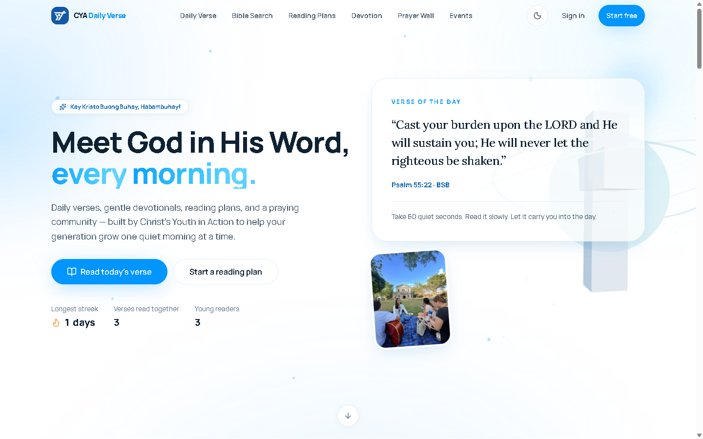
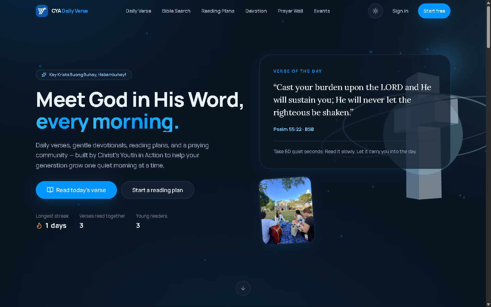
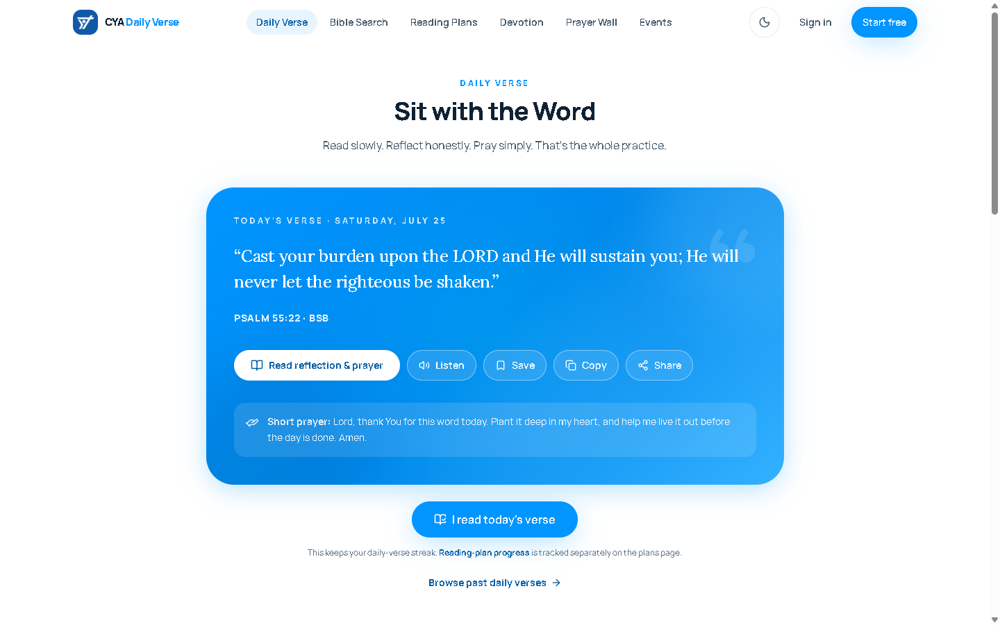
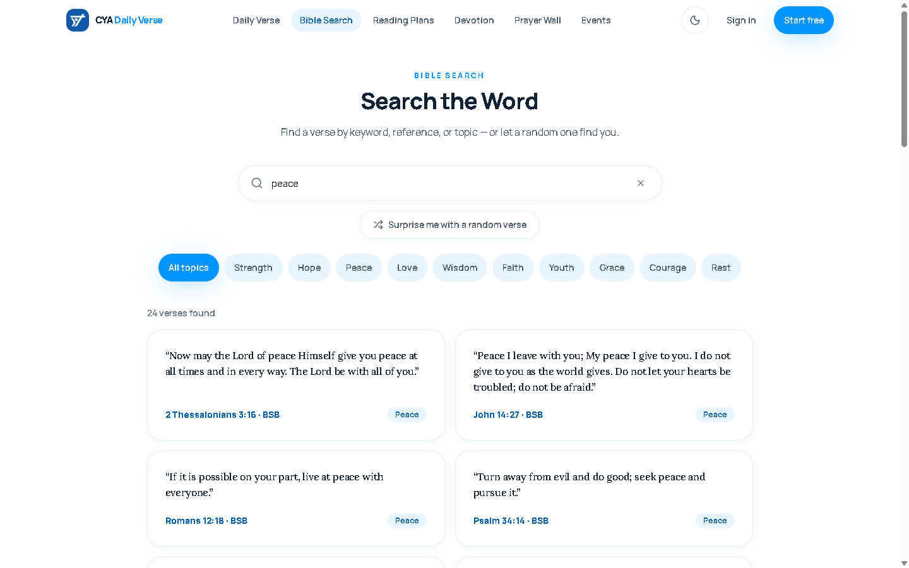

# Design Documentation

Visual and interaction design reference for **CYA Daily Verse** — a Progressive Web App and
daily-devotional platform built by *Christ's Youth in Action*. This document records how the product
looks, feels, and is put together: its design language, tokens, components, patterns, and screens.

Companion docs: [`ARCHITECTURE.md`](./ARCHITECTURE.md) (system design / engineering) and
[`FEATURES.md`](./FEATURES.md) (product behaviour). Where those explain *how the system runs*, this
explains *how the interface is designed*.

> **Evidence conventions**
> - **Fact** — read directly from source (`src/app/globals.css`, `src/components/**`, `src/app/**`).
> - **Inferred** — reasoned from the code, not explicitly stated.
>
> Design tokens mirror a Figma **Semantic** variable collection (Light / Dark modes); the CSS variables
> in `globals.css` are the source of truth in code.

---

## Visual reference

| Home (light) | Home (dark) |
|---|---|
|  |  |

| Signature verse card (`/verse`) | Bible search (`/search`) |
|---|---|
|  |  |

*Captured at 1440×900 against `npm run dev:local`. The same components render both themes by swapping
the semantic CSS variables — see [§3](#3-color-system).*

---

## 1. Design Overview

### Design philosophy

A calm, faith-forward interface that makes a daily spiritual habit feel effortless and inviting. The
product leads with one clear action each morning — *read today's verse* — then quietly surfaces
devotionals, reading plans, prayer, and community around it. Nothing competes with the Word.

### Design goals

- **Habit formation.** Optimise the daily loop: *verse → mark read → streak/XP → community*.
- **Reverent, modern feel.** Serif scripture on a deep-blue signature card; airy sky-toned chrome.
- **Frictionless daily return.** Signed-in state resolves server-side so first paint is correct — no
  flash of signed-out chrome.
- **Accessible to a broad, mostly-mobile youth audience.** WCAG AA contrast, 44px touch targets,
  full reduced-motion support.
- **Installable, offline-tolerant PWA** that feels native on a phone.

### User experience principles

| Principle | In practice |
|---|---|
| One primary action per screen | The verse card owns the home and `/verse`; a single filled Button per view |
| Progressive disclosure | Actions (save, listen, share) sit *on* the verse; deeper content is one tap away |
| Immediate, honest feedback | Optimistic save with rollback; toasts for every mutation; inline form errors |
| Motion with meaning | Entrance reveals, shared-layout nav pills, spring taps — all disabled under `prefers-reduced-motion` |
| Mobile-first, thumb-first | Fixed bottom nav (max 5 items), safe-area padding, 44px+ targets everywhere |

### Target audience

Three roles (`src/lib/types.ts`):

- **Visitor** — read verse, search, browse devotions/prayer/events.
- **Member** — verified account; save verses, track streak/XP, follow plans, post prayers, RSVP.
- **Moderator/Admin** — a separate dark back-office console (`/admin`), deliberately sharing no chrome
  with the public site.

### Design priorities

1. Clarity and calm over density.
2. Accessibility (contrast, targets, motion, focus) as a default, not a pass.
3. Performance-aware polish — heavy 3D/motion is desktop-only and capability-gated.
4. Consistency through tokens and a small shared primitive set.

---

## 2. Design System

### Design principles

- **Visual hierarchy.** Eyebrow (uppercase, tracked, `text-primary`) → bold tight heading → soft-ink
  body. Codified in the `SectionHeading` primitive.
- **Spacing consistency.** Tailwind's 4px spacing scale throughout; generous section rhythm; cards use
  large radii (`rounded-3xl`) and soft shadows.
- **Component reuse.** A single primitive file (`src/components/ui.tsx`) supplies Button, Badge, Card,
  SectionHeading, ProgressBar, Field, EmptyState, Skeleton. Every feature composes from these.
- **Interaction patterns.** Filled primary for the main action; secondary/outline/ghost for the rest.
  Pressable elements spring on tap; cards lift on hover.
- **User-feedback principles.** Optimistic UI with rollback (verse save), polite `aria-live` toasts
  (auto-dismiss ~3.2s), inline `role="alert"` field errors, skeletons for loading, dedicated empty
  states.

### Design language

- **Overall visual style.** Modern, minimal, airy. Glassmorphism on floating chrome (nav, bottom bar);
  soft shadows and large rounded corners; a living aurora/gradient backdrop.
- **Brand personality.** Warm, hopeful, youthful, reverent — friendly without being casual about the
  Scripture itself.
- **UI tone.** Encouraging and personal ("Your streak missed you", "Welcome to the family!").
- **Visual direction.** Sky-blue daylight palette signalling *morning* and *new mercies*; a deep-blue
  gradient reserved for the signature verse card; serif type for scripture, sans for everything else.

---

## 3. Color System

Colors are CSS variables in `src/app/globals.css`, exposed to Tailwind as `bg-*`, `text-*`, `border-*`
tokens via `@theme inline`. Three palettes swap the *same* semantic variables: **Light**, **Dark**
(`.dark` on `<html>`), and **Admin** (`.admin-shell`, forced dark regardless of site theme).

### Primary colors

| Name | Token | Light | Dark | Usage |
|---|---|---|---|---|
| Primary | `--primary` | `#0095ff` | `#0095ff` | Brand blue; primary buttons, active states, links |
| Primary 600 | `--primary-600` | `#0077d6` | `#2ea8ff` | Hover on primary |
| Primary 700 | `--primary-700` | `#005ea8` | `#7ec9ff` | Text on tints, emphasis, link text |

### Secondary colors (sky tints & neutrals)

| Name | Token | Light | Dark | Usage |
|---|---|---|---|---|
| Background | `--bg` | `#ffffff` | `#0a1522` | Page background |
| Surface | `--surface` | `#ffffff` | `#122031` | Cards, inputs, raised chrome |
| Sky tint | `--sky-tint` | `#e8f5ff` | `#16293d` | Secondary buttons, active nav pill, badges |
| Sky soft | `--sky-soft` | `#f4faff` | `#0d1a29` | Ghost hover, subtle fills |
| Sky mist | `--sky-mist` | `#d4ecff` | `#1e3c5a` | Hover borders, empty-state icon |
| Line | `--line` | `#e3edf5` | `#223850` | Borders, dividers |

### Text colors

| Name | Token | Light | Dark | Usage |
|---|---|---|---|---|
| Ink | `--ink` | `#0f2233` | `#eaf3fb` | Primary text, headings |
| Ink soft | `--ink-soft` | `#45586b` | `#a9bdd0` | Body / secondary text |
| Ink faint | `--ink-faint` | `#5f7488` | `#7e93a8` | Hints, captions, placeholders (darkened to clear AA on white) |

### Semantic colors

| Role | Token | Value | Notes |
|---|---|---|---|
| Success | `--color-success` | `#2eb886` | Toasts, confirmations (static token) |
| Warning | `--color-warning` | `#f59f4a` | Cautions (static token) |
| Danger/Error | `--color-danger` | `#ef5f5f` | Field errors, destructive, required `*` |
| Gold | `--color-gold` | `#ffc94d` | Rewards / XP accents |
| Amber soft / strong | `--amber-soft` / `--amber-strong` | `#fff4d6` / `#9a6b00` | Streak badge (flame) |
| Mint soft / strong | `--mint-soft` / `--mint-strong` | `#e2f8ee` / `#116b4a` | Positive "green" badge |
| Glass bg / border | `--glass-bg` / `--glass-border` | `rgba(255,255,255,.72)` / `rgba(227,237,245,.9)` | Frosted nav & bottom bar |
| Skeleton a / b | `--skeleton-a` / `--skeleton-b` | `#eef5fb` / `#f8fbfe` | Loading shimmer stops |
| Scrim | `--scrim` | `rgba(9,22,36,.45)` | Modal / sheet overlay |

> **Disabled** state is expressed by opacity, not a color token (`disabled:opacity-40` on buttons).

### The signature verse gradient

The daily verse card uses a fixed deep-blue gradient (not theme-swapped) so it reads as *the* moment in
both themes:

```
linear-gradient(135deg, #0095ff 0%, #0089ec 50%, #33b1ff 100%)
```

### Dark & admin modes

- **Dark mode** is class-based (`.dark` on `<html>`), set before paint by an inline theme script to
  avoid a flash. `color-scheme` is set per palette so form controls and scrollbars match.
- **Admin console** (`.admin-shell`) overrides the same semantic variables to a slate/cyan console
  palette (`--bg #020617`, `--primary #38bdf8`), so every shared component restyles itself with no
  component changes and stays dark in either site theme.

---

## 4. Typography System

### Font families

| Role | Font | Token | Loaded via | Weights |
|---|---|---|---|---|
| UI / sans | **Manrope** | `--font-sans` | `next/font/google`, `display: swap` | 400, 500, 600, 700, 800 |
| Scripture / serif | **Lora** | `--font-serif` | `next/font/google`, `display: swap` | 400, 500, 600 (+ italic) |

Fallback stacks: sans → `ui-sans-serif, system-ui, sans-serif`; serif → `ui-serif, Georgia, serif`.

Scripture uses a dedicated `.verse-text` class: Lora 500, `letter-spacing: -0.01em`, `line-height:
1.55`, for a calm, readable quote.

### Font scale

Sizes are Tailwind utilities as used in the code (rem → px at 16px base). Headings are extrabold and
tight-tracked; body is relaxed leading.

| Style | Classes | Size | Weight | Usage |
|---|---|---|---|---|
| Display / hero | `text-2xl → text-[2rem]` on `.verse-text` | 24–32px | 500 (serif) | Verse quote |
| H1 (page) | `text-2xl … tracking-tight` | 24px | 800 | Auth/page titles |
| H2 (section) | `text-3xl sm:text-4xl tracking-tight` | 30–36px | 800 | `SectionHeading` |
| Eyebrow | `text-xs uppercase tracking-[0.2em]` | 12px | 800 | Section kicker, primary color |
| Body | `text-base leading-relaxed` | 16px | 400 | Section sub-copy |
| Body small | `text-sm` | 14px | 400–600 | Cards, nav, labels |
| Input text | `text-[15px]` | 15px | 400 | Form fields |
| Label | `text-sm font-bold` | 14px | 700 | `Field` labels |
| Caption / help | `text-xs` | 12px | 400 | Hints, `ink-faint` |
| Bottom-nav label | `text-[11px] font-bold` | 11px | 700 | Mobile tab labels |

### Hierarchy & rhythm

- **Tracking.** Headings `tracking-tight`; eyebrows/labels wide (`tracking-[0.2em]`/`[0.25em]`).
- **Line height.** Body `leading-relaxed` (~1.625); scripture 1.55; headings `leading-snug`.
- **Emphasis ladder.** `ink` (headings) → `ink-soft` (body) → `ink-faint` (meta).
- **Gradient headline.** `.text-gradient` gives hero headlines a slowly-panning sheen, with a solid
  `--primary` fallback where `background-clip: text` is unsupported.

---

## 5. Layout System

### Grid & containers

- **Framework.** Tailwind CSS v4 (utility-first), no separate config file — tokens live in `globals.css`
  via `@theme`.
- **Max width.** `max-w-7xl` (1280px) for the nav and primary page shells; content columns use narrower
  `max-w-2xl` / `max-w-5xl` where reading comfort matters.
- **Horizontal padding.** Responsive gutters `px-4 sm:px-6 lg:px-8`.
- **Layout composition.** Flexbox and CSS grid utilities; cards use `rounded-3xl` with `border-line` and
  `shadow-soft`.

### Breakpoints

Tailwind v4 defaults; `lg` is the product's mobile↔desktop hinge (nav swaps, 3D/heavy motion enable).

| Token | Min width | Role |
|---|---|---|
| `sm` | 640px | Padding/step-ups, larger headings |
| `md` | 768px | Multi-column content |
| `lg` | 1024px | **Desktop nav** replaces mobile menu + bottom bar; 3D hero enabled |
| `xl` | 1280px | Wide layouts |

### Spacing & radius tokens

Spacing follows Tailwind's 4px base scale (`1`=4px … `4`=16px … `8`=32px …). Recurring radii:

| Token | Value | Usage |
|---|---|---|
| `rounded-full` | 9999px | Buttons, badges, pills, nav |
| `rounded-2xl` | 16px | Inputs, small cards, skeletons |
| `rounded-3xl` | 24px | Cards, mobile menu items |
| `rounded-[2.5rem]` | 40px | Signature verse card |

### Shadows

| Token | Value | Usage |
|---|---|---|
| `shadow-soft` | `0 2px 12px rgba(15,60,100,.06)` | Cards at rest |
| `shadow-lift` | `0 12px 32px -8px rgba(0,110,190,.16)` | Card hover, toasts, bottom nav |
| `shadow-glow` | `0 8px 40px -6px rgba(0,149,255,.35)` | Primary button, verse card |

### Responsive design

- **Mobile.** Fixed frosted bottom nav (`inset-x-3 bottom-3`, safe-area padded), hamburger sheet,
  single-column stacks, no 3D scene.
- **Tablet.** Content steps into multi-column grids at `sm`/`md`.
- **Desktop (`lg+`).** Inline top nav with animated active pill; hover affordances (card lift,
  spotlight, sheen); 3D hero and cursor glow enabled.
- **Overflow discipline.** `overflow-x: hidden` on both `html` and `body` so decorative blur layers
  never cause sideways scroll.

---

## 6. Component Design

All primitives live in [`src/components/ui.tsx`](../src/components/ui.tsx) unless noted. Only components
that exist in the project are documented.

### Button (`Button`, `ButtonLink`)

- **Purpose.** The primary interactive control; pill-shaped, with a hover sheen and spring tap.
- **Variants.** `primary` (filled blue, glow), `secondary` (sky tint), `outline` (bordered surface),
  `ghost` (text-only), `white` (on photos/gradients), `glass` (frosted).
- **Sizes.** `sm`/`md` (h-44px), `lg` (h-52px) — **every size meets the 44px touch minimum**.
- **States.** Default · Hover (variant color shift + sheen sweep) · Active (`scale 0.97` spring) ·
  Disabled (`opacity-40`, no pointer) · Loading (caller swaps in a spinning `Loader2` + label).
- **Guidelines.** One `primary` per view. Use `outline`/`ghost` for secondary actions; `white`/`glass`
  only over imagery or the verse gradient.

### Badge (`Badge`)

- **Purpose.** Compact status/metadata pill.
- **Tones.** `sky`, `gold` (amber), `green` (mint), `white` (always-white, for photos).
- **Usage.** Categories, counts, streak flame; not for actions.

### Card (`Card`)

- **Purpose.** The universal content container — `rounded-3xl`, `border-line`, `shadow-soft`.
- **Options.** `hover` (lift + border/shadow on hover), `ring` (conic gradient border for featured),
  `spotlight` (pointer-tracked radial highlight, mouse only).
- **Guidelines.** Reserve `ring`/`spotlight` for hero/featured surfaces; keep list cards plain.

### SectionHeading (`SectionHeading`)

- **Purpose.** Consistent section intro — eyebrow + animated heading + optional sub.
- **Usage.** Front of every marketing/content section; `center` variant for hero blocks. Title animates
  via `TextReveal` (word-mask), respecting reduced motion.

### ProgressBar (`ProgressBar`)

- **Purpose.** Reading-plan / streak progress. Announces via `role="progressbar"` with `aria-valuenow/min/max`.
- **States.** Animates width in on scroll into view; renders static under reduced motion.

### Form field & input (`Field`, `inputClass`)

- **Purpose.** Labelled input wrapper with help/error slots.
- **States.** Default · Focus (`focus:border-primary`, global 3px focus-visible ring) · Error
  (`role="alert"` danger text, `aria-invalid`, `aria-describedby`) · Optional (label suffix).
- **Guidelines.** Always pair `Field`/label with an `id`; mark required with a danger `*`, optional
  inline; help text in `ink-faint`.

### Empty state (`EmptyState`)

- **Purpose.** Friendly placeholder for empty lists — icon + title + body + optional action.
- **Usage.** Saved verses, prayer wall, search with no results.

### Skeleton (`Skeleton`)

- **Purpose.** Shimmer placeholder during load (`--skeleton-a/b` gradient, `animate-shimmer`).
- **Usage.** Reserve layout space for async content; shimmer freezes under reduced motion.

### Toast (`Toaster` / `toast()`) — `src/components/toast.tsx`

- **Purpose.** Transient, non-blocking feedback. Fired imperatively from anywhere via
  `toast(msg, tone)`.
- **Tones.** `success` (check), `info` (info), `error` (triangle).
- **Behavior.** Bottom-centered pill, `aria-live="polite"` (never steals focus), auto-dismiss ~3.2s,
  manual dismiss button; spring in/out, opacity-only under reduced motion.

### VerseCard (`VerseCard`) — `src/components/verse-card.tsx`

- **Purpose.** The signature surface — today's verse on the deep-blue gradient with 3D tilt, specular
  sheen, four quick actions, and a short prayer.
- **Actions/states.** Listen (Web Speech toggle, `aria-pressed`), Save (optimistic + rollback, burst
  animation, `aria-pressed`), Copy (clipboard), Share (Web Share with copy fallback). `compact` prop
  for embedded contexts.
- **Guidelines.** One per view; the product's focal point — nothing sits above it in hierarchy.

### Navigation — `Navbar`, `BottomNav`, `Footer`, `ThemeToggle`

Documented as patterns in [§7](#7-user-interface-patterns).

---

## 7. User Interface Patterns

### Navigation patterns

- **Top navbar (`lg+`).** Fixed, transparent at top → frosted `glass` + shadow on scroll (`useScrolled(12)`).
  Logo, six primary links with a shared-layout animated active **pill** (`layoutId="nav-pill"`), streak
  badge, theme toggle, and auth CTAs. `aria-current="page"` on the active link.
- **Mobile menu.** Hamburger opens a height-animated sheet; locks body scroll, closes on `Escape` and on
  route change; staggered link entrance.
- **Bottom nav (mobile).** Fixed frosted bar, **max 5 thumb-friendly tabs** (min-height 56px), animated
  active background (`layoutId="bottom-nav-active"`) + dot; last tab adapts (Dashboard when signed in,
  else Sign in). Hidden at `lg`.
- **Skip link.** `Skip to content` visible on focus, jumps to `#main`.
- **Theme toggle.** Persists to `localStorage('cya-theme')`; applied pre-paint.

### Forms

- **Validation.** Client-side on submit (`noValidate`) — name ≥2, email regex, password ≥8 — with
  focus moved to the first invalid field; server errors surfaced in a danger banner.
- **Input states.** Focus ring via `focus:border-primary` + global `:focus-visible` outline; error via
  `aria-invalid` + `role="alert"` message + `aria-describedby` wiring.
- **Password field.** Show/hide toggle (`aria-pressed`, `aria-label`), correct `autocomplete`
  (`current-password` / `new-password`).
- **Submission.** Button disables and swaps to a spinner + progress label; success routes + toasts.

### Feedback

| Channel | Mechanism | When |
|---|---|---|
| Toast | `toast()` polite live region | Save/copy/share, sign-in, mutation results |
| Inline error | `role="alert"` danger text | Field-level validation |
| Error banner | Danger-tinted panel | Server/network failure on forms |
| Optimistic UI | Immediate flip + rollback | Verse save |
| Loading | Skeleton shimmer / button spinner | Async data / in-flight submit |
| Empty state | `EmptyState` card | No saved verses, prayers, results |

---

## 8. Page & Screen Design

Route groups: **`(site)`** (public + member, full chrome) and **`(admin)`** (dark console, no site
chrome). Full route list in [§Appendix](#route-map).

### Home (`/`)

- **Purpose.** First impression + entry into the daily habit.
- **Layout.** Hero (3D light scene on desktop, aurora backdrop) → `VerseCard` → feature sections
  (`home/sections.tsx`).
- **Components.** Hero, VerseCard, SectionHeading, Card, Button.
- **Actions.** Read reflection (primary), Save/Listen/Copy/Share, Start free / Sign in.

### Daily Verse (`/verse`, archive at `/verse/archive`)

- **Purpose.** Today's verse plus reflection, prayer, and Mark-as-read (streak/XP).
- **Components.** VerseCard, `MarkRead`, `WeekProgress`, Card.
- **Actions.** Mark read (primary, gamified), save, browse archive.

### Search (`/search`)

- **Purpose.** Full-text Bible search over the seeded corpus.
- **Components.** Search input, result Cards, EmptyState, `RecentlyViewed`.
- **Actions.** Query, open verse, save.

### Prayer Wall (`/prayer`)

- **Purpose.** Post and pray for moderated community requests.
- **Components.** `Prayer` list/composer, Card, EmptyState, Badge.
- **Actions.** Post (verified members), pray (one per user), moderation entry for admins.

### Plans (`/plans`), Devotion (`/devotion`, `/devotion/[slug]`), Events (`/events`), Mood (`/mood`)

- **Purpose.** Reading plans with progress, devotional articles, community events with RSVP + pubmats,
  mood-based verse discovery.
- **Components.** Card, ProgressBar, Badge, SectionHeading, image pubmats.

### Dashboard (`/dashboard`)

- **Purpose.** Member home — streak, XP/level, saved verses, plan progress, notification toggle.
- **Components.** `SavedVerses`, `WeekProgress`, `AccountControls`, `NotifyToggle`, ProgressBar, Card.
- **Actions.** Manage account, toggle push, resume plans, export/delete data.

### Auth (`/login`, `/register`, `/forgot-password`, `/reset-password`, `/verify-email`)

- **Purpose.** Account lifecycle.
- **Layout.** Centered `AuthForm` card — logo, contextual heading/sub, fields, CTA, cross-link.
- **Actions.** Sign in / create account, request/reset password, verify email.

### Static (`/about`, `/privacy`, `/terms`)

- Long-form content within the standard site chrome.

### Admin console (`/admin`, `/admin/prayers`, `/admin/users`, `/admin/devotions`, `/admin-portal`)

- **Purpose.** Moderation and management.
- **Layout.** Dark `admin-shell`; sticky minimal header (logo, "Events console", exit), no public
  chrome. Passphrase gate at `/admin-portal`.

---

## 9. User Experience Flow

### Registration & verification

```
/register → validate (name/email/pw) → POST /api/auth/register
  → success toast → /dashboard → email-verify prompt → /verify-email → member (can post/pray)
```

### Login

```
/login → validate → POST /api/auth/login
  → "Welcome back" toast → /dashboard   (errors: inline field / server banner)
```

### Daily reading (core loop)

```
Home or /verse → read verse → Mark as read → streak + XP update (once/day)
  → optional Save / Listen / Share → return tomorrow
```

### Save a verse (optimistic)

```
Tap Save → flip to "Saved" instantly + burst
  → POST /api/saved → 401? rollback + "Sign in" toast + /login
                    → !ok? rollback + error toast
                    → ok? confirm from server + success toast
```

### Password recovery

```
/forgot-password → email → reset link → /reset-password → new password → /login
```

### Prayer participation

```
/prayer → (verified) post request → moderation → appears on wall
        → others tap Pray (one per user) → prayedCount increments
```

### Error recovery

- **Form/network errors** surface inline or as a danger banner without losing input.
- **Offline** falls back to a cached shell (`offline.html`) via the service worker.
- **Failed mutations** roll back optimistic UI and explain via toast.

---

## 10. Accessibility

- **Contrast.** Text tokens tuned for WCAG AA — `--ink-faint` was darkened (`#7d8fa0 → #5f7488`) to
  clear 4.5:1 on white surfaces.
- **Touch targets.** 44px minimum on every interactive control (button sizes, icon buttons, nav tabs).
- **Focus.** Global `:focus-visible` 3px ring (keyboard-only); visible skip-to-content link.
- **Semantics/ARIA.** `aria-current` on active nav, `aria-pressed` on toggles, `aria-invalid` +
  `role="alert"` on errors, `aria-live="polite"` toasts, `role="progressbar"`, `aria-label` on
  icon-only buttons, decorative art marked `aria-hidden`.
- **Reduced motion.** `prefers-reduced-motion` globally collapses animations/transitions to ~0ms,
  hides cursor glow and aurora, freezes shimmer, and disables 3D — every effect has a static fallback.
- **Capability gating.** 3D hero is desktop-only and skipped on low-core devices; scripture-quote SVGs
  and background layers are `aria-hidden`.
- **Color independence.** State is never conveyed by color alone (icons + text accompany tones).

---

## 11. Motion & Interaction

Motion tokens live in [`src/lib/motion.ts`](../src/lib/motion.ts); keyframes in `globals.css`.

- **Durations.** `micro 0.18s`, `fast 0.24s`, `base 0.36s`, `slow 0.6s`, `exit 0.22s` (exits ~65% of
  enters so dismissals feel responsive).
- **Easing.** `EASE [0.21,0.66,0.29,0.99]` (fluid), `EASE_OUT [0.16,1,0.3,1]`; springs `spring`
  (stiff, snappy taps) and `springSoft`.
- **Patterns.** Section reveal (fade + rise + blur), staggered children (40ms), word-mask `TextReveal`,
  route crossfade (`pageVariants`), shared-layout nav pills, hover sheen/lift/spotlight, verse-save
  burst, streak flame.
- **Decorative layers.** Aurora mesh, cursor glow, scroll-progress bar, panning gradient text, floating
  blobs — all additive and reduced-motion-aware.

---

## Appendix

### Design tokens summary

- **Source of truth (code).** CSS variables in `src/app/globals.css`, surfaced to Tailwind via
  `@theme` / `@theme inline`. Mirrors the Figma **Semantic** collection (Light/Dark).
- **Token families.** Color (semantic, theme-swapped) · static color (success/warning/danger/gold) ·
  typography (`--font-sans`, `--font-serif`) · shadow (`soft/lift/glow`) · animation (`float`, `drift`,
  `shimmer`, `aurora`, `ping-slow`, `gradient-pan`).

### Route map

| Group | Routes |
|---|---|
| `(site)` public | `/`, `/verse`, `/verse/archive`, `/search`, `/plans`, `/devotion`, `/devotion/[slug]`, `/events`, `/mood`, `/prayer`, `/about`, `/privacy`, `/terms` |
| `(site)` auth | `/login`, `/register`, `/forgot-password`, `/reset-password`, `/verify-email` |
| `(site)` member | `/dashboard` |
| `(admin)` | `/admin`, `/admin/prayers`, `/admin/users`, `/admin/devotions`, `/admin-portal` |

### Key design files

| File | Role |
|---|---|
| `src/app/globals.css` | Design tokens, themes, effects, keyframes |
| `src/app/layout.tsx` | Fonts (Manrope/Lora), theme-init script, metadata |
| `src/components/ui.tsx` | Shared primitives (Button, Card, Field, …) |
| `src/components/verse-card.tsx` | Signature verse surface |
| `src/components/toast.tsx` | Toast feedback system |
| `src/components/nav/*` | Navbar, bottom nav, footer, theme toggle |
| `src/lib/motion.ts` | Motion tokens, variants, easing |

### Design glossary

| Term | Meaning |
|---|---|
| Semantic tokens | Theme-swappable CSS variables (`--ink`, `--surface`, …) shared by all components |
| Signature card | The deep-blue gradient verse card — the product's focal surface |
| Glass chrome | Frosted, blurred nav / bottom bar (`.glass`) |
| Aurora | Animated blurred mesh backdrop, reduced-motion-aware |
| Active pill | Shared-layout highlight that slides between nav items |
| Optimistic UI | Instant UI change with rollback if the server disagrees (verse save) |

---

*Maintenance note: keep this document evidence-driven. When tokens in `globals.css`, primitives in
`ui.tsx`, or motion tokens change, update the affected section here. This file documents the
**interface**; system/engineering design lives in [`ARCHITECTURE.md`](./ARCHITECTURE.md).*
