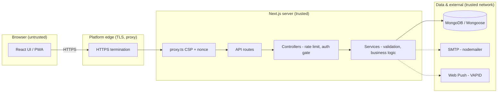
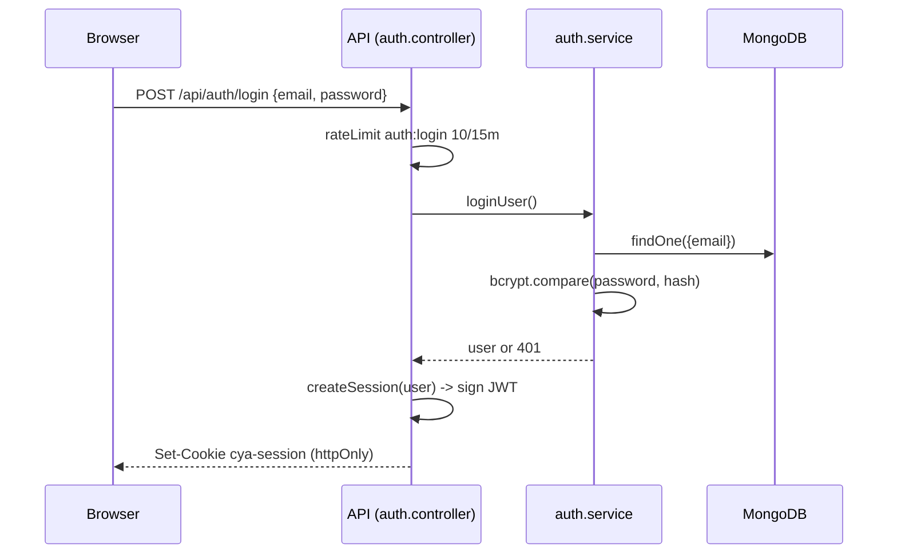
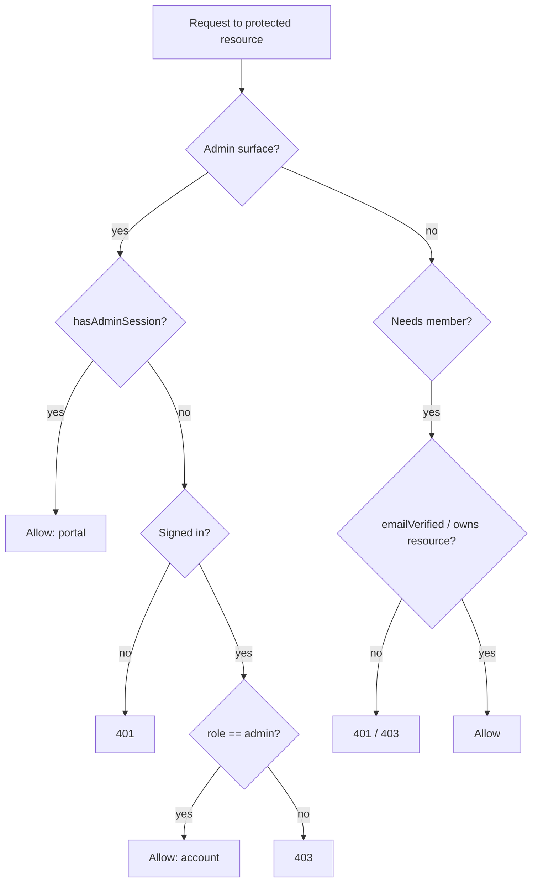

# Security

Security architecture, controls, and operational guidance for **CYA Daily Verse** — a
Next.js 16 application (App Router) backed by MongoDB/Mongoose. This document is written from an
audit of the actual implementation. Features not yet in the codebase are labelled
**Recommended Improvement** and never presented as shipped.

Related design rationale: [`ARCHITECTURE.md`](./ARCHITECTURE.md), [`DATABASE.md`](./DATABASE.md),
[`API.md`](./API.md), [`DEPLOYMENT.md`](./DEPLOYMENT.md).

---

## Table of contents

1. [Security Overview](#1-security-overview)
2. [Security Architecture](#2-security-architecture)
3. [Authentication](#3-authentication)
4. [Authorization](#4-authorization)
5. [Password Security](#5-password-security)
6. [Input Validation & Data Sanitization](#6-input-validation--data-sanitization)
7. [SQL / NoSQL Injection Prevention](#7-sql--nosql-injection-prevention)
8. [XSS Protection](#8-xss-cross-site-scripting-protection)
9. [CSRF Protection](#9-csrf-cross-site-request-forgery-protection)
10. [Secrets Management](#10-secrets-management)
11. [API Security](#11-api-security)
12. [Database Security](#12-database-security)
13. [Dependency Security](#13-dependency-security)
14. [Logging & Monitoring](#14-logging--monitoring)
15. [Secure Development Practices](#15-secure-development-practices)
16. [Deployment Security](#16-deployment-security)
17. [Security Checklist](#17-security-checklist)
18. [Reporting Security Issues](#18-reporting-security-issues)

---

## 1. Security Overview

### Purpose

This document tells three audiences what protects the application and where its edges are:
maintainers who extend it, reviewers who audit it, and evaluators judging engineering quality. It is
descriptive of the code as it exists, not aspirational.

### Security philosophy

- **Defence in depth.** No single control is trusted alone — transport, headers, session integrity,
  authorization, and input validation each stand on their own.
- **Least privilege.** Members see and mutate only their own data; admin surfaces sit behind a single
  gate; the DB user needs only application-scope rights.
- **Fail safely, degrade gracefully.** Session reads fail *open* on a DB blip to avoid mass logout;
  sensitive writes fail *closed*. Rate limiting falls back to in-memory when Mongo is unreachable
  rather than blocking real traffic.
- **Secure by default.** Secrets gate boot; production cookies are `secure`; CSP ships without
  `script-src 'unsafe-inline'`.
- **No secrets, no PII in the repo or logs.** Enforced by `.gitignore` and a single logging choke
  point.

### Application security goals

| Goal | Mechanism |
|---|---|
| Authenticate members | bcrypt password hash + signed JWT session cookie |
| Keep sessions revocable | `tokenVersion` re-checked against DB on every read |
| Protect account takeover surfaces | rate limiting, anti-enumeration, single-use tokens |
| Gate privileged actions | `assertAdmin()`, `emailVerified` checks, ownership checks |
| Resist injection & XSS | Mongoose queries, escaped regex, React escaping, strict CSP |
| Protect data in transit | HSTS, `upgrade-insecure-requests`, secure cookies |
| Give members data control | self-service export and delete |

### Threat model summary

| Threat | Exposure | Primary control |
|---|---|---|
| Credential stuffing / brute force | Login, forgot, verify endpoints | Per-IP rate limiting (Mongo-backed) |
| Session theft / replay | Session cookie | `httpOnly`, `secure`, `sameSite=lax`, `tokenVersion` revocation |
| Password database leak | `passwordHash` at rest | bcrypt cost 10; no plaintext ever stored |
| Account enumeration | `/api/auth/forgot` | Uniform response regardless of account existence |
| Reflected / stored XSS | Rendered content, emails | React escaping, nonce CSP, `escapeHtml` in mail |
| NoSQL injection | Search, query params | Mongoose casting, `escapeRegex`, `isValidObjectId` |
| Privilege escalation | Admin surfaces | `assertAdmin()` single gate; role cannot self-elevate |
| Secret disclosure | Env, cron, admin passphrase | env-only storage, timing-safe compares, `.gitignore` |
| Clickjacking | Any page | `X-Frame-Options: DENY`, `frame-ancestors 'none'` |
| IP spoofing to evade limits | `X-Forwarded-For` | Trusted-hop counting from the right |

**Out of scope / accepted:** shared admin-portal passphrase model (documented, ministry-operated);
platform-level DDoS (delegated to the hosting edge); no MFA (see Recommended Improvements).

---

## 2. Security Architecture

The app is a single Next.js deployment. The browser talks only to Next.js; Next.js server code talks
to MongoDB and, optionally, SMTP and the Web Push service. There are no other inbound trust
boundaries.



### Trust boundaries

| Boundary | Left (untrusted) | Right (trusted) | Enforcement at the line |
|---|---|---|---|
| Browser → Edge | Client input, cookies, headers | TLS-terminated request | HTTPS, HSTS |
| Edge → App | `X-Forwarded-For` chain | Derived client IP | Trusted-hop counting |
| Route → Controller | Raw request | Authenticated/limited request | `rateLimit`, `getSession`, `assertAdmin` |
| Controller → Service | Request-shaped args | Validated domain args | Length/format/type validation |
| Service → DB | JS values | Mongoose-cast query | Schema casting, `isValidObjectId` |

### Security layers

- **Frontend** — React output escaping; PWA served same-origin; no secrets shipped to the client
  (only `NEXT_PUBLIC_*`). 3D/motion assets are static.
- **Backend** — layered `route → controller → service`; controllers own rate limiting and the auth
  gate, services own validation and data access. `server-only` import guards keep session/DB code out
  of client bundles.
- **API** — same-origin JSON; per-endpoint auth and rate-limit policy; typed `ApiError` responses
  that avoid leaking internals.
- **Database** — Mongoose schemas with typed fields, `maxlength`, enums, unique indexes, and TTL
  indexes for token/rate-bucket expiry.
- **External** — SMTP and Web Push are optional and fail soft; both use credentials held only in env.

---

## 3. Authentication

### Strategy

Stateless **JWT session cookie** signed with `jose` (HS256), plus a DB-checked revocation counter so
sessions are not purely stateless. Implemented in [`session.js`](../src/server/middleware/session.js).

### Login / session flow



### Token management

| Property | Value |
|---|---|
| Cookie name | `cya-session` |
| Algorithm | HS256 (`jose`) |
| Claims | `sub` (user id), `name`, `email`, `tv` (tokenVersion), `iat`, `exp` |
| `httpOnly` | Yes |
| `secure` | Yes in production (`NODE_ENV==="production"`) |
| `sameSite` | `lax` |
| `path` | `/` |
| Lifetime | 30 days |

### Session state & revocation

Every authenticated read re-reads the account's `tokenVersion` and compares it to the JWT's `tv`
claim. A mismatch invalidates the session. `tokenVersion` is incremented on password reset, so a
reset logs out **all** existing sessions.

- **Fail-open (default):** a DB outage during the revocation lookup keeps the session valid — avoids
  mass logout on a transient blip.
- **Fail-closed (`getSession({ strict: true })`):** used on auth-sensitive writes (account export,
  account delete) so a stale session cannot act during an outage.

### Access-token expiration & refresh

No refresh tokens. The 30-day cookie is re-issued on login. There is no sliding renewal.
**Recommended Improvement:** sliding expiry / explicit refresh for long-lived sessions.

### Account recovery

Self-service password reset by email (see [§5](#5-password-security)). Tokens are single-use,
hashed at rest, and expire in 60 minutes. The request endpoint is anti-enumeration (uniform
response).

### MFA

Not implemented. **Recommended Improvement:** TOTP or email-code second factor for admin accounts.

---

## 4. Authorization

### Model

Two axes:

1. **Member role** on the user document — `role: "member" | "admin"`.
2. **Verification gate** — `emailVerified` must be true for participation writes (e.g. posting a
   prayer).

Admin access is granted by **either** a valid admin-portal passphrase session **or** a signed-in user
whose account carries `role: "admin"`. Both funnel through one gate,
[`assertAdmin()`](../src/server/middleware/require-admin.js).

### Authentication vs authorization

- **Authentication** answers *who are you* — the `cya-session` JWT.
- **Authorization** answers *may you do this* — `assertAdmin()`, `emailVerified` checks, and
  per-resource ownership checks.

### Permission validation flow



### Roles

| Role | Capabilities |
|---|---|
| Anonymous | Public reads: daily verse, archive, search, devotions, events, public prayer wall |
| Member | Own data: prayers (post, pray), plans, streaks, saved verses, RSVP, export/delete |
| Verified member | Adds participation writes gated on `emailVerified` (e.g. prayer post) |
| Admin | Devotions, events, users, prayers moderation, verse sync, image upload |

### Protected-resource rules

- Users **cannot** strip or grant their own admin role.
- Push subscriptions are ownership-checked before removal.
- Prayers are **hidden, never hard-deleted**, by moderators.
- Admin API endpoints (`/api/admin/*`) call `assertAdmin()` before any effect.

---

## 5. Password Security

| Concern | Implementation |
|---|---|
| Hashing algorithm | **bcrypt** (`bcryptjs`), cost factor **10** |
| Salt | Per-password salt generated by bcrypt, embedded in the hash |
| Storage | Only `passwordHash` is stored; **plaintext is never persisted or logged** |
| Comparison | `bcrypt.compare` (constant-time within bcrypt) |
| Minimum strength | ≥ 8 characters (enforced on register and reset) |
| Reset token | `crypto.randomBytes(32)` hex, **SHA-256 hashed at rest**, 60-min TTL, single-use |
| Reset side effect | `tokenVersion++` invalidates all sessions |
| Brute-force defence | Per-IP rate limits on login (10/15m), forgot (3/15m), reset (10/15m) |

Reset flow ([`password-reset.service.js`](../src/server/services/password-reset.service.js)):

- The raw token travels only in the emailed link; the DB stores its SHA-256 hash, so a DB read cannot
  reconstruct a usable link.
- Requesting a new link deletes prior unused links for that user.
- `requestReset` always resolves identically whether or not the email is registered
  (**anti-enumeration**), and sends mail fire-and-forget so SMTP latency cannot be timed.

**Recommended Improvements:**

- Password complexity / breached-password check (e.g. HaveIBeenPwned k-anonymity range API).
- Explicit account lockout after N consecutive failures (today only rate limiting applies).

---

## 6. Input Validation & Data Sanitization

### Where validation lives

Validation is centralised in **services** (the layer nearest the data), so every entry path shares
one rule set:

- **Auth** — name 2–60 chars, email `^\S+@\S+\.\S+$` and ≤ 120 chars, password ≥ 8.
- **Prayer** — request trimmed, 10–1000 chars; display name clamped to 60 chars.
- **IDs** — `isValidObjectId` before any lookup by id.
- **Pagination/limits** — bounded numeric `limit` values.
- **Coercion** — inputs coerced with `String(x ?? "")` / `.trim()` before checks, so non-string and
  `null`/`undefined` payloads cannot bypass validation.

### Client-side validation

The React forms validate for UX (required fields, formats), but **server-side validation is
authoritative** — client checks are never trusted.

### File / image upload validation

Admin pubmat uploads are stored in Mongo and streamed back with a **content-type allowlist**
(`image/jpeg`, `image/png`, `image/webp`) in
[`image.controller.js`](../src/server/controllers/image.controller.js); anything else is clamped to a
safe default so a mismatched type cannot be served for script execution. Image serving is rate-limited
(`admin:image` 30/10m).

---

## 7. SQL / NoSQL Injection Prevention

The datastore is MongoDB via **Mongoose**, so classic SQL injection does not apply; the relevant risk
is **NoSQL / operator injection**.

**Approach**

- All access goes through **Mongoose models**, which cast inputs to their schema types — a string
  field cannot silently become a `{ $gt: ... }` operator object.
- Object ids are validated with `isValidObjectId` before use.
- User-supplied text used in a regex search is escaped before it reaches `RegExp`.

**Secure pattern** ([`verse.service.js`](../src/server/services/verse.service.js)):

```js
function escapeRegex(s) {
  return s.replace(/[.*+?^${}()|[\]\\]/g, "\\$&");
}
const rx = new RegExp(escapeRegex(query), "i");   // user input neutralised
await Verse.find({ text: rx }).limit(bounded);
```

**Dangerous patterns avoided**

```js
// DO NOT: raw user object spread into a query — enables operator injection
await User.find(req.body);
// DO NOT: unescaped user string in a RegExp — ReDoS / unintended matches
new RegExp(userInput);
```

---

## 8. XSS (Cross-Site Scripting) Protection

### Strategy

Layered: framework escaping for output, a strict nonce-based CSP as a backstop, and manual escaping
where content leaves React (transactional email).

| Vector | Control |
|---|---|
| Stored XSS | User content rendered through React (auto-escaped); no `dangerouslySetInnerHTML` on user data |
| Reflected XSS | Nonce + `strict-dynamic` CSP — a reflected `<script>` has no valid nonce, so it cannot run |
| DOM-based XSS | React-managed DOM; no `innerHTML` sinks fed by request data |
| Email HTML | `escapeHtml()` applied to interpolated names in reset/verify mail |

### Content Security Policy

Set **per request** in [`proxy.ts`](../src/proxy.ts) so `script-src` carries a fresh nonce instead of
`'unsafe-inline'`:

```
default-src 'self';
script-src 'self' 'nonce-<random>' 'strict-dynamic';
style-src 'self' 'unsafe-inline';
img-src 'self' data: blob:;
font-src 'self' data:;
connect-src 'self';
worker-src 'self' blob:;
frame-ancestors 'none';
base-uri 'self';
form-action 'self';
object-src 'none';
upgrade-insecure-requests;
```

- `strict-dynamic` means only the nonce'd bootstrap and scripts it loads execute.
- `style-src` retains `'unsafe-inline'` because `next/font` and Tailwind inject inline `<style>` a
  nonce cannot reach. Style-based XSS is materially weaker than script-based; documented and accepted.
  **Recommended Improvement:** move to hashed/nonce'd styles if the toolchain allows.

---

## 9. CSRF (Cross-Site Request Forgery) Protection

### Current strategy

- **`SameSite=Lax`** on both session cookies (`cya-session`, `cya-admin`) — cross-site POSTs do not
  send the cookie.
- **`form-action 'self'`** and **same-origin** API design — state changes are JSON calls from the
  app's own origin.
- Session cookies are `httpOnly` and (in production) `secure`.

| Cookie | httpOnly | secure (prod) | sameSite | maxAge |
|---|---|---|---|---|
| `cya-session` | ✅ | ✅ | lax | 30 days |
| `cya-admin` | ✅ | ✅ | lax | 8 hours |

### Gap

There is **no explicit anti-CSRF token** on state-changing POSTs; protection rests on `SameSite=Lax`
plus same-origin. `Lax` permits top-level cross-site GET navigations, so any future
**state-changing GET** would be exposed — all mutations must stay POST/PUT/DELETE.

**Recommended Improvement:** double-submit CSRF token (or `SameSite=Strict` for the admin cookie) for
defence in depth on privileged mutations.

---

## 10. Secrets Management

### Storage

Secrets live **only in environment variables**; none are committed. Documented in
[`.env.example`](../.env.example) with generation commands.

| Variable | Purpose | Required |
|---|---|---|
| `MONGO_URL` | MongoDB connection string | ✅ (boot gate) |
| `AUTH_SECRET` | HS256 signing key for session + admin JWTs | ✅ (boot gate) |
| `NEXT_PUBLIC_SITE_URL` | Canonical origin for reset/verify links | ✅ (boot gate) |
| `ADMIN_PORTAL_PASSWORD` | Shared admin-portal passphrase | Admin portal |
| `CRON_SECRET` | Shared secret for the daily-verse scheduler | Cron |
| `VAPID_PUBLIC_KEY` / `VAPID_PRIVATE_KEY` / `VAPID_CONTACT_EMAIL` | Web Push | Optional |
| `SMTP_USER` / `SMTP_PASS` / `SMTP_FROM` | Transactional email | Optional |
| `TRUSTED_PROXY_HOPS` | Trusted reverse-proxy count for IP derivation | Optional |

### Protections

- **Boot gate** — `assertEnv()` refuses to start if `MONGO_URL`, `AUTH_SECRET`, or
  `NEXT_PUBLIC_SITE_URL` is missing ([`env.js`](../src/server/config/env.js)).
- **Timing-safe compares** — `CRON_SECRET` and the admin passphrase are compared with
  `crypto.timingSafeEqual` over SHA-256 digests, so response timing cannot leak the value.
- **Never logged** — the logging choke point records error scope/message only, no secret material.
- **`.gitignore`** excludes `.env*` (except `.env.example`), `*.pem`, `admin-credentials.json`,
  `railway-variables.json`.

### Dev vs prod & rotation

- Dev uses a local in-memory Mongo (`mongodb-memory-server`) and a local `.env`; production secrets
  live in the platform's secret store.
- **Rotation:** rotate `AUTH_SECRET` (invalidates all sessions), `ADMIN_PORTAL_PASSWORD` (rotate when
  a leader steps down), `CRON_SECRET`, and SMTP/VAPID keys on a schedule and on suspected exposure.

---

## 11. API Security

| Control | Detail |
|---|---|
| Authentication | `cya-session` JWT via `getSession()`; admin via `assertAdmin()` |
| Authorization | Per-endpoint role and `emailVerified` checks; ownership checks on user resources |
| Rate limiting | Per-IP, Mongo-backed fixed window with in-memory fallback (see table) |
| Request validation | Service-layer length/format/type checks; `isValidObjectId` |
| Error handling | Typed `ApiError` → uniform JSON; internals not leaked to clients |
| Security headers | Static set in `next.config.ts` + per-request CSP in `proxy.ts` |
| CORS | **Same-origin only** — no permissive `Access-Control-Allow-Origin` is set |
| Cron / machine auth | `CRON_SECRET` timing-safe compare on the daily-verse job |

### Rate-limit policy (implemented)

| Endpoint | Name | Limit | Window |
|---|---|---|---|
| Register | `auth:register` | 5 | 60 min |
| Login | `auth:login` | 10 | 15 min |
| Forgot password | `auth:forgot` | 3 | 15 min |
| Reset password | `auth:reset` | 10 | 15 min |
| Verify email | `auth:verify` | 10 | 15 min |
| Resend verification | `auth:verify-resend` | 3 | 15 min |
| Post prayer | `prayer:create` | 5 | 10 min |
| Pray for a prayer | `prayer:pray` | 60 | 1 min |
| Verse search | `verse:search` | 120 | 1 min |
| Admin image serve | `admin:image` | 30 | 10 min |
| Admin portal login | `admin:portal` | 5 | 15 min |

**Anti-spoofing:** the client IP is taken from `X-Forwarded-For` **counting from the right** by
`TRUSTED_PROXY_HOPS`, so a client-injected leftmost address cannot forge identity
([`rate-limit.js`](../src/server/middleware/rate-limit.js)).

**Gap / Recommended Improvement:** non-auth state-changing writes — RSVP, plan enroll/leave, saved
verses, streak, push subscribe — are **not** rate-limited. Add limits to blunt automated abuse.

---

## 12. Database Security

| Area | Practice |
|---|---|
| Access control | Single application DB user via `MONGO_URL`; no shared admin credentials in app |
| Least privilege | DB user should hold read/write on the app database only (**operational**) |
| Query safety | Mongoose casting + `isValidObjectId` + escaped regex (see §7) |
| Schema constraints | `required`, `maxlength`, `enum`, `unique` (email), typed fields |
| Token/abuse expiry | **TTL indexes** auto-expire reset tokens, verify tokens, and rate buckets |
| Migration safety | Schema-on-write via Mongoose; seed/purge scripts are explicit and non-destructive by default |
| Backups | Managed by the hosting platform (**operational**) |

**Encryption:** data in transit to Mongo depends on TLS in the connection string (`mongodb+srv://` /
`tls=true`); at-rest encryption is provided by the managed database tier. **Recommended
Improvement:** verify TLS is enforced on the connection and enable at-rest encryption on the cluster.

---

## 13. Dependency Security

- **Runtime deps are deliberately lean** — `bcryptjs`, `jose`, `mongoose`, `nodemailer`, `web-push`,
  plus the Next/React/UI stack. No heavyweight security middleware; controls are first-party and
  auditable.
- **Lock file** — `package-lock.json` is committed for reproducible, pinned installs.
- **Pinned framework** — Next.js and `eslint-config-next` pinned to an exact version.

**Recommended tooling** (not yet wired into CI):

| Tool | Use |
|---|---|
| `npm audit` | Baseline vulnerability scan on install |
| Dependabot / Renovate | Automated dependency PRs |
| Snyk / OSV-Scanner | Deeper transitive-vulnerability analysis |
| OWASP Dependency-Check | SCA in CI |

**Recommended Improvement:** enable Dependabot and an `npm audit`/OSV gate in the GitHub Actions
workflow.

---

## 14. Logging & Monitoring

Centralised in [`logger.js`](../src/server/utils/logger.js) — a single choke point emitting
structured JSON to `console.error`, designed to be swapped for a hosted reporter (Sentry, Logtail)
without touching call sites.

**What is logged**

- Genuine failures only: unreachable DB, unexpected throws, mail-send failures.
- Structured fields: `level`, `scope`, `message`, optional non-sensitive `meta` (e.g. `userId`),
  `time`.

**What is never logged**

- Passwords, password hashes, JWTs, session cookies, reset/verify tokens.
- Customer PII beyond a user id reference.
- Routine expected conditions (expired JWT, malformed body) — kept out to preserve signal.

**Gaps / Recommended Improvements:**

- No security-specific alerting (failed-login spikes, admin actions) in the repo.
- **No admin-action audit log.** Add an append-only audit trail for privileged mutations.
- Wire the logger to a real error-tracking backend in production.

---

## 15. Secure Development Practices

- **Layered architecture** keeps auth/DB code server-only via `import "server-only"` guards, so it
  cannot leak into client bundles.
- **Typed errors** (`ApiError`) standardise safe client responses.
- **Environment separation** — local in-memory Mongo for dev; managed cluster for prod; env-gated
  optional integrations.
- **Linting** — ESLint (`eslint-config-next`) on the codebase.
- **Focused commits** — atomic, conventional messages.

**Recommended Improvements:**

- Branch protection + required PR review on `main`.
- CI security checks (dependency audit, secret scanning, lint gate) before merge.
- A pre-commit secret scanner (e.g. gitleaks).

---

## 16. Deployment Security

### Production checklist

- [x] HTTPS enforced (HSTS `max-age=63072000; includeSubDomains`, `upgrade-insecure-requests`)
- [x] Secure cookies (`secure` in production)
- [x] Security headers set (`X-Content-Type-Options`, `X-Frame-Options: DENY`, `Referrer-Policy`,
  `Permissions-Policy`, HSTS) + per-request CSP
- [x] Required secrets present (boot gate refuses to start otherwise)
- [x] No secrets committed (`.gitignore` verified)
- [ ] Dependency audit in CI *(Recommended)*
- [ ] Admin-action audit logging *(Recommended)*
- [ ] Error-tracking backend connected *(Recommended)*

### Security headers (static, `next.config.ts`)

| Header | Value |
|---|---|
| `Strict-Transport-Security` | `max-age=63072000; includeSubDomains` |
| `X-Content-Type-Options` | `nosniff` |
| `X-Frame-Options` | `DENY` |
| `Referrer-Policy` | `strict-origin-when-cross-origin` |
| `Permissions-Policy` | `camera=(), microphone=(), geolocation=()` |

Content-Security-Policy is delivered per-request from `proxy.ts` (see §8).

---

## 17. Security Checklist

**Authentication**
- [x] Secure authentication implemented (bcrypt + signed JWT)
- [x] Password hashing enabled (bcrypt cost 10)
- [x] Session security configured (httpOnly, secure-in-prod, SameSite=Lax, revocable)

**Authorization**
- [x] Role permissions validated (`assertAdmin`, `emailVerified`, no self-elevation)
- [x] Protected routes secured (admin gate + ownership checks)

**Data Protection**
- [x] Input validation implemented (service-layer, coercion + bounds)
- [x] Injection prevention enabled (Mongoose casting, `escapeRegex`, `isValidObjectId`)
- [x] XSS protection implemented (React escaping + nonce CSP + email escaping)
- [~] CSRF protection implemented (SameSite=Lax + same-origin; **no token** — Recommended)

**Secrets**
- [x] No secrets committed (`.gitignore` enforced)
- [x] Environment variables secured (env-only, boot gate, timing-safe compares)
- [ ] Credentials rotated regularly (**operational** — establish a rotation schedule)

**Operations**
- [ ] Dependencies scanned in CI (**Recommended**)
- [~] Security monitoring (structured error logging present; no alerting/audit log — Recommended)
- [ ] Backups secured (**operational** — managed platform)

Legend: `[x]` implemented · `[~]` partial · `[ ]` not yet / operational.

---

## 18. Reporting Security Issues

**Do not open a public GitHub issue for security problems.**

Report privately to the CYA maintainers / ministry leadership. Include:

- Affected component or endpoint
- Steps to reproduce
- Impact assessment
- Any proof-of-concept

### Responsible disclosure

- Please give reasonable time to remediate before any public disclosure.
- Expect an acknowledgement, a coordinated fix, and credit (if desired) once resolved.

### Expected response process

1. **Acknowledge** the report.
2. **Triage & reproduce**, assign severity.
3. **Remediate**, prioritised by severity.
4. **Coordinate disclosure** after a fix ships.

### Supported versions

| Version | Supported |
|---|---|
| 1.0.x (latest) | ✅ |
| < 1.0 | ❌ |
